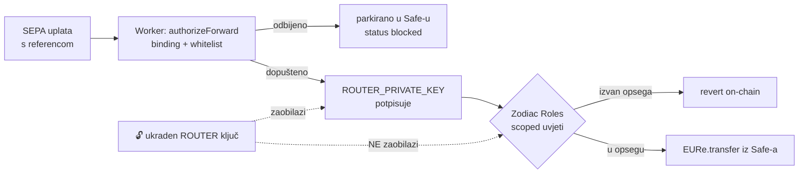

# Batch 006 — on-chain scoping of `EUReForwarder` (PRIPREMLJENO, NIJE IZVRŠENO)

> Status: **template only.** Ništa nije potpisano ni poslano on-chain. Ovaj
> dokument postoji da odluka bude donesena svjesno, a ne da se batch potpiše
> "jer postoji". Pročitaj §Verifikacija prije nego išta uploadaš u Safe.

## Zašto

Batch 001 je roli `EUReForwarder` dopustio **selektor** `transfer(address,uint256)`
na EURe ugovoru, ali **oba parametra su ostala neograničena**:

```
Roles.execTransactionWithRole(
  to:   EURe,
  data: transfer(<BILO KOJA adresa>, <BILO KOJI iznos>),
  ...)
```

Softverska whitelista (ADR 0016) zatvara napad "SEPA platitelj upiše proizvoljnu
adresu u referencu". Ne zatvara ovo: **tko ukrade `ROUTER_PRIVATE_KEY` može
isprazniti Safe na svoju adresu**, jer taj ključ zaobilazi cijeli Worker. Ovaj
batch dio te garancije spušta na chain, gdje kompromitirani backend ključ ne
doseže.



## Što batch radi

Zamjenjuje bezuvjetni `allowFunction` na `EURe.transfer` sa `scopeFunction` +
stablom uvjeta:

| Parametar | Uvjet | Efekt |
|---|---|---|
| `to` | `Or(EqualTo(a₁), … EqualTo(aₙ))` ili `Pass` | primatelj mora biti iz skupa |
| `amount` | `LessThan(cap)` ili `Pass` | strogo manje od kapice po transferu |

Generator:

```bash
# Preporuka za danas — samo kapica po transferu:
node safe-tx/006-scope-eure-transfer-recipients.mjs --max-eur 250

# Ako/kad rail bude imao stabilan skup primatelja:
node safe-tx/006-scope-eure-transfer-recipients.mjs \
  --recipient 0x… --recipient 0x… --max-eur 250
```

Commitani `006-scope-eure-transfer-recipients.template.json` je varijanta
**samo s kapicom** (`--max-eur 250`) — v. §Preporuka.

## Preporuka: kapica DA, popis primatelja (za sada) NE

Whitelista danas ima **51 adresu** i raste sa svakim novim korisnikom DOMOVINA
Walleta (`wallet_registry` je dinamički izvor upravo zato). Stavljanje tog skupa
on-chain značilo bi **2/3 multisig transakciju po svakom novom korisniku** — to
se u praksi ne održava, a whitelista koja zaostaje za stvarnošću proizvodi
blokirane uplate legitimnim korisnicima.

Zato:

1. **Sada:** `--max-eur <cap>` bez popisa primatelja. Ukraden ključ i dalje može
   slati kome hoće, ali **po transakciji najviše `cap`**. Uz `MAX_AMOUNT_CENTS`
   od 10.000 € u intent API-ju, kapica od npr. 250 € ne dira nijednu realnu
   uplatu (najveća dosad zabilježena: 1,21 €), a ograničava štetu po transakciji.
2. **Sljedeći korak (nije u ovom batchu):** Roles v2 *allowances*
   (`WithinAllowance` + `setAllowance`) daju **rolling limit po periodu** —
   npr. 1.000 € / 24 h ukupno, neovisno o broju transakcija. To je stvarna
   granica štete i logičan nastavak; traži zasebnu verifikaciju API-ja pa nije
   ugurano ovdje.
3. **Popis primatelja** ima smisla ako/kad rail dobije mali stabilan skup
   odredišta (npr. samo kampanjski Safeovi, bez per-user walleta).

## ⚠️ Dvije stvari koje ovo scoping-anje tiho zaobilaze

**1. MultiSend putanja.** Batch 005 je roli dopustio
`MultiSendCallOnly.multiSend(bytes)` preko **DelegateCall**. Kad su
`PAYMENT_REGISTRY_ADDRESS` + `MULTISEND_ADDRESS` postavljeni, `forwardViaSafe`
šalje transfer **unutar** multiSend bloba — a uvjeti nad `EURe.transfer`
parametrima se na taj blob **ne primjenjuju**, jer Roles vidi samo
`multiSend(bytes)`.

- Danas je `PAYMENT_REGISTRY_ADDRESS = ""` u `wrangler.toml`, pa rail koristi
  legacy direktni transfer i scoping **jest** djelotvoran.
- Ako se registry uključi, scoping treba pratiti jedno od:
  (a) registrirati **MultiSend unwrapper** na Roles Modifieru
  (`setTransactionUnwrapper(...)`, adapter `MultiSendUnwrapper`) da Roles
  raspakira blob i primijeni uvjete na svaki pod-poziv, ili
  (b) povući `multiSend` dopuštenje i odustati od atomskog batcha.
- **Ovo je blokirajući preduvjet za uključivanje PaymentRegistryja.**

**2. `scopeFunction` zamjenjuje, ne dodaje.** Poziv prepisuje postojeću
konfiguraciju selektora. Ako uvjet bude krivo složen, forward putanja pada u
revert **za sve uplate** dok se ne popravi novom 2/3 transakcijom. Zato
verifikacija ispod nije formalnost.

## Verifikacija prije potpisa (obavezno)

- [ ] **Enum vrijednosti.** `ParameterType` / `Operator` / `ExecutionOptions` u
      generatoru su upisani iz poznavanja Zodiac Roles v2 `Types.sol`, a **nisu**
      pročitani s deployanog ugovora. Usporedi s
      `gnosisguild/zodiac-modifier-roles` na verziji koja odgovara instanci
      `0x330347d656b1a5DF972f758DE1E25E99ec36762c`. Kriva vrijednost ne puca
      glasno — daje **drugu** dozvolu.
- [ ] **Selektor `scopeFunction`.** Generator ga izvodi iz vlastitog ABI-ja;
      potvrdi da odgovara ABI-ju deployanog Modifiera (Gnosisscan → Contract).
- [ ] **Redoslijed flat stabla.** Roles traži BFS poredak i djecu istog roditelja
      u nizu. Provjeri da je `[0]` root (`Calldata`/`Matches`), `[1]` = `to`,
      `[2]` = `amount`, a `EqualTo` listovi imaju `parent = 1`.
- [ ] **Simulacija.** Prije potpisa simuliraj na forku (Tenderly ili
      `anvil --fork-url https://rpc.gnosischain.com`):
      1. izvrši batch,
      2. `execTransactionWithRole` na dopuštenu adresu + iznos ispod kapice → **prolazi**,
      3. isti poziv na adresu izvan skupa → **revert**,
      4. isti poziv s iznosom iznad kapice → **revert**.
      Bez koraka 2 nema potpisa: prolazak legitimnog transfera je jedini dokaz da
      rail nije zaključan.
- [ ] **Rollback spreman.** Ako scoping zaključa legitiman promet, povratak je
      `allowFunction(role, EURe, 0xa9059cbb, None)` (batch 001, korak 2) — pripremi
      taj JSON prije nego što potpišeš ovaj.
- [ ] `cfg.safe`, `cfg.roles`, `cfg.eure` odgovaraju vrijednostima iz
      `safe-tx/README.md` (standing context tablica).

## Upload

Isti postupak kao ostali batchevi: app.safe.global → Apps → Transaction Builder
→ Load batch → 2/3 potpis → execute. Nakon izvršenja preimenuj u
`006-…EXECUTED.json` i upiši Gnosisscan TX hash ovdje, po uzoru na batch 001.

## Veze

- ADR: `docs/decisions/0016-tenant-payout-whitelist.md` (softverska whitelista)
- Prethodni batchevi: `001-eure-forwarder-role-setup.EXECUTED.md`,
  `005-extend-role-payment-registry.mjs`
- Rizici raila: `RISK-MITIGATIONS.md`
