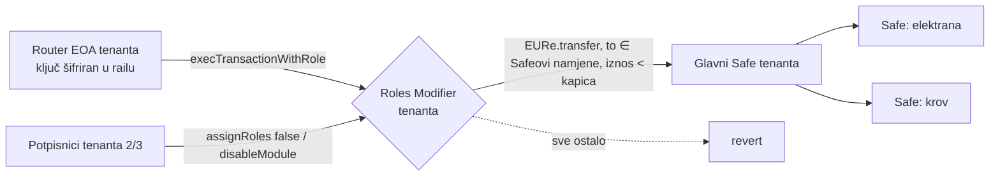

# Batch 007: rail uloga na Safeu tenanta (ADR 0017)

> Ovaj batch potpisuju **potpisnici tenanta** (npr. 2/3 župe), ne ITalk. Daje
> routeru raila za tog tenanta pravo da s glavnog Safea tenanta šalje EURe,
> ali **samo** na Safeove namjene istog tenanta i **samo** ispod kapice.

## Što tenant dobiva, a što rail ne može



Ni ukradeni router ključ ni kompromitirani Worker ne mogu:

- poslati EURe na adresu izvan popisa (revert na Modifieru),
- poslati iznos ≥ kapice,
- pozvati bilo koju drugu funkciju ili ugovor, uključujući redeem na IBAN,
- delegatecall/MultiSend: rail za tenante ne koristi PaymentRegistry put
  (006 §1), a uloga ga ne dopušta.

Tenant zadržava potpunu kontrolu. `assignRoles(router, [role], [false])` ili
`disableModule(modifier)` u jednoj transakciji njegovih potpisnika isključuje
rail.

## Postupak (jednom po tenantu)

1. **Admin raila:** `POST /admin/api/tenants/:id/rail/router-key` vraća adresu
   router EOA-a. Ključ nikad ne napušta rail.
2. **Tenant, u svom Safeu:** Apps → **Zodiac** → **Roles Modifier v2** →
   dodaj. Time se deploya Modifier proxy s owner = avatar = target = Safe
   tenanta i uključuje kao modul (transakcija tenantovih potpisnika).
3. **Admin raila:** generira batch:
   ```bash
   node safe-tx/007-tenant-rail-setup.mjs \
     --tenant zupa-sv-marko \
     --safe 0x<glavni Safe> --roles 0x<Modifier iz koraka 2> \
     --router 0x<adresa iz koraka 1> \
     --recipient 0x<Safe elektrana> --recipient 0x<Safe krov> \
     --max-eur 5000
   ```
4. **Verifikacija** (dolje), pa tenant učita JSON: Apps → Transaction Builder →
   Load → 2/3 potpis → execute.
5. **Admin raila:** u `tenant_rail` upisuje `roles_modifier`, `role_key`
   (`0x4555…` za `EUReForwarder`) i `max_forward_cents = kapica × 100`.
   Softverska kapica je stroga kao on-chain `LessThan`. Zatim
   `POST …/rail/verify`.
6. Router EOA treba malo xDAI za gas (~1 xDAI je dovoljan za tisuće forwarda).

## Verifikacija prije potpisa (obavezno)

Isti popis kao [006](006-scope-eure-transfer-recipients.md#verifikacija-prije-potpisa-obavezno):

- [ ] Enum vrijednosti (`ParameterType`/`Operator`/`ExecutionOptions`) odgovaraju
      `Types.sol` verzije deployanog Modifiera.
- [ ] `owner()`, `avatar()` i `target()` na Modifieru vraćaju glavni Safe tenanta.
- [ ] **Simulacija na forku** (`anvil --fork-url https://rpc.gnosischain.com` ili Tenderly):
  1. izvrši batch kao Safe;
  2. `execTransactionWithRole(EURe, 0, transfer(<Safe namjene>, 1 EURe), 0, role, true)`
     s router adrese → **prolazi**;
  3. isti poziv na adresu izvan popisa → **revert**;
  4. isti poziv s iznosom = kapica → **revert**;
  5. `transfer` s druge adrese (ne router) → **revert**.
- [ ] Glavni Safe **nije** među primateljima (generator to odbija). Memo prema
      glavnom Safeu je `self_noop` grana i ne pomiče vrijednost.

## Kad se doda nova namjena (novi Safe)

Kao i ITalkovu whitelistu, primatelje mijenja **tenant**: ponovno pokretanje
generatora s proširenim `--recipient` popisom daje novi `scopeFunction`
(zamjenjuje stari uvjet) i potpisuju ga potpisnici tenanta. U railu se ista
adresa dodaje na whitelistu tenanta (`/admin/whitelist`). Forward na adresu
koja je u railu, a nije on-chain, revertira i alarmira. Obrnuto se ne može
dogoditi jer rail ne pokušava ono što whitelista odbija.
