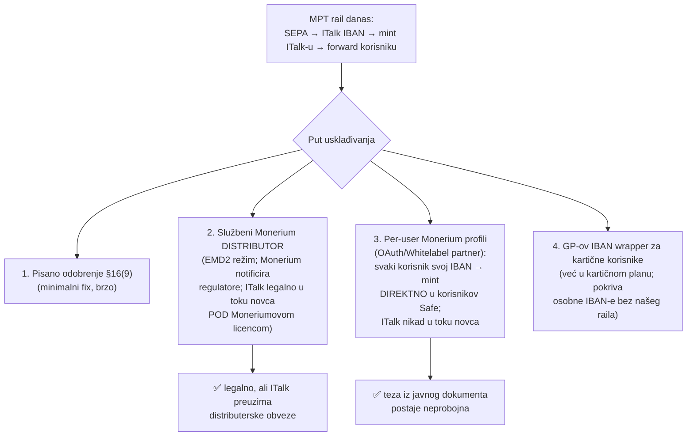

# INTERNO — Monerium Business ToS vs. MPT rail (NE OBJAVLJIVATI)

> Forenzička analiza Monerium uvjeta (Personal/Business/API ToS, effective 2025-05-20 /
> 2024-05-12; cache `~/.cache/monerium-docs/legal/`). Ovaj dokument postoji da prije
> službenog kontakta s Moneriumom (post-MVP plan) točno znamo svoju poziciju, slabe točke
> i opcije. Javna verzija teze je u [README.md](README.md).

## TL;DR

Regulatorna pozicija ITalk-a kao softverskog providera je čista (javni dokument). **Ali
trenutna topologija MPT raila — SEPA uplata trećih na ITalk-ov Monerium IBAN → mint EURe
ITalk-u → onward routing korisniku po referenci — doslovno je radni primjer koji Monerium
Business ToS §16 navodi kao zabranjen bez eksplicitnog odobrenja ili statusa distributera.**
To nije regulatorna rupa nego ugovorna klauzula — i ima jasne, predviđene putove rješenja.

## Klauzule koje pogađaju MPT (doslovno)

**§16 (zadnji odlomak) — "front/reseller" klauzula, ključna:**

> "Please note that you are not allowed to operate as a 'front', a 'reseller', or in any way
> act on behalf of a third party in the business relationship between you and Monerium
> without Monerium's explicit approval. **For example, you are not allowed to receive
> payments to your Monerium IBAN account from your customer or a third party and subsequently
> transfer the corresponding amount of e-money to the same customer. In order to operate
> under such a model you must become an official distributor of Monerium which requires
> legal integration and notification process to relevant financial supervisory authorities.**"

**§16(9):** zabrana *"to use the Services on behalf of any third party or to hold or carry
out transactions with your clients' money without our prior written approval"*.

**§17(10):** zabranjene transakcije: *"any unlicensed financial services or money
transmitting activities"* — neovisno o Moneriumu, hold-and-forward za treće osobe riskira
kvalifikaciju kao money remittance (PSD2 Annex I t. 6) za ITalk osobno.

**§11:** standing izjava *"funds used in exchange for e-money belong to the legal entity"* —
napeta ako su SEPA priljevi ekonomski korisnikov novac. **§19(3):** puno pravo i naslov na
sredstvima, bez tereta. **§19(6):** *"the legal entity will not remit e-money to US
residents"* — rail mora geofencati US destinacije.

**§18 Reversal:** SEPA recall NAKON što smo EURe već proslijedili = direktan gubitak ITalk-a.
**§22.2:** LHV može jednostrano narediti gašenje IBAN noge. **API ToS §9:** odgovornost
Moneriuma ograničena na **ISK 1.000** ukupno; licenca opoziva u svakom trenutku.

**API ToS §4 (gag clause):** *"You agree to refrain from making public statements … without
prior written and express permission from Monerium"* u vezi API-ja → **javni compliance
dokument koji opisuje Monerium integraciju treba Moneriumovu pisanu suglasnost prije objave.**

## Što ide u prilog (isto doslovno)

- Monerium sam crta granicu softver vs. izdavatelj: *"We do not provide you with a wallet
  service for your benefit"* (§1.4); wallet je korisnikova "oprema" (§3.4).
- API ToS §2 izričito licencira da *"allow customers to use your integration of the Monerium
  APIs within your application"* — app-ispred-Moneriuma je sankcionirana arhitektura.
- §8.5: EURe je slobodno prenosiv on-chain, pravo otkupa automatski prelazi na primatelja
  (uvjetovano njegovim onboardingom kod Moneriuma).
- KYB taksonomija predviđa `FUND_ORIGIN_CUSTOMER_FUNDS` / `FUND_ORIGIN_THIRD_PARTY_FUNDS` /
  `PURPOSE_COLLECT_PAYMENTS` — obrasci s tuđim novcem su onboardabilni **kad su deklarirani
  i odobreni**. Pitanje: što je ITalk deklarirao u svom KYB-u? (provjeriti prije razgovora)

## Putovi rješenja (Moneriumov vlastiti meni, rastućim redom integracije)

**Preporuka (za razgovor s Moneriumom, post-MVP kako je planirano):**
- **Cilj = opcija 3** (per-user profili, OAuth ili Whitelabel uz KYC Sharing/Sumsub): mint ide
  direktno payer→korisnikov IBAN→korisnikov Safe, ITalk potpuno izlazi iz toka novca, javna
  teza ("ITalk nikad ne dira novac") vrijedi bez zvjezdica. Moneriumov OAuth eksplicitno:
  *"you handle the product experience, Monerium handles the regulation."*
- **Prijelazno**: tražiti pisano odobrenje §16(9)/§16 za postojeći volumen (donacije/uplate s
  referencom), uz transparentan opis raila; ili formalizirati distributerski status ako
  Monerium to preferira.
- U istom razgovoru: suglasnost za javni compliance dokument (API ToS §4).
- Do tada: ograničiti javnu komunikaciju o detaljima Monerium integracije; US geofence na
  recipient adrese (§19(6)); čuvati rezervu za SEPA recall rizik (§18).

## Napomena o GP kartičnoj nozi

GP/Monavate analiza (vidi README §2, §5) ne otkriva nijednu problematičnu klauzulu za nas —
naprotiv, "Third Party Platform Integrations" + "self-custodial wallet providers" su izričito
predviđeni kanal; jedina obveza je proći GP-ovo partner-odobrenje (B2B ugovor, nejavan) i
GDPR urediti za identifikatore kartica. Kartični tok korisnikov EURe nikad ne vodi kroz
ITalk — čist je od prvog dana.

## Akcije

- [ ] Provjeriti što je ITalk deklarirao u Monerium KYB-u (purpose / fundOrigin)
- [ ] Pripremiti one-pager raila za Monerium (tok, volumeni, reference, AML touchpointi)
- [ ] Post-MVP poziv s Moneriumom: opcija 3 (per-user) kao cilj, §16 odobrenje kao prijelaz,
      suglasnost za javni dokument
- [ ] Odvjetničko mišljenje (HR): kvalifikacija raila po ZPP/PSD2 prije skaliranja volumena
- [ ] US geofence + SEPA recall rezerva u backendu raila
