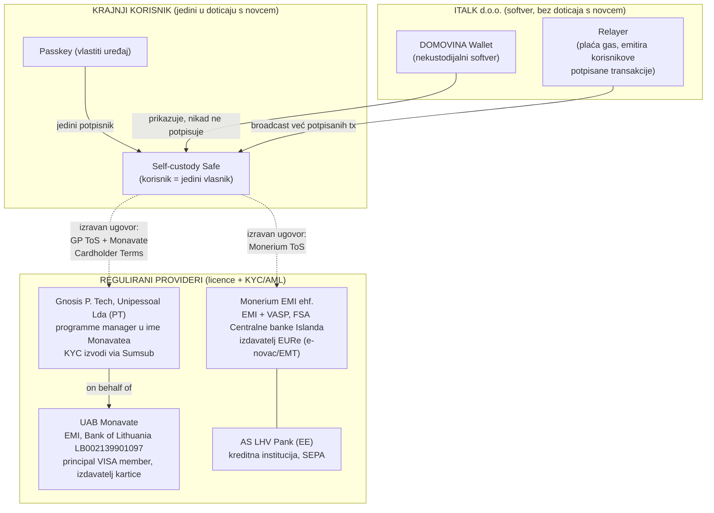
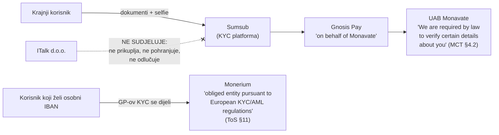
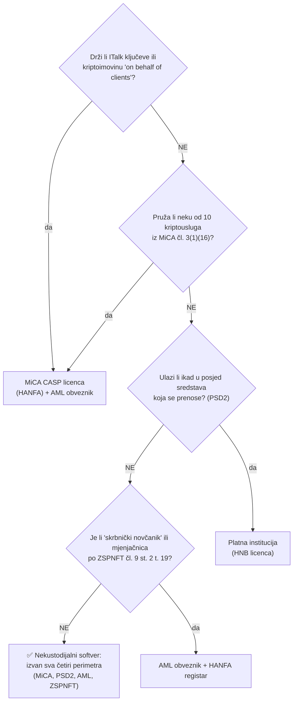

# ITalk d.o.o. — model nekustodijalnog softverskog providera

> **Single point of truth** o regulatornom položaju ITalk d.o.o. kao proizvođača DOMOVINA
> self-custody walleta i integratora reguliranih providera (Monerium, Gnosis Pay/Monavate).
> Verzija 1.0 · 2026-06-11 · Izvori: EUR-Lex, Narodne novine, HANFA, HNB, te službeni uvjeti
> korištenja providera (citati doslovni). Prateći interni dokument:
> [INTERNO-monerium-tos-analiza.md](INTERNO-monerium-tos-analiza.md).
>
> ⚠️ **Disclaimer**: ovaj dokument je tehničko-regulatorna analiza s citatima primarnih izvora,
> a ne pravni savjet. Prije javnog pozivanja na njega zatražiti odvjetničko mišljenje
> (vidi TODO) i suglasnost providera na opis integracija.

## Teza

**ITalk d.o.o. ne provodi KYC ni AML nad krajnjim korisnicima i ne treba odobrenje HNB-a ni
HANFA-e**, jer:

1. DOMOVINA Wallet je **nekustodijalni softver** — korisnik je jedini vlasnik ključeva
   (passkey u vlastitom Apple/Google credential manageru) i jedini tko može pokrenuti
   transakciju; ITalk ni u jednom trenutku ne drži, ne kontrolira i ne može rekonstruirati
   ključeve ni sredstva.
2. Sve **regulirane funkcije** (izdavanje e-novca, SEPA platni promet, izdavanje VISA kartica,
   KYC/AML/sankcijski screening, FIU prijave) ugovorno i stvarno obavljaju **licencirane
   institucije**: Monerium EMI ehf. (islandski EMI) i UAB Monavate (litavski EMI, principal
   VISA member), s Gnosis Pay kao Monavateovim programme managerom — a krajnji korisnik s
   njima sklapa **izravne ugovore**.
3. DOMOVINA Wallet i MPT su **bolji UI/UX nad postojećom reguliranom infrastrukturom** —
   tehnička usluga u smislu PSD2 čl. 3(j), a ne platna usluga ni kriptousluga.



## 1. Akteri i licence (verificirano)

| Uloga | Subjekt | Licenca / nadzor | Verifikacija |
|---|---|---|---|
| Izdavatelj EURe (e-novac; MiCA EMT) | **Monerium EMI ehf.** (Island, br. 571110-0240) | EMI + VASP; "supervised by the Financial Supervisory Authority of the Central Bank of Iceland" (Business ToS §1.1); Act No. 17/2013 (implementacija EMD2 2009/110/EZ) | **HNB registar passportiranih institucija** ✓ |
| Izdavatelj VISA kartice, platne usluge (EEA) | **UAB Monavate** (Litva, 305628001) | "authorised by the Bank of Lithuania (authorisation code: LB002139901097) to issue electronic money and provide payment services and licensed as a principal member of Visa" (Monavate Cardholder Terms §2) | **HNB registar passportiranih institucija** ✓ |
| Card programme manager, platforma | **Gnosis P. Tech, Unipessoal Lda** (Portugal, 517 666 898) | Sam deklarira: "Gnosis Pay is not regulated… does not at any time enter into the possession of crypto-assets" (GP ToS §1.10); djeluje "on behalf of Monavate" (§1.8) | ugovor korisnik↔GP |
| KYC vendor | SUM AND SUBSTANCE LTD (Sumsub) | GP Privacy Policy §5 | — |
| SEPA banka Moneriuma | AS LHV Pank (Estonija) | "licensed credit institution, license No 4.1-1/37, supervised by the Estonian Finantsinspektsioon" (Monerium ToS §5) | — |
| Softver (wallet UI, relayer, QR) | **ITalk d.o.o.** (Hrvatska) | **nije potrebna licenca** — analiza dolje | — |

> HNB-ova službena lista "List of payment institutions, electronic money institutions and
> registered account information service providers from other member states"
> (hnb.hr → Payment system → Notifications received from EU member states, ažurirano 13.5.2026)
> sadrži i **Monerium EMI ehf.** i **UAB Monavate** — oba providera su notificirana za
> prekogranično pružanje usluga u Hrvatskoj (Island preko EEA sporazuma, Litva kao članica EU).

## 2. Tko provodi KYC / AML — ugovorna alokacija (doslovni citati)



**Monerium** (Personal/Business ToS, §11): *"As an obliged entity pursuant to European KYC/AML
regulations we must apply customer due diligence measures when establishing a business
relationship with you."* Provodi: identifikaciju (uklj. biometriju preko Onfida — Privacy
Policy §5), **kontinuirani monitoring transakcija** (*"Ongoing monitoring of your activity is
conducted throughout the course of the relationship…"*), sankcijski screening (EU/UN/OFAC),
blacklisting adresa i **prijave FIU-u** (*"We are obligated to report suspected illegal
activity to the FIU"*), AML provjere na svakoj fiat nozi (§5), safeguarding pokrića
(ring-fenced računi, §6) i otkup po nominali na zahtjev (§4).

**Monavate/Gnosis Pay** (kartična noga): zakonska obveza verifikacije je Monavateova —
*"We are required by law to verify certain details about you. You cannot use our Services
until we verify your identity"* (MCT §4.2) — a operativno je izvodi Gnosis Pay: *"The
Onboarding Process is carried out by Gnosis Pay … on behalf of Monavate … you will be
redirected to the Compliance Provider's platform"* (GP ToS §4.2). Korisnikovi ugovori su
**izravni i bilateralni**: *"This Agreement is between you and us only"* (MCT §21.2).

**Ključno za ITalk**: GP ToS **izrijekom predviđa pristup kroz aplikacije trećih strana** —
usluge su dostupne *"through approved third party applications and platforms that have
integrated our services ('Third Party Platform Integrations')"* (GP ToS §1.3), a GP Privacy
Policy §2 navodi upravo *"self-custodial wallet providers"* kao arhetip partnera. **Nijedna
klauzula u potrošačkim uvjetima ne nameće interfejs-provideru nikakvu KYC/AML ulogu** —
identifikacijski dokumenti i biometrija idu direktno korisnik→Sumsub→GP/Monavate i nikad ne
dodiruju ITalk-ove sustave.

## 3. Custody analiza — ITalk nikad ne dira novac

```mermaid
sequenceDiagram
    participant U as Korisnik (passkey)
    participant APP as DOMOVINA Wallet (ITalk softver)
    participant R as ITalk relayer
    participant C as Gnosis Chain (Safe ugovori)
    participant POS as POS / primatelj

    Note over U,C: princip: ITalk softver PRIKAZUJE i PRENOSI,<br/>nikad ne POSJEDUJE i ne ODLUČUJE
    U->>APP: namjera plaćanja (iznos, primatelj)
    APP->>U: priprema transakciju za potpis
    U->>U: passkey ceremonija (Face ID)<br/>= jedini potpis koji chain prihvaća
    APP->>R: već potpisana transakcija
    R->>C: broadcast (relayer samo plaća gas;<br/>ne može izmijeniti ni inicirati tx)
    C->>POS: EURe transfer Safe→primatelj<br/>(peer-to-peer, bez posrednika)
```

- Safe je vlasništvo korisnika: GP ToS §3.1 — *"The Safe is an open-source self-custodial
  blockchain wallet that is owned and controlled by you through your Signing Wallet."*
  Monavate isto (MCT §5.2). Čak i sam izdavatelj e-novca tretira wallet kao korisnikovu
  opremu: *"We do not provide you with a wallet service for your benefit. You are responsible
  for bringing and using your own wallet of choice"* (Monerium ToS §1.4).
- ITalk **nema ključeve**: passkey živi u korisnikovom credential manageru; recovery seed
  vidi samo korisnik; aplikacija nikad ne briše ni ne izvozi tuđe ključeve.
- ITalk-ov relayer emitira isključivo transakcije **koje je korisnik već potpisao** — analogno
  nodeu/mineru koje MiCA recital 93 izričito isključuje iz "transfer services".
- P2P EURe transferi između self-custody walleta su po Uredbi (EU) 2023/1113 (TFR)
  *"person-to-person transfer of crypto-assets … without the involvement of any crypto-asset
  service provider"* (čl. 3(13)) — izvan Travel Rule obveza, koje na fiat nogama nosi Monerium.

## 4. Regulatorni okvir — zašto licenca nije potrebna



| Okvir | Odredba | Doslovni tekst | Primjena na ITalk |
|---|---|---|---|
| **MiCA** (EU 2023/1114) | recital 83 | *"Hardware or software providers of non-custodial wallets should not fall within the scope of this Regulation."* | izričito izuzeće |
| MiCA | čl. 3(1)(17) | custody = *"the safekeeping or controlling, **on behalf of clients**, of crypto-assets or of the means of access … in the form of private cryptographic keys"* | ITalk ne čuva ni ne kontrolira ništa za klijente |
| MiCA | čl. 3(1)(16)(a)–(j) | taksativna lista 10 kriptousluga | pružanje softvera nije na listi → čl. 59 (obveza odobrenja) se ne aktivira |
| MiCA | recital 93 | transfer services ne uključuju *"validators, nodes or miners"* | relayer = broadcast korisnikovih potpisa |
| MiCA Title IV | čl. 48 | autorizaciju treba **izdavatelj** EMT-a (Monerium) | sučelje za držanje/slanje EMT-a ne "nudi javnosti" token |
| **PSD2** (2015/2366) | čl. 3(j) | izuzeće za *"services provided by technical service providers, which support the provision of payment services, **without them entering at any time into possession of the funds to be transferred**, including processing and storage of data, … data and entity authentication, information technology (IT) and communication network provision"* | ITalk-ov dom u PSD2: IT + autentikacija (passkey) + podaci, bez posjeda sredstava |
| PSD2 | čl. 4(22), Annex I t. 6 | money remittance = *"funds are received from a payer"* | ITalk ne prima sredstva ni od koga |
| **AMLD5** (2018/843) | čl. 3(19) | custodian wallet provider = *"an entity that provides services to **safeguard private cryptographic keys on behalf of its customers**"* | self-custody softver ne čuva ključeve |
| **AMLR** (EU 2024/1624) | čl. 2(1)(9) + recital 160 | obveznik = CASP po MiCA-i; *"That prohibition does not apply to providers of hardware and software or providers of self-hosted wallets insofar as they do not possess access to or control over those crypto-asset wallets."* | nije obveznik ni po novom okviru (primjena od 10.7.2027.) |
| **TFR** (EU 2023/1113) | čl. 2, čl. 3(10)(13) | obveze samo za CASP-ove; P2P transferi izvan dosega | Travel Rule nosi Monerium na svojim nogama |
| **ZSPNFT** (NN 108/17…151/22) | čl. 9 st. 2 t. 19 | obveznici su samo oni koji *"na profesionalnoj osnovi **uime ili za račun druge** fizičke ili pravne osobe"* obavljaju skrbništvo, mjenjačnicu, izvršavanje naloga… | razvoj i pružanje softvera nije na listi; ništa se ne radi "uime ili za račun" |
| ZSPNFT | čl. 4 t. 50 | skrbništvo = *"čuvanje ili kontrola, uime trećih strana, virtualne imovine ili načina pristupa"* | zrcali MiCA-u → ne primjenjuje se |
| **Zakon o provedbi MiCA-e** (NN 85/24) | čl. 6, čl. 8 | nadležnost: HANFA → CASP-ovi (Titles II, V, VI); HNB → izdavatelji ART/EMT (Titles III, IV) | ITalk nije ni CASP ni izdavatelj → **nijedno tijelo nema osnovu za odobrenje** |

**Industrijske analogije** (ista pravna pozicija, EU-wide, bez licence za softver):
Consensys/MetaMask (*"Consensys operates non-custodial services… we do not have access to the
security key"*), **Safe** — čiji smart contracte DOMOVINA i koristi (*"A Safe Account is a
modular, self-custodial (i.e. not supervised by us) smart contract-based wallet"*), Ledger
Live (*"we do not store, nor do we have access to your Crypto Assets nor your Private Keys"*).

## 5. Kartični tok — cijeli platni ciklus kroz regulirane subjekte

```mermaid
sequenceDiagram
    participant U as Korisnik
    participant D as DOMOVINA Wallet (ITalk UI)
    participant GP as Gnosis Pay / Sumsub
    participant MVT as UAB Monavate (EMI, VISA)
    participant GS as GP Safe (korisnikov)
    participant POS as POS u Hrvatskoj

    U->>D: "Želim karticu"
    D->>GP: redirect u GP onboarding (unutar UI-ja)
    Note over U,GP: KYC: dokumenti+selfie idu Sumsubu;<br/>ITalk ih NE VIDI i NE POHRANJUJE
    GP->>MVT: verifikacija "on behalf of Monavate"
    MVT-->>U: kartica izdana (ugovor korisnik↔Monavate)
    U->>GS: punjenje: EURe transfer (passkey potpis)
    U->>POS: VISA plaćanje (Apple/Google Pay)
    POS->>MVT: autorizacija kroz VISA mrežu
    MVT->>GS: naplata kroz Roles modul<br/>(u Monavateov Settlement Safe)
    Note over MVT,POS: PSD2 Framework Contract obveze<br/>(refundacije, SCA, prigovori, BoL ADR)<br/>nosi Monavate
```

I u kartičnom toku jedina kustodijalna točka je **Monavateov** Settlement Safe (GP ToS §22) —
ITalk ni ovdje nema doticaja s novcem; svaka transakcija punjenja je korisnikov passkey potpis.

## 6. Granice modela — što ITalk svjesno NE radi (tripwires)

| Tripwire (što bi aktiviralo regulaciju) | Posljedica | DOMOVINA dizajn-pravilo koje to sprječava |
|---|---|---|
| Čuvanje/rekonstrukcija korisničkih ključeva ili veto-potpis | MiCA custody → CASP + AML obveznik | passkey samo u korisnikovom credential manageru; server-recovery **trajno odbijen** (ADR/postmortem politika); threshold-1 vlasništvo isključivo korisnikovo |
| Prolaz korisničkog novca kroz ITalk-ove račune/adrese (pooling, float, collect-and-forward) | gubitak PSD2 3(j) → money remittance → HNB licenca | sredstva idu izravno korisnikov Safe ↔ regulirani provider; *(za MPT on-ramp vidi interni dokument — formalizacija s Moneriumom)* |
| Iniciranje transfera "on behalf of" korisnika | MiCA 3(1)(16)(j) + PSD2 | relayer emitira samo korisnikove potpisane transakcije; ne može ih kreirati |
| Mjenjačnica vlastitim kapitalom / matching | MiCA (c)(d)(b) | nema exchange funkcije; swap bi išao kroz licencirane treće strane s izravnim ugovorom |
| Primanje i prijenos naloga / savjetovanje | MiCA (e)–(h) | neutralan UI za samostalne odluke korisnika |

## 7. Pošteni caveati (i za javnu verziju)

1. **Ovo nije pravni savjet** — formalno odvjetničko mišljenje je u planu prije šireg javnog
   pozivanja na ovaj dokument.
2. ITalk **obrađuje neke osobne podatke** (identifikatori kartice, statusi, adrese Safe-ova,
   telefon hash) i za to ima GDPR odgovornost kao voditelj/izvršitelj obrade — ali **nikad KYC
   dokumente ni biometriju** (oni idu direktno Sumsubu/GP-u/Moneriumu).
3. Integracije pretpostavljaju **B2B ugovore s providerima**: "approved third party
   applications" (GP ToS §1.3) znači da partner-odobrenje s Gnosis Payem nosi vlastite
   (nejavne) obveze; Monerium API ToS predviđa Specific Agreements. Za MPT on-ramp topologiju
   u tijeku je formalizacija s Moneriumom (interni dokument).
4. Sredstva u Safe-u **nisu depozit** i nemaju pokriće sustava osiguranja depozita (MCT §5.5);
   EURe nosi Moneriumov safeguarding (ring-fenced računi + najviši red prvenstva u stečaju po
   islandskom Zakonu 21/1991) i pravo otkupa po nominali — ali ostvarivanje otkupa direktno
   kod Moneriuma pretpostavlja da imatelj prođe Moneriumov onboarding (ToS §8.5).
5. Prigovori: za karticu postoji puni regulirani lanac (GP → Monavate → Bank of Lithuania
   ADR; hrvatski potrošač može tužiti i u Hrvatskoj, GP ToS §19.2). Za sam softver prigovori
   idu ITalk-u.

## Izvori

EUR-Lex: [MiCA 2023/1114](https://eur-lex.europa.eu/legal-content/EN/TXT/?uri=CELEX:32023R1114) ·
[PSD2 2015/2366](https://eur-lex.europa.eu/legal-content/EN/TXT/?uri=CELEX:32015L2366) ·
[AMLD5 2018/843](https://eur-lex.europa.eu/legal-content/EN/TXT/?uri=CELEX:32018L0843) ·
[AMLR 2024/1624](https://eur-lex.europa.eu/legal-content/EN/TXT/?uri=CELEX:32024R1624) ·
[TFR 2023/1113](https://eur-lex.europa.eu/legal-content/EN/TXT/?uri=CELEX:32023R1113)
· Hrvatska: [ZSPNFT](https://www.zakon.hr/z/117/) ·
[Zakon o provedbi Uredbe (EU) 2023/1114, NN 85/24](https://narodne-novine.nn.hr/clanci/sluzbeni/2024_07_85_1473.html) ·
[HANFA — tržište kriptoimovine](https://www.hanfa.hr/regulativa/trziste-kriptoimovine/) ·
[HNB — notifikacije iz država članica](https://www.hnb.hr/en/core-functions/payment-system/notifications-received-from-eu-member-states)
· Provideri: [Monerium ToS/Privacy](https://monerium.com/policies) ·
[Gnosis Pay ToS](https://help.gnosispay.com/hc/en-us/articles/43350967419412) ·
[Monavate Cardholder Terms EEA](https://help.gnosispay.com/hc/en-us/articles/39726634253076) ·
Apple Pay HR: [support.apple.com/hr-hr/109516](https://support.apple.com/hr-hr/109516) ·
Google Wallet HR: [support.google.com/wallet/answer/12059326](https://support.google.com/wallet/answer/12059326?hl=en&co=GENIE.CountryCode%3DHR)
· Lokalni cache svih analiziranih dokumenata: `~/.cache/monerium-docs/` i `~/.cache/gnosispay-docs/`.
