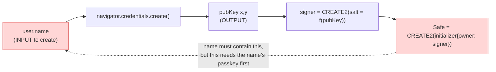
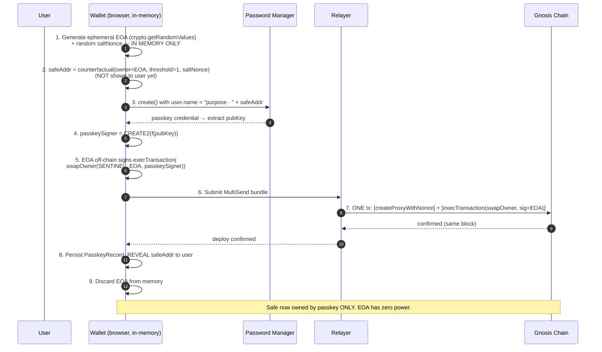
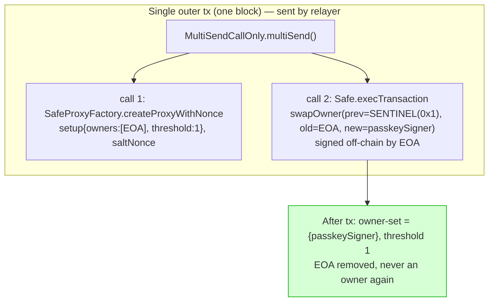
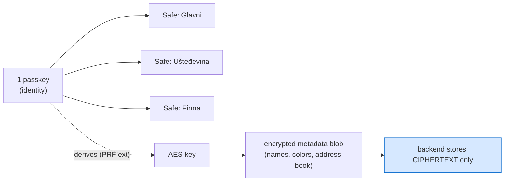
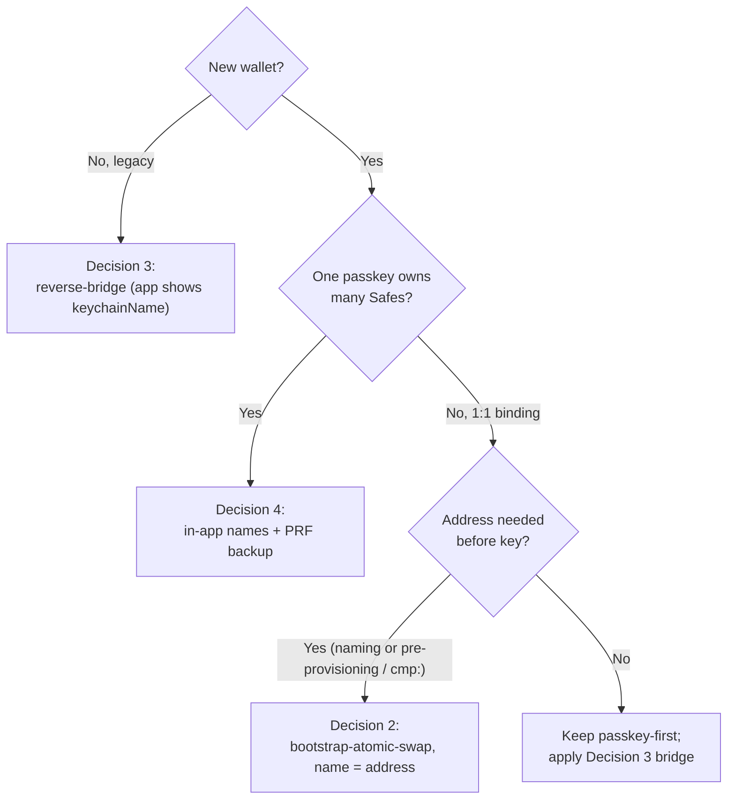

# ADR 0011 — Passkey name = Safe address (bootstrap-atomic-swap deploy)

**Status:** Accepted (direction). Naming-binding part recommended for new
wallets; bootstrap-atomic-swap deploy specified for naming + pre-provisioning.
**Date:** 2026-06-06
**Decision owners:** Matija Stepanic, ITalk d.o.o.
**Inherits from:** ADR 0001 (self-custody invariant — no server-side custody,
not even a transient bootstrap key the server can see). ADR 0008 (multi-passkey
ownership — passkeys are the identity layer; this ADR decides what their *names*
are). ADR 0009 (`cmp:` / pre-provisioning consumes the same address-before-key
primitive).

## Context

### The problem: passkey wallets have no human-readable account identity

A passkey-owned Safe is identified on-chain **only by its hex address**.
Today (`passkey.ts:259`) the WebAuthn `user.name` / `displayName` — the only
field a user sees in Apple Passwords / Google Password Manager / 1Password /
LastPass — is set to a free-text label like `"DOMOVINA Wallet · 6.6.2026"`.

Two failure modes follow at scale:

1. **Password-manager clutter.** A user with 30+ passkeys sees 30 entries
   collapsed under one website (RP ID `domovina.ai`), distinguishable only by
   `user.name`. They cannot tell which passkey controls which Safe. `user.name`
   is **immutable** after creation (Apple Passwords does not allow editing it),
   so "rename later" is not an option.

2. **Nicknames don't travel.** The obvious fix — let the user nickname each
   Safe — puts the human-readable label in browser `localStorage`. That label
   is **per-browser-profile and non-portable**. This is the exact pain the
   decision owner hit as an `app.safe.global` user: the *same* Safe added to
   multiple Chrome profiles (each with a different MetaMask signer) carries a
   *different* nickname per profile, and the mapping is lost the moment you
   switch profile, device, or clear storage. The pretty name is offline and
   local; the only thing that is globally consistent is the hex address.

### The key insight

The one string that is **already** globally consistent, synced (iCloud
Keychain / Google Password Manager), immutable, and present in every password
manager on every device — is the passkey `user.name`. If we make
`user.name` **equal the Safe address itself**, the password manager becomes the
canonical, portable account registry. No `localStorage` dependency for the core
binding; the human sees the exact same `0x…` string in the manager and in the
app, on any device, forever.

A full address (`0x` + 40 hex = 42 chars) fits inside the existing 64-char cap
(`passkey.ts:251`), with room to prefix a purpose: `Ušteđevina · 0x1234…`.

### Why this is hard: the chicken-and-egg

`user.name` is an **input** to `navigator.credentials.create()`; the Safe
address is **derived from the output**. The address cannot be known when the
name must be set.



The keypair is generated **inside** `create()` by the hardware authenticator —
it cannot be pre-computed offline (doing so would mean it is a seed, not a
passkey). So the address genuinely cannot be embedded in the same `create()`
call. See ADR 0001 / `feedback_safe_counterfactual_address` for the
counterfactual-address mechanics this builds on.

## Decision

### Decision 1 — The passkey `user.name` carries the canonical Safe identity

For wallets created via the bootstrap path (Decision 2), set:

```
user.name = user.displayName = `${purpose} · ${safeAddress}`   // ≤ 64 chars
```

`purpose` is the user-chosen label (`Glavni`, `Ušteđevina`, …); `safeAddress`
is the full checksummed `0x…` address. The address makes the entry an
**exact-match, portable key**; the purpose keeps it human-meaningful. The app
displays the identical string next to the Safe, so manager and app are
byte-identical — the binding is verifiable by eye on any device.

### Decision 2 — Break the chicken-and-egg with a bootstrap-atomic-swap deploy

To know the Safe address **before** the passkey exists, deploy the Safe with a
throwaway in-memory EOA as initial owner, then atomically swap ownership to the
passkey signer in a **single transaction (one block)**. The EOA is never shown,
never persisted, and is discarded from memory after the deploy.



The atomic transaction contents:



**Critical invariant — the address is not revealed until deploy confirms.**
Before confirmation, both the EOA address and the Safe address exist only in
memory; nothing is on-chain, nothing has leaked. Therefore funds cannot arrive
early, and an EOA leak before the tx is harmless (no funds + EOA removed by the
same tx). This is what keeps the pattern 100 % self-custody (ADR 0001): the
server never sees the EOA, and there is no window in which a non-user key
controls funds.

### Decision 3 — Reverse-bridge fallback for legacy / passkey-first wallets

Wallets created the old way (passkey first, address derived after) **cannot**
have the address in their immutable `user.name`. For those, the app shows the
stored `keychainName` (`PasskeyRecord.keychainName`, `passkey.ts:290`) next to
the Safe. The bridge then runs **app → manager**: the user reads the label in
the app and searches for that exact string in the manager. This requires no new
infrastructure and coexists with Decision 1 (new wallets get the strong
binding; old wallets keep the weak one).

### Decision 4 — Decouple passkey count from Safe count (identity vs account)

The naming problem is amplified by the current `1 passkey = 1 Safe` model. A
single WebAuthn signer can own arbitrarily many Safes. The long-term model:
**passkey = identity (few, 1 primary + backups per ADR 0008), Safe = account
(many, named in-app).** Per-account names live in the app and are made durable
across devices — without a custodian — via a **WebAuthn PRF-extension-encrypted
metadata blob** stored as ciphertext on the backend (server sees only
ciphertext; decryption key derives from the passkey itself).



Decisions 1–2 (address-as-name) and Decision 4 (identity/account split) are
**complementary, not mutually exclusive**: when one passkey owns many Safes you
cannot put one address in one passkey name, so Decision 4 leans on Decision 3's
in-app naming + PRF backup, while Decision 1–2 apply when a passkey is
deliberately bound 1:1 to a Safe (single-purpose accounts, pre-provisioning).

### When to use which



## Consequences

### Positive

- **Portable, synced, immutable account identity.** The passkey name *is* the
  Safe address, carried by iCloud/Google sync to every device, identical in
  every password manager. Solves the `app.safe.global` per-profile-nickname
  drift by construction.
- **No `localStorage` dependency for the core binding.** Even with cleared
  storage / new device, the manager still shows `purpose · 0x…`.
- **Pre-provisioning falls out for free** (ADR 0009 `cmp:`): the same
  address-before-key primitive lets you mint/print a receiving address or QR
  before the recipient has set up a key.
- **Stays within ADR 0001.** No persisted secret, no server-visible key, no
  window where a non-user key controls funds.

### Negative / costs (bootstrap path)

- **Mandatory synchronous deploy at onboarding.** Today deploy is lazy (first
  `sendEure` deploys; `feedback_safe_counterfactual_address`). This path
  deploys immediately, so onboarding waits for one on-chain confirmation
  (~5 s on Gnosis) before revealing the address. *Gas cost is negligible on
  Gnosis (xDAI, sub-cent), so the cost is latency, not money.*
- **Orphan-on-failure.** If the deploy tx fails after the passkey is created,
  the passkey is orphaned in the manager (no funds at risk — address never
  revealed — but a dead entry, the very clutter we fight). Mitigation: persist
  the `PasskeyRecord` only on deploy confirmation, and offer "retry" that
  reuses the orphan passkey if its pubkey is recoverable.
- **Loses the "binding is eternal & deploy-independent" property.** In the
  passkey-first model the address commits to the passkey, so the passkey can
  deploy its Safe at any later time. Here the binding is real only after a
  successful deploy. Acceptable because deploy is immediate, but it is a real
  robustness trade.
- **More complex deploy path** (`MultiSend[deploy, swapOwner]` with an
  off-chain EOA signature) vs today's `deploy + send`.

## Alternatives considered

- **Persisted bootstrap EOA (encrypted in localStorage / PRF blob).**
  Rejected: reintroduces a seed-like secret with a custody window (EOA controls
  the Safe until first deploy). The in-memory + atomic-deploy variant (Decision
  2) eliminates the persistence and thus the window.
- **Deterministic key derivation from a seed (pre-compute pubkey offline).**
  Rejected: that is a seed wallet, not a passkey — defeats the hardware-bound,
  non-extractable property that is the entire value proposition.
- **Create passkey, then rename to include the address.** Rejected:
  `user.name` is immutable in Apple Passwords; not portable across managers.
- **Address fingerprint (last-4) only, in a passkey-first flow.** Rejected as
  the *primary* mechanism: still can't be embedded (same chicken-and-egg), and
  4 chars is a weaker key than the full address. Retained only conceptually
  inside Decision 3's app-side display.

## Implementation tracking

| Decision | Status | Notes |
|---|---|---|
| 1 — name = `purpose · address` | ⏳ Planned | `suggestPasskeyName()` / create() call site `passkey.ts:251-259` |
| 2 — bootstrap-atomic-swap deploy | ⏳ Planned | new deploy path; relayer `MultiSend[createProxy, execTransaction(swapOwner)]` |
| 3 — reverse-bridge (app shows keychainName) | ⏳ Planned (cheap) | display-only; data already in `PasskeyRecord.keychainName` |
| 4 — identity/account split + PRF backup | 🔬 Direction | depends on PRF ext support matrix; coexists with ADR 0008 |

## Self-custody analysis (ADR 0001 compliance)

The only new key material is the ephemeral bootstrap EOA. It is:
generated client-side (`crypto.getRandomValues`), never transmitted, never
persisted, never displayed, removed as a Safe owner by the same atomic tx that
adds the passkey, and discarded from memory immediately after. At no point does
the server — or any party other than the user's browser, for a few seconds —
have the ability to move funds. This upholds ADR 0001 and does **not** revive
the permanently-rejected Phase 4 server-recovery model
(`project_self_custody_principle`).
