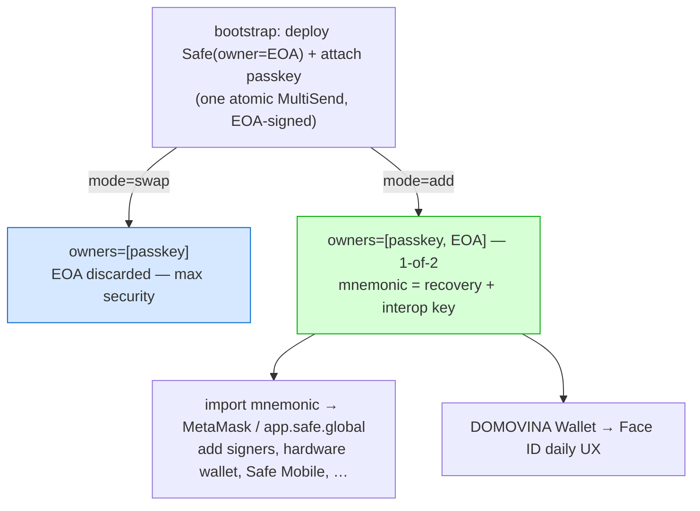

# ADR 0012 — Recovery seed as optional second Safe owner (1-of-2) + app.safe.global interop

**Status:** Accepted (direction). Implemented on `feat/passkey-name-equals-safe-address`
(untested on-chain at time of writing).
**Date:** 2026-06-06
**Decision owners:** Matija Stepanic, ITalk d.o.o.
**Extends:** ADR 0011 (reuses the bootstrap mechanism + name=address). **Inherits from:**
ADR 0001 (self-custody — the seed is never persisted/server-seen), ADR 0008 (threshold-1
multi-owner is the recovery primitive — the seed owner is one such owner).

## Context

ADR 0011 introduced a bootstrap that mints an ephemeral EOA to learn the Safe address
before the passkey exists, then `swapOwner(EOA → passkey)` and discards the EOA. That
gives a passkey-only Safe with `user.name = address`.

Two gaps remained:

1. **Recovery breadth.** Passkey-only recovery leans entirely on platform passkey sync
   (iCloud/Google) plus adding more passkeys (ADR 0008). Users who want a classic,
   portable, offline backup (paper / MetaMask) had no option.
2. **Interop.** Our passkey owner is a WebAuthn signer module — `app.safe.global` cannot
   readily sign with it. So a passkey-only Safe is usable only inside our apps. To offer
   "add hardware-wallet signer", "Safe Mobile", "add co-signers", etc. we'd have to
   re-build features `app.safe.global` already provides.

The insight (Matija): instead of discarding the bootstrap EOA, **keep it as a second
owner in a 1-of-2 Safe**. The 12-word mnemonic becomes a recovery key the user can import
into MetaMask / `app.safe.global`, where the *same* Safe gains every standard Safe feature
— while DOMOVINA Wallet keeps the Face-ID-only daily UX. Our differentiator (cross-domain
passkey across domovina / pinka / community wallets) is untouched; standard Safe ops go
through MetaMask. Don't reinvent the wheel.

## Decision

### Decision 1 — Two ownership modes on the same bootstrap rail

The bootstrap (ADR 0011) is unchanged through deploy; only the post-deploy attach differs,
selected by a `mode` flag. **The Safe address is identical in both modes** — both deploy
with initializer `owners=[EOA]`, so `predictSafe([EOA])` is the permanent address and the
`DOMOVINA_0x…` passkey name works either way.

- **`swap`** → `swapOwner(SENTINEL, EOA, passkeySigner)` → `owners=[passkey]`. Max security;
  recovery via passkey sync + multi-passkey. (ADR 0011 original.)
- **`add`** → `addOwnerWithThreshold(passkeySigner, 1)` → `owners=[passkey, EOA]`, **1-of-2**.
  Either key signs independently. The mnemonic is the recovery/interop key.

### Decision 2 — Default is `add` (1-of-2); `swap` and classic-custom are opt-in

The creation screen offers three choices; default selected = **Passkey + recovery seed (1-of-2)**:
- **Passkey + recovery seed** (`add`) — recommended default. Day-zero interop + offline backup.
- **Samo passkey** (`swap`) — max security, no seed.
- **Vlastiti naziv** — classic passkey-first flow, user-typed keychain label (unchanged).

### Decision 3 — The seed is a 12-word BIP39 mnemonic, shown once, only on explicit tap

- Generated client-side (`viem` `generateMnemonic`), **never persisted**, **never sent to the
  server** (only the EOA address + the SafeTx signature are). Held in React memory only until
  the user leaves the created screen, then dropped.
- On the created screen it is **hidden by default**; revealed only if the user taps "Prikaži
  recovery seed". A user who never taps never sees it (no screen-capture exposure), at the cost
  of having no offline backup (still recoverable via passkey).
- Import path documented in-UI: MetaMask → Import account → Secret Recovery Phrase. Derivation
  `m/44'/60'/0'/0/0` (viem `mnemonicToAccount` default) = MetaMask account 0 = the Safe owner.

### Decision 4 — The seed owner is removable (convergence to max security)

Because `add` leaves the EOA as a permanent owner, the one-time seed display is a lasting
attack surface (1-of-2 = either key drains; this is the seed-phrase risk passkeys remove,
reintroduced as opt-in). Mitigation: the EOA owner is **removable later** via `removeOwner`
(through `app.safe.global` today; a DOMOVINA Wallet "Ukloni seed backup" action is future
work). A user who adds other backups (second passkey, hardware) can drop the seed owner and
converge on ADR 0011 `swap`-equivalent security.

## Consequences

### Positive
- Day-zero interop: same Safe in DOMOVINA Wallet (Face ID) **and** `app.safe.global` (MetaMask),
  unlocking all standard Safe features without us rebuilding them.
- Classic, portable, offline-backuppable recovery key alongside passkey sync.
- Same address, same `DOMOVINA_0x…` name as ADR 0011; one `mode` flag, ~one extra UI screen.
- Self-custody preserved (ADR 0001): seed never persisted/server-seen; relayer never an owner.

### Negative
- `add` keeps a second full-control key; the one-time seed display is a lasting attack surface
  if captured. Mitigated by reveal-on-tap (opt-out of even seeing it) and later `removeOwner`.
- Cross-device restore of bootstrap wallets depends on the backend registry accepting an
  `safeAddress` that is **not** `predict(signer)` (it derives from the EOA). **Follow-up:** the
  out-of-repo `/api/wallets` backend (mpt.domovina.ai) must not validate `safe == predict(signer)`
  on register/lookup, or bootstrap wallets won't restore from the registry.
- Inherits ADR 0011 bootstrap costs: synchronous deploy at onboarding (latency ~5s on Gnosis,
  gas negligible on xDAI), orphan-passkey on deploy failure.

## Implementation tracking

| Item | Status | Location |
|---|---|---|
| Client bootstrap (mint EOA, sign attach, submit) | ✅ code | `src/lib/bootstrap.ts` |
| Server deploy+attach endpoint (swap/add, CREATE2 guard, wait receipt) | ✅ code | `functions/api/bootstrap-deploy.ts` |
| Relay CREATE2 guard moved to cold-path-only (unblocks bootstrap sends) | ✅ code | `functions/api/relay.ts` |
| Creation UI: 3-mode selector, default 1-of-2 | ✅ code | `src/routes/Landing.tsx` NamingView |
| Created UI: reveal-on-tap seed + MetaMask hint | ✅ code | `src/routes/Landing.tsx` CreatedView |
| `addressKeychainName` (`BRAND_0x…`) | ✅ code | `src/lib/passkey.ts` |
| On-chain test (real passkey + funded relayer) | ⏳ pending | needs Matija |
| Backend `/api/wallets` accepts EOA-derived safeAddress | ⏳ pending | mpt.domovina.ai (out of repo) |
| Settings → "Ukloni seed backup" (`removeOwner`) | ⏳ future | — |
