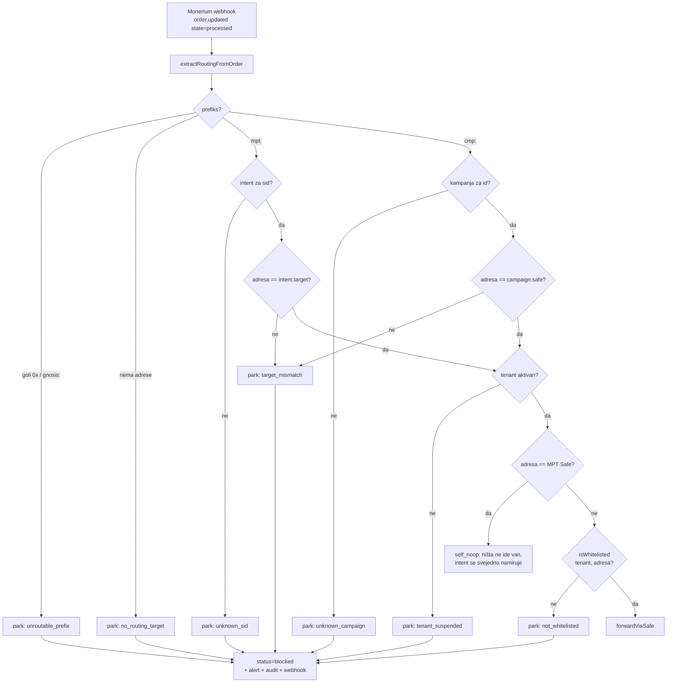

# ADR 0016 — Tenant payout whitelist: fail-closed forward rail

- **Status:** Accepted / implemented (2026-08-01)
- **Kontekst:** `backend/` (Cloudflare Worker, MPT hold-and-forward rail)
- **Veze:** [0012](0012-recovery-seed-second-owner-interop.md) ·
  `backend/safe-tx/006-scope-eure-transfer-recipients.md` (on-chain sloj) ·
  `docs/compliance/INTERNO-monerium-tos-analiza.md` ·
  `docs/reviews/2026-07-fable5/backend-worker.md` (BW-09)

## Problem

Odredište forwarda čitalo se **izravno iz SEPA reference**. `extractRoutingTarget`
je prihvaćao četiri oblika — `mpt:0x…`, `cmp:0x…`, `gnosis:0x…` i **goli `0x…`** —
i vraćao prvu adresu koju nađe u tekstu, neovisno o prefiksu. Odluka o slanju
padala je na `isAddress()` u `forwardViaSafe`, tj. samo na provjeru je li niz
sintaktički adresa.

Posljedica: **bilo tko tko može poslati SEPA uplatu na ITalk-ov IBAN mogao je
odabrati proizvoljnu Gnosis adresu i dobiti EURe na nju.** Rail je time bio
otvoreni on-ramp.

Novac time nije bio izravno ukradiv (platitelj šalje svoj novac na svoju
adresu), ali izloženost je stvarna i troslojna:

1. **Ugovorna / regulatorna.** Monerium Business ToS §16 zabranjuje primanje
   uplata trećih na vlastiti IBAN i prosljeđivanje e-novca dalje bez odobrenja
   ili statusa distributera; §17(10) cilja na neregistrirane money-transmitting
   aktivnosti. Otvoreni on-ramp je najgori mogući oblik toga — bez ijedne
   kontrole nad time tko i kamo.
2. **Sankcijska / AML.** Nula vidljivosti i nula kontrole nad odredišnim
   adresama.
3. **Operativna.** Svaka prisilna uplata troši xDAI router EOA-e i proizvodi
   forward koji nitko nije naručio.

Uz to, `ADDR_RE` nije imao granicu (nalaz BW-09): duži hex niz u memou skraćivao
se na prvih 40 znakova → uvjerljiva, ali **kriva** adresa.

## Odluka

Forward je **fail-closed** i mora zadovoljiti **dva neovisna uvjeta** prije nego
ijedan EURe napusti Safe:

1. **Binding** — adresa iz reference mora odgovarati odredištu koje smo
   autorizirali unaprijed:
   - `mpt:` → `payment_intents.target_address` za taj `sid`
   - `cmp:` → `tenant_campaigns.safe_address` za taj `id`
2. **Whitelist** — ta adresa mora biti aktivna payout adresa **tenanta** koji je
   vlasnik tog intenta/kampanje.

Sve ostalo se parkira: EURe ostaje u Safe-u, forward red dobiva status
`blocked` s razlogom, ide alert i outbound `forward.blocked` webhook.

Binding je zapravo jači uvjet od whiteliste: bez prethodnog autenticiranog API
poziva ne postoji ništa na što se referenca može vezati, pa je injekcija adrese
u SEPA referencu mrtva sama po sebi. Whitelista dodaje drugi sloj i, važnije,
daje operativnu polugu — adresa se može opozvati u sekundi, bez deploya.



### Jedna točka provođenja

Sva odluka živi u `authorizeForward` (`backend/src/tenants/whitelist.ts`).
`handleForward` djeluje **isključivo** na njezinu presudu; nigdje drugdje se
adresa ne odobrava. Zato je `handleForward` izdvojen iz `index.ts` u
`backend/src/monerium/forward.ts` s injektiranim ovisnostima — fail-closed grane
su pokrivene unit testovima bez D1 i bez RPC-a.

Cron putanje ne mogu zaobići provjeru jer uopće ne odlučuju o odredištu:
`reconcileSubmittedForwards` i `confirmForwardIfMined` samo čitaju receipt već
poslane transakcije. Novi forward nastaje isključivo kroz `maybeForward`.

### Tenant model

| Tablica | Uloga |
|---|---|
| `tenants` | id, naziv, status, `allow_sources` (JSON), **SEPA noga: `beneficiary_name` / `iban` / `bic`** |
| `tenant_payout_addresses` | statična whitelista; opoziv je mek (`revoked_at`) |
| `tenant_campaigns` | registar `cmp:` kampanja (id → Safe) |
| `tenant_api_keys` | sha256 ključa; `pk_` javni, `sk_` tajni |
| `tenant_audit_log` | tko/kad/koja adresa + svaki odbijeni forward |

`payment_intents` dobiva `tenant_id`.

### Dinamički izvor `wallet_registry`

Statična lista sama bi blokirala **svakog novog korisnika DOMOVINA Walleta** —
Safeovi nastaju self-serve i njih je danas 40+, uz rast. Zato tenant može
uključiti izvor `wallet_registry`: Safe koji je korisnik sam registrirao kroz
`/api/wallets` (`wallet_registry` ili `wallet_accounts`) je dopušteno odredište.

### Tenant = entitet s Monerium odnosom, ne brand

Tenant nije marketinška oznaka nego **pravna osoba na čiji KYB-ani IBAN sleti
SEPA noga**. To dvoje je ista činjenica: novac stiže na IBAN tog entiteta, pa
samo taj entitet smije reći kamo ide dalje. Zato tenant nosi i svoju SEPA nogu
(`beneficiary_name` / `iban` / `bic`) umjesto dosadašnjih hardkodiranih
konstanti u `intents/api.ts` i `checkout/page.ts` — drugi tenant naplaćuje na
**svoj** IBAN, nakon **svog** Monerium KYC/KYB-a, i to je preduvjet a ne redak
u tablici.

Prvi tenant je `italk` = **ITalk d.o.o.**, IBAN `EE707777000162921128`
(EE70 7777 0001 6292 1128), BIC `LHVBEE22` — Monerium default račun koji je
prošao KYB.

Nepoznato ime izvora u `allow_sources` se **ignorira** — nikad ne proširuje
dopušteni skup (`parseAllowSources`).

### API ključevi su identifikatori, ne autentikacija

Oba postojeća klijenta su javna (browser bundle + Flutter app), pa je svaki
ključ koji nose javan. Ključ zato **identificira tenanta**, ne autentificira ga.
Sigurnosna granica je nizvodno: whitelista odlučuje kamo novac smije, a
poznavanje `tenant_id`-a napadaču ne daje ništa što whitelista već ne ograničava.

Uvod je mek: bez ključa → `DEFAULT_TENANT_ID`. `INTENT_REQUIRE_TENANT_KEY=1` se
pali tek kad svi klijenti isporuče `pk_` ključ.

## Semantika parsera nakon promjene

| Memo | `target` | Ishod |
|---|---|---|
| `mpt:0x…?sid=…` | ✅ | forward ako binding + whitelista prođu |
| `cmp:0x…?id=…` | ✅ | forward ako je kampanja registrirana |
| `gnosis:0x…` | ❌ | `diagnosticTarget` samo za log → `unroutable_prefix` |
| goli `0x…` | ❌ | `diagnosticTarget` samo za log → `unroutable_prefix` |
| `0x<64 hex>` | ❌ | granica na regexu; nema skraćivanja (BW-09) |

Provjereno protiv produkcije prije promjene: **sav stvarni promet ide `mpt:` s
`sid`-om** (43 Monerium ordera, 41 forward, 0 `cmp:`, 0 golih `0x`, 0 `gnosis:`).
Postrožavanje ne lomi nijedan tok koji je ikad prošao railom.

## Migracija

`0013_tenants.sql` (shema) + `0014_seed_tenant_italk.sql` (seed). Seed je
**snimka stvarnog stanja iz produkcijskog D1-a**, ne izmišljen popis: unija
`payment_intents.target_address`, `monerium_forwards.target_address`,
`wallet_registry.safe_address` i `wallet_accounts.safe_address` = 52 adrese, od
kojih se seeda 51 (sam MPT Safe se ne seeda — memo prema njemu je `self_noop`
koji ne miče vrijednost), plus **2 izričito odobrene ITalk payout adrese**
(Matija, 2026-08-01) = **53**. Sve tri odobrene adrese
(`0x6693a7D1…`, `0xb2AF1Dc5…`, `0x7582f6f5…`) imaju valjan EIP-55 checksum —
provjereno prije upisa.

U trenutku pisanja migracije: **0 pending intenata**, pa nijedno plaćanje u
letu ne može biti osirotjeno prijelazom.

**Redoslijed deploya je obavezan:**

```bash
cd backend
npm run db:migrate:prod   # 0013 + 0014 PRVO
npm run deploy            # tek onda Worker
```

Obrnutim redoslijedom `createIntent` piše u `tenant_id` stupac koji još ne
postoji i svaki `POST /api/intents` puca.

## Kako se dodaje adresa

Admin konzola `/admin/whitelist` (Basic Auth, isti gate kao ostatak `/admin`),
ili JSON API:

```bash
curl -u "$ADMIN_USER:$ADMIN_PASS" -X POST \
  https://mpt.domovina.ai/admin/api/tenants/italk/addresses \
  -H 'content-type: application/json' \
  -d '{"address":"0x…","label":"kampanjski Safe X"}'

# "bi li ova adresa danas prošla i zašto"
curl -u … https://mpt.domovina.ai/admin/api/tenants/italk/check/0x…
```

Svaka izmjena piše red u `tenant_audit_log` (akter = Basic Auth korisnik).
Opoziv djeluje **odmah**, i na već izdane intente — `authorizeForward` provjerava
whitelistu u trenutku forwarda, ne u trenutku kreiranja intenta.

## Posljedice

**Dobiveno**

- Rail više nije otvoreni on-ramp; §16 izloženost je bitno manja (i dalje
  hold-and-forward, ali prema poznatom, kontroliranom skupu odredišta).
- Svaki odbijeni forward je vidljiv: status `blocked`, razlog, audit red, alert,
  webhook trgovcu.
- Adresa se povlači bez deploya.

**Plaćeno**

- `POST /api/intents` sada vraća `403 target_not_whitelisted` za nepoznatu
  adresu. Flutter app kao generički QR generator za **proizvoljnu** adresu više
  ne radi bez prethodnog upisa adrese — to je namjerna promjena politike.
- `GET /api/intents/campaign-qr` traži registriranu kampanju (prije je izdavao
  QR za bilo koji par adresa+id).
- Jedna tablica više za održavanje.

**Ne rješava** — ukraden `ROUTER_PRIVATE_KEY`. Whitelista živi u Workeru; taj
ključ je zaobilazi. Za to postoji odvojen, pripremljen ali **neizvršen**
on-chain sloj: `backend/safe-tx/006-scope-eure-transfer-recipients.md`
(Zodiac Roles `scopeFunction` s kapicom po transferu i opcionalnim skupom
primatelja). Preporuka tamo je kapica, ne popis primatelja — popis od 51 adrese
koja raste ne održava se kroz 2/3 multisig.

## Alternative koje su odbačene

- **Samo whitelista, bez bindinga.** Slabije: tko zna bilo koju whitelistanu
  adresu može na nju usmjeriti tuđu uplatu.
- **Samo statična lista, bez `wallet_registry`.** Najstrože, ali blokira svakog
  novog korisnika Walleta dok admin ručno ne doda adresu.
- **Tvrdi API ključ odmah.** Lomi Flutter app i wallet PWA do koordiniranog
  deploya tri repozitorija; isti sigurnosni učinak dobiva se mekim uvodom.
