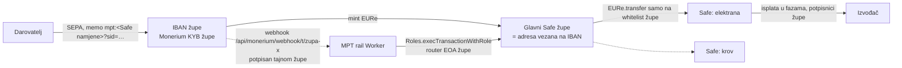
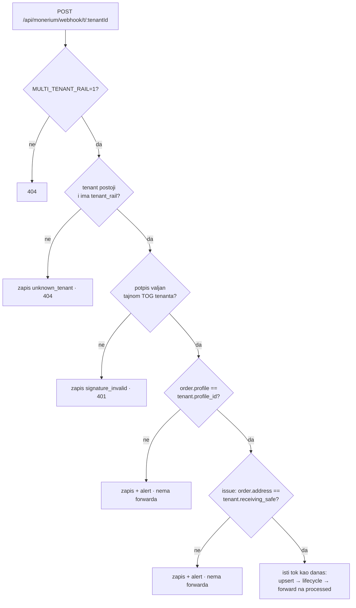

# ADR 0017 — Rail za više tenanata: Monerium račun, webhook i potpisnik po tenantu

- **Status:** Accepted, implementacija u tijeku (2026-10-05, grana `feat/multi-tenant-rail`)
- **Kontekst:** `backend/` (Cloudflare Worker, MPT rail)
- **Gradi na:** [0016](0016-tenant-payout-whitelist.md) (tenant = pravna osoba na
  čiji KYB-ani IBAN sleti SEPA; forward je fail-closed)
- **Veze:** `docs/compliance/INTERNO-monerium-tos-analiza.md` (§16, §16(9), §17, §18) ·
  `backend/safe-tx/006-scope-eure-transfer-recipients.md` ·
  `docs/reviews/2026-10-fable51/implementation-plan.md` (P0-2, BW-05) ·
  solardei-hr `docs/08-monerium-model-kampanja.md` (model B) ·
  energy.domovina.ai `docs/15-pravi-projekti-vlastite-lokacije.md` §6–7

## Problem

ADR 0016 je uveo tenanta s vlastitim IBAN-om, ali sve ostalo što dira novac
ostalo je **globalno** u `env`: Monerium vjerodajnice, webhook secret, prihvatni
Safe, Roles modifier, uloga i router ključ. Drugi tenant zato danas ne može
postojati. Ili mu uplate slijeću na ITalk-ov IBAN, pa ITalk prosljeđuje tuđi
novac, što je doslovno primjer iz Monerium ToS §16, ili rail za njegov IBAN
uopće ne vidi webhook.

Prvi korisnici koji to trebaju:

- **Župe preko solardei.hr, model B.** Župa je tenant: ima svoj Monerium KYB i
  IBAN, glavni Safe i Safeove namjene (elektrana, krov…).
- **domovina.energy Mod 2**, Safeovi koji nisu ITalkovi.

Čitanje koda otkrilo je i pet stvari koje bi s drugim tenantom postale bugovi
s novcem ili podacima:

1. `enqueueWebhook` šalje **svaki** outbound event na globalni
   `INTENT_WEBHOOK_URL` (pinka). Uplata župi poslala bi IBAN i ime darovatelja
   trećoj strani.
2. `readTenantKey` ključem smatra samo `Bearer pk_|sk_…`, pa svaki drugi
   `Bearer` tiho pada na zadanog tenanta (ITalk).
3. `self_noop` i potpisnik čitaju globalni `env.SAFE_ADDRESS` / `ROLES_*`.
4. Nitko ne provjerava da je mint sletio na Safe iz kojeg forwardamo. Za
   tenanta s više adresa forward bi mogao trošiti novac koji nije došao s tim
   orderom.
5. `GET /api/monerium/orders` je javan i vraća IBAN-e i imena (BW-05).

## Odluka

**Svaki tenant ima vlastiti Monerium račun, vlastiti webhook i vlastiti
potpisni put. Novac koji je sletio na IBAN tenanta X smije završiti samo na
adresama s whitelist tenanta X.** To se provodi u kodu (dva neovisna uvjeta) i
on-chain (Zodiac Roles na Safeu tenanta).

ITalk nikad ne prima ni ne drži novac župe. Rail je softver koji po uputi
župe premješta župin EURe između **župinih vlastitih** adresa.

### Model podataka (sve migracije aditivne)

| Promjena | Zašto |
|---|---|
| `tenants.status` dobiva `'onboarding'` | kod već tretira sve ≠ `'active'` kao zatvoreno → fail-closed bez nove logike |
| nova tablica `tenant_rail` (1:1 s `tenants`) | Monerium vjerodajnice, profil, prihvatni Safe, modifier, uloga, router EOA, webhook tajna, outbound webhook — sve po tenantu |
| `tenant_id` na `monerium_orders`, `monerium_forwards`, `monerium_webhook_events` | svaki zapis o novcu zna kojem tenantu pripada; NULL = povijesni ITalk |
| dedup ključ `<tenant>:<webhook-id>` za nove tenante | webhook-id je jedinstven po pretplati, ne globalno; ITalk zadržava goli id |

**ITalk nema red u `tenant_rail`.** Resolver `getTenantRail(env, tenantId)`
za `italk` gradi konfiguraciju iz `env` točno kao danas, a za ostale čita
`tenant_rail`. Sav kod koji danas čita `env.MONERIUM_*`, `SAFE_ADDRESS`,
`ROLES_*` ili `ROUTER_PRIVATE_KEY` ide kroz taj resolver. Tako je ITalk put
bajt-identičan, a drugi tenant ne može slučajno dobiti ITalkovu konfiguraciju.
Nepoznat tenant ili tenant bez reda daje `null`, a ne ITalk.

### Gdje žive tajne

**Šifrirano u D1, AES-256-GCM, s ključem (KEK) u Worker secretu
`TENANT_SECRETS_KEK`.** Format je `v1:<iv b64>:<ct b64>`. AAD je
`<tenant_id>|<ime polja>`, pa se šifrat jednog tenanta ne može dešifrirati kao
tajna drugog (podmetanje reda u D1 ne prolazi). Prefiks `v1` ostavlja prostor
za rotaciju KEK-a.

| Opcija | Ishod |
|---|---|
| Worker secret po tenantu | ❌ svaki onboarding traži deploy |
| Cloudflare Secrets Store | ❌ svaki secret traži binding u `wrangler.toml` → opet deploy po tenantu |
| **Šifrirano u D1, KEK u secretu** | ✅ onboarding bez deploya; jedna tajna za čuvanje |

Ograničenje treba reći izravno: tko kompromitira Worker, ima i KEK, dakle sve
tajne svih tenanata. Zato potpisni put ima i drugi, on-chain sloj (niže) koji
kompromitirani Worker ne može zaobići.

### Webhook po tenantu

- Postojeća ruta `/api/monerium/webhook` ostaje ITalk s
  `env.MONERIUM_WEBHOOK_SECRET`, nepromijenjena. Monerium pretplata na
  `monerium.domovina.ai` se ne dira.
- Potpis se provjerava **samo** tajnom tenanta iz URL-a. Ne isprobava se
  „bilo koja tajna koja prolazi": to bi omogućilo da se event jednog tenanta
  pripiše drugom.
- Handler je izdvojen iz `index.ts` (`monerium/webhookHandler.ts`) s
  injektiranim ovisnostima, kao `forward.ts`, i ITalk ruta zove isti handler.
- **Token po tenantu:** KV ključ `monerium:access_token:<tenant>`. ITalk
  zadržava `monerium:access_token`.
- **Reconcile po tenantu:** cron prolazi aktivne tenante, svaki sa svojim
  clientom i profilom. Greška jednog tenanta ne zaustavlja ostale.

### Forward samo na whitelistu tog tenanta: tri sloja

1. **Binding + pripadnost.** `authorizeForward` dobiva `railTenantId`, tenanta
   čiji je potpisani webhook donio order. Intent ili kampanja drugog tenanta
   daju `park: tenant_mismatch`. Uplata na IBAN X sa `sid`-om intenta tenanta
   Y nikad ne ide dalje.
2. **Whitelista tenanta X** (ADR 0016). `self_noop` (memo cilja prihvatni
   Safe) uspoređuje s `X.receiving_safe`, ne s globalnim Safeom.
3. **On-chain.** Forward je `Roles.execTransactionWithRole` na **X-ovom**
   Roles modifieru, kojem je avatar **X-ov** glavni Safe. Uloga je scopeana na
   `EURe.transfer(to ∈ {Safeovi namjene X}, amount < kapica)`. Za župu je skup
   primatelja malen i stabilan (2–5 Safeova), pa popis primatelja on-chain
   ovdje ima smisla, za razliku od ITalka s 51+ adresa (006 §Preporuka).
   Batch je `safe-tx/007-tenant-rail-setup`. MultiSend/PaymentRegistry put je
   za tenante isključen dok Roles nema MultiSend unwrapper (006 §1).

### Tko potpisuje forward s tenantova Safea

**Zodiac Roles Modifier na glavnom Safeu tenanta. Član uloge je zaseban EOA
raila po tenantu (`router_address`), koji rail generira pri onboardingu.**
Ključ je šifriran u D1, a AAD ga veže na tenanta. Potpisnici župe jednom
izvršavaju batch 007 (uključi modul, scopeaj ulogu, dodijeli je EOA-u).

Zašto ovako:

- **Rail ne može ništa izvan uloge:** samo `EURe.transfer`, samo na Safeove
  namjene te župe, samo ispod kapice. Ni ukradeni ključ ni kompromitirani
  Worker ne mogu isplatiti na IBAN, na tuđu adresu ni iznad kapice.
- **Župa zadržava kontrolu:** `disableModule` ili `revokeRole` u jednoj
  transakciji njezinih potpisnika isključuje rail bez nas.
- **EOA po tenantu, ne zajednički.** Zajednički EOA stvara nonce sudare među
  tenantima: paralelni forwardi dvaju tenanata daju `failed` i ručni retry
  (BW-17). S EOA-om po tenantu opoziv jednog tenanta ne dira ostale, a u
  uvjetima se može navesti konkretna adresa. Cijena: svaki EOA treba malo xDAI
  za gas (~1 xDAI je dovoljan za tisuće forwarda na Gnosisu), a 6-satni cron
  alarmira kad saldo padne ispod praga.
- ITalk ostaje na postojećem `ROUTER_PRIVATE_KEY` + modifieru `0x3303…762c`.

**Tekst za uvjete župe** (ide i na stranicu):

> MPT softver (ITalk d.o.o.) smije s glavnog Safea župe prenositi EURe
> isključivo na Safeove namjene koje je župa odobrila, do iznosa X € po
> transakciji. Softver ne može isplatiti novac na bankovni račun, na drugu
> adresu niti iznad tog iznosa. ITalk ne prima i ne drži novac župe. Župa to
> ovlaštenje može ukinuti u bilo kojem trenutku jednom transakcijom svojih
> potpisnika. Adresa softverskog ključa za vašu župu: `0x…`.

### SSE za intente

`GET /api/intents/:sid/stream` (do sada rezerviran, 404) postaje SSE kanal.
Worker sam ne može gurati promjenu iz webhook zahtjeva u tuđu konekciju, pa se
koristi Durable Object `IntentStream`, **jedna instanca po sid-u**.

- Prvi event je trenutni status, izračunat istim kodom kao polling
  (`buildIntentStatus` / `computeStage`). Ako je faza već terminalna, šalje se
  jedan event i stream se zatvara.
- Format: `event: stage` · `id: <n>` · `data: {sid, state, status}`, gdje je
  `status` **isti objekt** kao u `GET status_url`. Uz to `: ping` svakih 15 s
  i `retry: 3000`. Stream se zatvara na `settled | rejected | expired` ili
  nakon 30 min, a klijent tada pada na polling.
- Push dolazi s točaka gdje se faza mijenja: upsert ordera u webhooku, upis i
  promjena forwarda, settle i istek. Uvijek je fail-soft u `waitUntil` i nikad
  ne dira novčani put.
- Polling, oblik odgovora i CORS (`Content-Type, Authorization`) se ne
  mijenjaju. `EventSource` ne šalje custom headere, a sid je capability kao i
  `status_url`.

### Admin

Onboarding je slijed s provjerom, a tenant postaje `active` tek kad sve prođe:

1. `POST /admin/api/tenants`: tenant u statusu `onboarding` (IBAN, BIC,
   primatelj, `allow_sources = []`).
2. `PUT …/rail`: Monerium client id/secret, `profile_id`, prihvatni Safe,
   modifier, uloga, opcionalno outbound webhook. Tajne se šifriraju odmah i
   nikad se ne vraćaju.
3. `POST …/rail/router-key`: rail generira EOA i vraća samo adresu (za batch 007).
4. `POST …/rail/webhook`: rail generira `whsec_` i registrira pretplatu
   vjerodajnicama tenanta na `/api/monerium/webhook/t/:id`.
5. `POST …/rail/verify` (read-only, izvještaj se sprema): token radi, profil
   odgovara, IBAN tenanta postoji i vezan je na prihvatni Safe, Safe je
   deployan, modifier je uključen modul s tim Safeom kao avatarom, router ima
   xDAI.
6. `POST …/activate` radi samo uz uspješan verify i registriran webhook.
   `…/suspend` i `…/resume` djeluju odmah. Svaka promjena ide u
   `tenant_audit_log`.

**Origini:** dodaju se `https://solardei.hr` i `https://solardei.domovina.ai`.
CORS ostaje globalan, ne po tenantu: nije sigurnosna granica (`pk_` je javan,
granica je whitelista), a D1 lookup na svakom preflightu ne bi ništa donio.

### Zastavice

| Varijabla | `0` (default) | `1` |
|---|---|---|
| `MULTI_TENANT_RAIL` | `/webhook/t/:id` → 404; intent za tenanta ≠ ITalk → `403 tenant_rail_disabled`; reconcile samo ITalk | rail za tenante s `tenant_rail` |
| `INTENT_SSE` | `/stream` → 404 kao danas | SSE |

ITalk put ne čita nijednu od njih.

## Redoslijed isporuke

| Korak | Sadržaj |
|---|---|
| 0 | ovaj ADR · Fable P0-2: atomski zasun na `monerium_forwards` (unique parcijalni indeks) |
| 1 | `tenant_rail` + šifriranje + resolver · Monerium client po tenantu · webhook `/t/:id` s provjerom profila i mint adrese · reconcile po tenantu |
| 2 | izolacija forwarda (`tenant_mismatch`, `RailSigner`, `self_noop` po tenantu) · outbound webhook po tenantu · bez tihog `Bearer` pada · `/api/monerium/orders` iza admina · `safe-tx/007` |
| 3 | SSE (Durable Object `IntentStream`) + checkout na EventSource s polling rezervom |
| 4 | admin onboarding, verify, suspend, gas alert, origini solardei |

**Deploy** ide uvijek u redoslijedu `db:migrate:prod` → `deploy`, sa
zastavicama na `0`. Prvi stvarni tenant pali se tek nakon sandbox testa
(`monerium_env = sandbox`, Chiado) ili testne uplate od 1 € na produkciji.

## Posljedice

**Dobiveno.** Župa (ili bilo koji entitet s KYB-om) prima na **svoj** IBAN, a
ITalk izlazi iz toka novca. To je opcija 3 iz ToS analize za poslovne
tenante. Izolacija tenanata vrijedi na tri neovisna sloja. Onboarding ne traži
deploy.

**Plaćeno.** Jedna tablica i jedna tajna (KEK) više. Svaki tenant traži
svoj KYB i jednu 2/3 transakciju svojih potpisnika (batch 007). Svaki router
EOA treba xDAI. Rail drži šifrirane vjerodajnice tuđih Monerium računa, a to
je odgovornost koju treba opisati u uvjetima.

**Ne rješava.** SEPA recall nakon forwarda (§18). Novac je u slučaju župe
ionako unutar župe, pa je rizik njezin, ali proces povrata nije definiran.

## Otvorena pitanja za Monerium

1. Smije li tenant svojim **private app** vjerodajnicama dati ITalk-u pristup
   API-ju svog profila, ili Monerium za to traži **OAuth partner app** (tenant
   autorizira našu aplikaciju)? Kod podržava oba (`auth_kind`). Gradi se
   `client_credentials` jer radi danas, bez odobrenja.
2. Daje li OAuth za **korporativne profile** offline pristup (refresh token
   bez prisutnog korisnika), potreban za webhook i reconcile?
3. Dostavlja li webhook pretplata private appa **samo** ordere tog profila?
   Rail svejedno provjerava `order.profile`.
4. Je li u redu po §16(9) da rail preko Zodiac uloge na Safeu tenanta
   premješta EURe tenanta između **njegovih vlastitih** adresa, po njegovoj
   uputi?
5. Pamti li se „first-IBAN screening" po profilu? Ako da, svaka nova župa
   kreće od nule.
6. Minta li `mpt:` memo na profilu tenanta na adresu vezanu za IBAN (exact
   match pravilo, pokus 21.5.2026. na ITalk profilu)?

## Alternative koje su odbačene

- **Zajednički router EOA za sve tenante:** nonce sudari među tenantima, a
  opoziv nije po tenantu.
- **Isprobavanje svih webhook tajni:** pripisivanje eventa krivom tenantu
  postaje moguće.
- **Nadbiskupija kao jedan tenant za sve župe:** župe su zasebne pravne
  osobe, pa je to opet „u ime trećeg" (§16).
- **CORS po tenantu:** trošak bez sigurnosne koristi.

## Implementacija (2026-10-05, grana `feat/multi-tenant-rail`)

| Korak | Commit | Sadržaj |
|---|---|---|
| 0 | `8fe0c7d` | ovaj ADR |
| 0b | `ec9d26f` (+`89703fe`) | migracija `0016_forward_latch.sql`: `insertForward` je odluka (Fable P0-2) |
| 1 | `8b7a2f9` | `0017_tenant_rail.sql`, `tenants/secrets.ts`, `tenants/rail.ts`, `monerium/webhookHandler.ts`, ruta `/t/:id`, reconcile po tenantu |
| 2 | `b454b0b` | `authorizeForward` (`tenant_mismatch`, `mint_address_mismatch`, `over_cap`), `RailSigner`, outbound po tenantu, `Bearer` bez tihog pada, `/api/monerium/orders` iza admina, `safe-tx/007` |
| 3 | `cbbae04` | `intents/stream.ts` (DO `IntentStream`), checkout na EventSource |
| 4 | `c187478` | `tenants/onboarding.ts`, `tenants/railAdmin.ts`, `/admin/tenants`, gas alert, origini solardei |

Testovi: 124 → 248. ITalk testovi prolaze s **nepromijenjenim očekivanjima**;
harnessi su dobili samo nova polja s vrijednostima za ITalk (`railTenantId:
'italk'`, `requireMintAt: null`, `maxForwardCents: null`). Lokalni E2E
(`wrangler dev` + lokalni D1) pokrio je SSE push (~50 ms nakon webhooka),
atribuciju webhooka po tenantu i onboarding.

### Što se mijenja za ITalk čim se deploya, i uz zastavice na `0`

Sve ostalo ostaje isto. Ovo su namjerne promjene:

- **Svaki poslan, a nevaljan tenant ključ** (`Authorization` ili `x-mpt-key`)
  vraća `401 invalid_tenant_key`. Provjereno je da nijedan postojeći klijent
  ne šalje `Authorization` na `/api/intents` (Flutter, wallet PWA, pinka SDK,
  energy). Šalje ga samo solardei, i to s `pk_`.
- **`GET /api/monerium/orders*` traži `ADMIN_TOKEN`.** Nijedan klijent ga ne
  zove; admin UI čita kroz `/admin/api/*`.
- **ITalk intent ili kampanja** na koju stigne novac s IBAN-a drugog tenanta
  (i obrnuto) se parka s razlogom `tenant_mismatch`. Dok drugih tenanata
  nema, to se ne može dogoditi.
- **Forward je atomski zaključan po orderu** (0016). Drugi konkurentni
  webhook više ne može poslati drugi transfer.

## Rollout (tim redom; ništa od ovoga nije napravljeno)

1. `npx wrangler login` na account `7dc7167b…`.
2. **Pre-check za 0016** na produkciji (mora vratiti 0 redaka):
   `SELECT order_id, COUNT(*) FROM monerium_forwards WHERE status IN ('pending','submitted','confirmed') GROUP BY order_id HAVING COUNT(*) > 1;`
3. `openssl rand -base64 32 | npx wrangler secret put TENANT_SECRETS_KEK`.
   KEK treba spremiti i izvan Cloudflarea: bez njega se svaki tenant mora
   ponovno onboardati.
4. `npm run db:migrate:prod` (0016 + 0017) **pa tek onda** `npm run deploy`.
   Zastavice ostaju `MULTI_TENANT_RAIL = "0"` i `INTENT_SSE = "0"`.
5. Provjera ITalka nakon deploya: energy `/beta/` stvara intent, postojeći
   `GET /api/intents/<sid>` ima isti oblik, test uplata od 1 € ide do
   `settled`.
6. `INTENT_SSE = "1"` → deploy → checkout otvoren u pregledniku prima eventove.
   Klijenti koji prelaze na SSE (energy `intent-panel`, solardei
   `kampanje-klijent.ts`) moraju na terminalnoj fazi pozvati `es.close()`.
   Inače EventSource ponovno otvara stream u isti terminalni snapshot.
7. Prvi tenant: `MULTI_TENANT_RAIL = "1"` → deploy → `/admin/tenants`
   onboarding po redu iz §Admin. Prije aktivacije: batch 007 simuliran na
   forku i potpisan od tenanta, pa test uplata od 1 €. Sandbox varijanta
   (`monerium_env = sandbox`, `chain = chiado`) prolazi isti put.

### Za potrošače

- **solardei** (`kampanje-klijent.ts`): novi kodovi greške
  `tenant_rail_disabled` i `tenant_rail_not_configured` (403) danas padaju u
  `nepoznato`. Preporuka je mapirati ih na `tenant`.
- **energy** (`mpt-intent.ts`): bez promjene. I dalje ne šalje `pk_`, pa
  ostaje na ITalku (§7 u energy docs/15).
