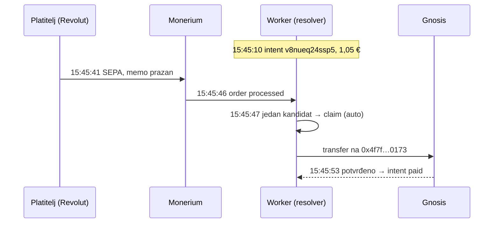

# ADR 0018 — Uplate bez reference: povezivanje s intentom po tenantu, iznosu i vremenu

- **Status:** Accepted (2026-10-08, grana `feat/stray-resolver`)
- **Kontekst:** `backend/` (Cloudflare Worker, MPT rail)
- **Gradi na:** [0016](0016-tenant-payout-whitelist.md) (forward je fail-closed,
  binding + whitelist) · [0017](0017-multi-tenant-rail.md) (tenant = rail)
- **Kod:** `backend/src/monerium/strayResolver.ts`, `forward.ts` (`handleForward`,
  `rerouteParkedOrder`), `intents/db.ts` (`findStrayCandidates`,
  `listRerouteCandidates`), migracija `0018_stray_resolver.sql`, admin
  `/admin/forwards` → „Preusmjeri…“

## Problem

Od 7. 10. 2026. Revolut iOS ispušta remittance iz EPC QR-a kad stanje računa
pokriva iznos (memory `feedback_epc_format`, ~45 varijanti formata provjereno bez
učinka). Isto se događa i kad platitelj ručno obriše ili prepiše referencu.
Takva uplata stigne s praznim memom, a ADR 0016 je parkira kao
`no_routing_target`. EURe ostaje u MPT Safe-u dok operater ručno ne napravi
transfer.

Produkcija 7. 10. (tenant `italk`, isti platitelj):

| forward | uplata | iznos | intenti tenanta s istim iznosom | što je trebalo napraviti |
|---|---|---|---|---|
| #68 | 17:56:51 | 1,02 | `z232pb646itg`, kreiran 70 s prije, još otvoren | jedinstven pogodak |
| #70 | 20:49:06 | 1,00 | `sqbwkeratgmm`, `nycwuw2m6u4t`, oba istekla ~7 min ranije | dva kandidata, **ista adresa** |
| #71 | 21:05:11 | 1,00 | `nycwuw2m6u4t` (drugi je preuzeo #70) | jedinstven pogodak |

Sve tri uplate imale su jednoznačno odredište. Rail je imao sve podatke da ih
proslijedi sam.

## Odluka

1. **Zalutala uplata** je ona čiji memo i `referenceNumber` nemaju ni adresu, ni
   sid, ni id kampanje. Goli `0x…` / `gnosis:` memo **nije** zalutala uplata:
   platitelj je naveo odredište koje odbijamo, a pogađati neko drugo bilo bi
   gore od parkiranja.
2. **Kandidati** su intenti tenanta čiji je IBAN primio novac. Moraju imati
   **točno** isti `amount_cents` i biti kreirani u prozoru
   `[placedAt − 48 h, placedAt + 2 min]`. Moraju biti `pending` ili `expired`
   bez namire, i ne smiju već imati živi forward.
3. **Odluka, u dva sloja** (dopuna 2026-10-09):
   - ako je u trenutku uplate bio **otvoren** barem jedan kandidat
     (`expires_at ≥ placedAt`), odlučuju **samo otvoreni**; istekli se ne gledaju;
   - ako nijedan nije bio otvoren, odlučuju svi istekli iz prozora;
   - kandidati sloja koji odlučuje vode na istu adresu → forward;
   - vode na različite adrese → park, a alert ispisuje kandidate tog sloja;
   - nema kandidata → park.
4. **Redoslijed za pripisivanje:** najnoviji intent sloja koji odlučuje prvi.
   Forward uzima prvi nezauzeti kandidat. Istekli kandidati ne ulaze u popis
   kad odlučuju otvoreni — gubitnik istovremenog preuzimanja se parkira, ne
   pada na checkout koji je već bio gotov.
5. **Gate se ne zaobilazi.** Iz kandidata se sastavi `mpt:` routing (adresa i sid
   intenta) i on prolazi isti `authorizeForward` kao memo: tenant, whitelist,
   kapica i mint adresa.
6. **Zasun po intentu:** `ux_forwards_resolved_sid` dopušta najviše jedan živi
   `auto`/`manual` forward po sid-u. Dvije istovremene uplate istog iznosa ne
   mogu uzeti isti intent; gubitnik prelazi na sljedeći kandidat ili se parkira.
7. **Trag:** `monerium_forwards.memo_prefix` = `auto` (resolver) ili `manual`
   (admin). Svako povezivanje šalje Telegram alert 🔀. Kad je bilo više kandidata
   s istom adresom, alert to navodi uz ⚠️.
8. **Park uvijek prijavljuje ono što je platitelj stvarno poslao.**
   `forward.blocked` webhook nikad ne imenuje intent kojem uplata samo *možda*
   pripada.
9. **Ručno preusmjeravanje:** u `/admin/forwards` parkirani red ima gumb
   „Preusmjeri…“. Gumb prikazuje intente tenanta oko vremena uplate, bilo kojeg
   iznosa, a isti iznos ide prvi. `POST /admin/api/orders/:id/reroute {sid}`
   pokreće isti forward put s odabranim sid-om, pa i tu odlučuje gate.
10. **Prekidač:** `STRAY_RESOLVER = "1"` u `wrangler.toml`. Vrijednost `"0"`
    vraća staro ponašanje; ručni gumb radi neovisno o prekidaču.

### Dopuna 2026-10-09: zašto dva sloja

Produkcija 8. 10. (order `a30abad7…`, forward #78, 1,00 €): dva **otvorena**
intenta za Rab (jedan kreiran 41 s prije uplate) i jedan za Lukavec **istekao
~4 h ranije**. Jednoslojno pravilo vidjelo je dvije adrese i parkiralo. Otvoren
checkout je puno jači signal od onog isteklog prije nekoliko sati, a zadani
iznos od 1 € na energy.domovina.ai čini takve sudare čestima. Replay je u
`test/strayResolver.test.ts`.

Rizik: platitelj koji kasno plati po **isteklom** QR-u dok je za istu svotu
otvoren tuđi checkout za drugu elektranu. Ista vrsta greške kao u Poznatim
ograničenjima — pogrešna namjena unutar tenanta, nikad tuđi novac.

## Zašto je to sigurno

Resolver ne izmišlja odredište: svaka adresa koju predloži je `target_address`
nekog intenta i i dalje mora proći whitelist.

> **Ispravak 2026-10-10 (Fable 5.1 r2, SR-01).** Izvorna tvrdnja „napadač bez
> API pristupa ne može stvoriti kandidata" nije vrijedila za zadani tenant
> `italk`: intenti se stvaraju bez ključa (`INTENT_REQUIRE_TENANT_KEY=0`), a
> njegova whitelista uključuje svaki self-registrirani wallet Safe (bez dokaza
> posjeda). Napadač je mogao držati otvorene intente za uobičajene iznose na
> vlastiti wallet i pokupiti zalutalu uplatu čiji je intent istekao, ili samo
> izazivati `conflict`.
>
> **Uvjet sigurnosti od tada:** kandidat sudjeluje u odluci samo ako je
> **trusted** — odredište je na *statičnoj* whitelisti tenanta (`source` =
> `admin` ili ne-wallet `seed`; wallet redovi iz seeda 0014 su migracijom 0022
> preimenovani u `seed_wallet`) **ili** je intent stvoren tenantovim tajnim
> (`sk_`) ključem (`payment_intents.created_with_key`). Netrusted kandidati ne
> ulaze ni u jedan sloj: ne mogu ni uhvatiti novac ni izazvati sukob; park
> poruka kaže koliko ih je bilo. Ručni reroute na njih traži pisani razlog.
> Uz to: najviše `MAX_OPEN_INTENTS_PER_TARGET` (zadano 20) otvorenih intenata
> na netrusted odredište bez `sk_` ključa → 429. Kapica namjerno ne vrijedi za
> trusted odredišta, da spam ne zaključa prave darovatelje kampanje.
>
> Posljedica za projekte: novi energy/solardei Safe mora biti upisan kroz
> `/admin/whitelist` (izvor `admin`) da bi njegove uplate bez reference išle
> automatski; s memoom (sid) radi i bez toga.

Može pogriješiti samo **pripisivanje** između intenata iste adrese: koji od njih
postane `paid` i koji merchant webhook ode. Novac u tom slučaju ipak sleti tamo
kamo bi ga poslao bilo koji od kandidata.

## Poznata ograničenja

- **Trajni QR kampanje (`cmp:`, iznos upisuje platitelj).** Ako Revolut ispusti
  i taj memo, a slučajno postoji intent istog tenanta s točno tim iznosom i
  drugom adresom, resolver će uplatu poslati na tu adresu. Šteta je ograničena
  na pogrešnu namjenu **unutar istog tenanta**, nikad na tuđi novac:
  - kandidati dolaze samo iz tenanta čiji je Monerium račun (IBAN) primio
    uplatu, a ADR 0017 daje svakom tenantu vlastiti Monerium račun, rail,
    relayer i 1..N namjenskih Safe-ova;
  - odredište mora biti na whitelisti tog tenanta, dakle jedan od njegovih
    Safe-ova;
  - tenant može naknadno ručno prebaciti novac između svojih Safe-ova. To vrijedi
    za Safe-ove koje tenant kontrolira; Safe s vanjskim vlasnikom (npr. 1/1
    passkey Safe kampanje) treba potpis tog vlasnika.

  Zato je to prihvatljiv rizik, a ne razlog za isključivanje resolvera. Ako se
  počne događati, rješenje je učenje platitelja (sljedeći korak), ne gašenje
  `STRAY_RESOLVER`.
- **Krivo upisan iznos** se ne povezuje automatski. Za to služi ručni gumb.
- **Memo sa sid-om, ali bez adrese** se i dalje parkira. Tu je sid jači signal
  od iznosa, pa je to kandidat za zasebnu odluku.

## Sljedeći korak (zaseban PR)

Frontend šalje trajni `client_ref` pri `POST /api/intents`. Kad uplata prođe
preko sid-a, server zapiše vezu `client_ref` → `hash(pepper + IBAN)`; sirovi
IBAN se ne sprema, po obrascu `PHONE_PEPPER`. Kandidati povezani s IBAN-om
platitelja tada idu prvi. To rješava istovremene uplate istog iznosa od
različitih ljudi, a otvorena checkout stranica (SSE) daje dodatni signal da je
intent „živ“.

## Implementacija

| Stavka | Status |
|---|---|
| Resolver + gate + zasun (migracija 0018) | ✅ #59, deployano 2026-10-08 |
| Admin „Preusmjeri…“ | ✅ #59 |
| Replay 7. 10. u testovima (`test/strayResolver.test.ts`) | ✅ |
| Status `resolved_offrail` + „Riješeno ručno…“ (§Rukovanje parkiranim uplatama) | ✅ #62, deployano 2026-10-08 |
| `client_ref` + učenje platitelja | ⏳ |
| energy.domovina.ai panel nakon `expired` | ⏳ (§Otvoreno) |

## Produkcija 2026-10-08

**Ručno preusmjeravanje 7. 10.** (admin, sesija s passkeyem, `memo_prefix='manual'`):

| Uplata | Intent | Forward | Tx |
|---|---|---|---|
| #68 1,02 € | `z232pb646itg` | 72 | `0x3f9499a2…` |
| #70 1,00 € | `sqbwkeratgmm` | 73 | `0xa6fb18bb…` |
| #71 1,00 € | `nycwuw2m6u4t` | 74 | `0x858b1256…` |

Lista kandidata u adminu dala je isti redoslijed kao replay test: za #71 je
`sqbwkeratgmm` već bio preuzet, pa je prvi kandidat bio `nycwuw2m6u4t`. Sva
tri intenta su istekla prije uplate, pa je namira zapisana kao zakašnjela
(`payment.late`). MPT Safe nakon toga: 0 EURe. Između forwarda čekala se
potvrda na chainu, jer sve potpisuje isti router EOA, a nonce manager je
otvoren (Fable 5.1 review, P0-5).

**Prvi automatski stray** (energy.domovina.ai/beta/lukavec, Revolut iOS
ispustio referencu):

Od uplate do `paid` prošlo je ~12 s, od `processed` ~6,5 s, isto kao uplata s
referencom. Detektor krađe (ADR 0019 faza 0) nije alarmirao.

## Produkcija 2026-10-09: rano „zaprimljeno“ (#65)

Order `9e691f01…` (Lukavec, 1,00 €, opis prazan, intent `szdmvyd3r536`):

| Δ od `placedAt` (22:57:21 UTC) | događaj |
|---|---|
| 0 s | `order.created` → `previewStraySid` → `sid_resolved=szdmvyd3r536`, SSE „zaprimljeno“ |
| +7 s | `processed` → forward #81 `auto` na **isti** sid |
| +13 s | potvrđeno → intent `paid` |

Platitelj je „zaprimljeno“ vidio ~5 s nakon „Send“ u Revolutu; to je vrijeme
prije `placedAt` (Revolut + SEPA Instant), ne rail. Prije #63 isti tip uplate se
8. 10. parkirao (order `a30abad7…`, forward #78: istekli 1 € intent za drugi
Safe u prozoru) — zato dva sloja u §Odluka 3.

## Rukovanje parkiranim uplatama

Parkirani order koji su 2/3 vlasnika isplatili **ručno mimo raila** rail i
dalje vidi kao „novac u Safe-u“. Order `39e395a9…` (21. 5., isplaćen
transferom `0xa2a877b8…` iz safe-tx/003) nudio je „Preusmjeri…“. Klik bi
platio drugi put, tuđim novcem koji je u tom trenutku u Safe-u. Zato:

- status `resolved_offrail` s tx hashom ručnog transfera; server prije upisa
  provjeri tx na chainu (uspješan, EURe izlaz iz Safe-a raila);
- jedan tx zatvara samo jedan order;
- `checkReroute` ga odbija, a ponovno isporučen webhook ga preskače.

**Pravilo:** svaki ručni 2/3 transfer koji rješava parkiranu uplatu odmah se
upisuje kroz „Riješeno ručno…“. Na dan uvođenja u bazi nije bilo nijedne
parkirane uplate bez rješenja.

## Otvoreno

- ~~**Bez međukoraka „zaprimljeno“.**~~ **Riješeno 2026-10-09** (migracija
  0021): na `order.created` bez reference webhook pokrene resolver **samo za
  čitanje** (`previewStraySid`) i odabrani sid zapiše u
  `monerium_webhook_events.sid_resolved`, odvojeno od `sid_extracted` („što je
  pisalo u opisu“). `loadStageContext` traži order po oba stupca i SSE se
  javlja odmah, pa checkout pokaže „zaprimljeno“ ~1 s nakon Send umjesto
  „plaćeno“ tek na ~15 s. Ništa se ne miče na tu vrijednost: forward i dalje
  odlučuje na `processed` istim pravilom. Mogu se razići samo ako se kandidati
  promijene između `created` i `processed` (~8 s) — tada je „zaprimljeno“
  upaljeno na intentu **iste** adrese. Sukob ili nijedan kandidat → ništa se
  ne pali, checkout čeka kao prije.
- **energy.domovina.ai nakon isteka.** `isTerminal()` u `lib/mpt-intent.ts`
  tretira `expired` kao kraj i zatvara stream. Backend zakašnjelu namiru
  prikazuje kao `settled` (`stage.ts`: order postoji, forward potvrđen), ali
  panel je vidi tek nakon osvježavanja. Popravak: nakon `expired` povremeno
  dohvatiti status još neko vrijeme (npr. 48 h dok je tab otvoren).
- **Dvije istovremene uplate istog iznosa** od različitih ljudi: rješava ih
  `client_ref` (§Sljedeći korak).
