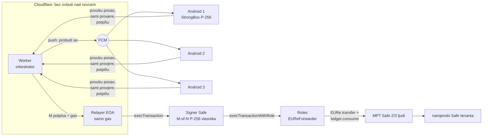

# ADR 0019 — Forward potpisuje M-of-N kvorum Android uređaja; Cloudflare samo orkestrira i plaća gas

- **Status:** Proposed (2026-10-08)
- **Kontekst:** MPT rail (`backend/`, `backend/safe-tx/`), nova Android aplikacija
- **Gradi na:** [0004](0004-phase-5c-android-verifier.md) (Android StrongBox P-256
  kvorum, key attestation) · [0016](0016-tenant-payout-whitelist.md) (whitelist) ·
  [0017](0017-multi-tenant-rail.md) (rail po tenantu) ·
  [0018](0018-stray-payment-resolver.md) (zalutale uplate)
- **Zamjenjuje:** varijantu „kapica po transferu + allowance“ iz
  `backend/safe-tx/006-scope-eure-transfer-recipients.md` (odbijena, v. §Odbijeno)

## Problem

Stanje on-chain 2026-10-08 (blok 48652060, čitanje svih eventa Roles modifiera
`0x3303…762c`):

| Što | Stanje |
|---|---|
| MPT Safe `0x449a…af2e` | 2/3 ljudskih vlasnika, jedini modul = Roles |
| Rola `EUReForwarder` | član = EOA `0xd612…54CB` (blok 46287783) |
| Dopuštenje | `ScopeTarget(EURe)` + `AllowFunction(EURe, transfer, options=0)` |
| Uvjeti na parametre (`ScopeFunction`) | **nikad postavljeni** |

Privatni ključ toga EOA-a je `ROUTER_PRIVATE_KEY`, Workers secret. Tko može
deployati Worker, može ga pročitati, jer Worker ima secrete u memoriji dok
radi; isto vrijedi za `TENANT_SECRETS_KEK` i ključeve tenant railova. S tim
ključem netko šalje sav EURe iz Safe-a na bilo koju adresu. Još gore, kao
trajni napadač presreće **svaku sljedeću uplatu** dok 2/3 vlasnika ne opozovu
rolu.

Whitelist (ADR 0016) i resolver (ADR 0018) odlučuju u Workeru, pa štite od
pogrešnih uputa platitelja. Od kompromitiranog clouda ne štite.

## Odluka

**Ključ koji smije pomaknuti EURe nikad nije u cloudu.** Uloge su podijeljene:

| Uloga | Tko | Kome se vjeruje |
|---|---|---|
| Orkestrator | Cloudflare Worker: webhook, intent, resolver, red poslova, push, prikupljanje potpisa | **ne vjeruje se** |
| Sponzor gasa | Cloudflare relayer EOA: šalje transakciju i plaća xDAI | **ne vjeruje se** (smije samo platiti gas) |
| Potpisnici | M-of-N Android uređaja na fizički odvojenim lokacijama, P-256 ključ u StrongBoxu | **vjeruje se** |

### 1. On-chain oblik: „signer Safe“ kao član role

- Član role `EUReForwarder` više nije EOA nego **signer Safe**. Njegovi vlasnici
  su `SafeWebAuthnSignerProxy` instance, po jedna za P-256 ključ svakog
  uređaja (isti `SafeWebAuthnSignerFactory` stack kao DOMOVINA Wallet).
- Prag raste s mrežom: **2/3 → 4/6 → 11/21**.
- **P-256 precompile radi na Gnosisu:** provjereno 2026-10-08 na `0x…0100`.
  Ispravan potpis vraća `1`, promijenjen ne vraća ništa, `estimateGas` je
  ~30,8k za cijeli poziv. Wallet već kodira `precompile << 160 | Daimo
  fallback` (`wallet/src/lib/safe.ts`), pa provjera potpisa ide kroz jeftini
  precompile. I 11 potpisa po forwardu je reda veličine stotina tisuća gasa.
- Roles ostaje i dalje ograničava kvorum: kvorum smije **samo** `EURe.transfer`
  (+ `ledger.consume`, §3). Ne može mijenjati vlasnike MPT Safe-a, Roles
  postavke ni druge tokene.
- **Kočnica za hitne slučajeve:** 2/3 ljudskih vlasnika MPT Safe-a opozove rolu
  jednom transakcijom.

### 2. StrongBox i WebAuthn omotnica

Android Keystore / StrongBox podržava samo P-256 (secp256r1), ne secp256k1, pa
običan EOA ključ ne može biti u hardveru. `SafeWebAuthnSigner` ne traži pravi
authenticator, nego provjerava P-256 potpis nad
`sha256(authenticatorData ‖ sha256(clientDataJSON))`, gdje je challenge u
`clientDataJSON` `safeTxHash`. Uređaj zato sam sastavi minimalni
`authenticatorData` (rpIdHash + flags + counter) i `clientDataJSON` te potpiše
ključem iz StrongBoxa (`setIsStrongBoxBacked(true)`, neizvoziv, isti
`KeyGenParameterSpec` kao ADR 0004).

**Ne koriste se** Credential Manager passkeyi: sinkroniziraju se u Google
Password Manager i nisu vezani za hardver.

### 3. Politika na uređaju: telefon ne potpisuje naslijepo

Ako telefon potpisuje sve što mu cloud pošalje, ključ je preseljen, ali odluka
nije. Svaki uređaj prije potpisa **sam, preko vlastitog RPC-a** (najmanje dva
neovisna providera), provjerava:

1. **Novac je stvarno stigao.** Posao navodi `mintTxHash`. Uređaj u tom tx-u
   nalazi Monerium mint EURe-a u MPT Safe tenanta i provjerava da je zbroj
   transfera u poslu ≤ mintani iznos.
2. **Svaki mint troši se jednom, i to se provodi on-chain.** Batch uz
   `transfer` zove `ForwardLedger.consume(mintTxHash, amount)`, koji revertira
   na ponovljeni hash. Uređaju ne treba lokalno stanje (offline uređaj ne
   može biti prevaren replayem), a kompromitirani orkestrator ne može dvaput
   potrošiti isti mint.
3. **Primatelj je dopušten.** Adresa mora biti na **on-chain popisu isplatnih
   adresa tenanta** (`PayoutRegistry`, upisuje ga tenantov Safe s ljudskim
   vlasnicima). D1 whitelist postaje cache tog registra, a ne izvor istine.
4. **Simulacija:** `eth_call` cijelog `execTransaction` mora proći i ne smije
   pomaknuti ništa osim navedenih EURe transfera.
5. **Nema kapice na iznos** (v. §Odbijeno).

Ako ijedna provjera padne, uređaj odbija posao, a Worker šalje Telegram alert
s razlogom. Rezultat: kompromitirani cloud može najviše rasporediti stvarno
primljeni novac **na pogrešnu dopuštenu adresu istog tenanta** (isti rizik
kao ADR 0018, popravljiv ručno unutar tenanta). Ne može ga izvući van ni
potrošiti dvaput.

### 4. Tok jednog forwarda

1. Monerium webhook → Worker (`authorizeForward`, resolver) → red čekanja
   `forward_jobs`: Safe tx signer Safe-a, `safeTxHash`, nonce, `mintTxHash`.
2. **Push služi samo za buđenje:** FCM high-priority data poruka bez sadržaja.
   Uređaj zatim sam **povuče** posao preko HTTPS-a s autentifikacijom uređaja.
   Ništa osjetljivo ne prolazi kroz Google. Uređaj nema ulazni port; to je
   jednostavnije od ingressa preko CF Tunnela iz ADR 0004 i prolazi kroz NAT.
   Rezervni put: uređaj sam provjerava red svakih 60 s.
3. Uređaj provede §3, potpiše i vrati potpis.
4. Kad stigne M potpisa, relayer pošalje `execTransaction` i plati gas.
5. Potvrda i `paid` ostaju na postojećem putu (`intents/confirm.ts`).

**Redoslijed:** nonce signer Safe-a je sekvencijalan. Worker sve forwarde koji
čekaju skupi u jedan MultiSend po nonceu, pa se jedna runda potpisa plaća
jednom.

**Kašnjenje:** danas ~12 s do namire. Procjena za novi tok je +10–20 s (push,
dva RPC providera, prikupljanje M potpisa).

### 5. Dostupnost

- Kad uređaji ne odgovore, ništa ne propada. Posao čeka, a nakon N minuta bez M
  potpisa šalje se Telegram alert. Uplata ostaje u MPT Safe-u, kao parkirana.
- Uređaji su na **više fizičkih lokacija**, na stalnom napajanju, s isključenom
  optimizacijom baterije i kao foreground service.
- 2/3 podnosi ispad jednog uređaja, 4/6 dva, 11/21 deset.

### 6. Upis i opoziv uređaja

- Upis uređaja: generira se ključ u StrongBoxu, Google Key Attestation lanac
  provjere postojeći operateri (izvan lanca, kao ADR 0004), a zatim signer Safe
  `addOwnerWithThreshold` potpisuje postojeći kvorum.
- Opoziv izgubljenog uređaja: `removeOwner` kvorumom. Ako je kvorum
  kompromitiran, 2/3 ljudi na MPT Safe-u opoziva cijelu rolu.
- Isti uređaji i aplikacija mogu služiti i ADR 0004 (verifier), ali **s
  odvojenim ključem po namjeni**.

### 7. Multi-tenant

Svaki tenant ima svoj MPT Safe + Roles (ADR 0017). Zadano je isti signer Safe
(DOMOVINA mreža uređaja) član role svakog tenanta. Tenant može kasnije
dobiti vlastiti kvorum uređaja bez promjene ugovora.

### 8. Android aplikacija: jednostavna, bez ovisnosti, uvijek budna

Polazište su dvije postojeće aplikacije na namjenskim telefonima
(pregled 2026-10-08):

- **`bank-push-gateway`** je predložak: nula ovisnosti (kod se može pročitati u
  cijelosti), Views bez Composea, jedan modul, SQLite red s 2xx/4xx/ostalo
  semantikom, HMAC potpis zahtjeva, `allowBackup=false` i backup/device
  transfer isključeni, release samo HTTPS.
- **`httpsms`** daje mehanizme za buđenje: FCM data-only poruka koja nosi
  najviše id posla, nakon čega uređaj **povuče** posao. Uz to: receiveri za
  BOOT_COMPLETED / LOCKED_BOOT_COMPLETED / MY_PACKAGE_REPLACED /
  USER_UNLOCKED, hvatanje odbijenog pokretanja foreground servicea,
  WorkManager kao rezerva i serverski watchdog (propušten heartbeat → FCM
  ping → alert).

Odluke za signer:

| Tema | Odluka |
|---|---|
| Servis | foreground service tipa `remoteMessaging` (provjereno u httpsms, smije se pokrenuti s boota), START_STICKY, petlja svakih 60 s kao rezerva za push, WorkManager periodični backstop. **Ne** `dataSync`: na Androidu 15 ograničen je na ~6 h dnevno i ne smije se pokretati s boota |
| Push | FCM **high priority**, data-only, bez sadržaja osim id-a; jedina Firebase ovisnost je Messaging (bez Analyticsa i Crashlyticsa) |
| Baterija | izuzeće od optimizacije baterije i status na ekranu; OEM postavke (Motorola, Xiaomi, Samsung) se dokumentiraju po modelu |
| Ključevi | **dva** StrongBox P-256 ključa: `sign` (Safe potpis, §2) i `auth` (potpis HTTP zahtjeva prema Workeru). Nijedan secret nije u SharedPreferences. Ključevi **bez** `setUserAuthenticationRequired` i `setUnlockedDeviceRequired`, inače zaključan telefon ne može potpisati |
| Auth zahtjeva | potpis `auth` ključem nad metodom, putanjom, id-om posla, timestampom i jednokratnim nonceom; Worker troši nonce tek nakon provjere potpisa |
| Upis | QR s jednokratnim kodom (10 min) + Google Key Attestation lanac za oba ključa; operater potvrđuje u adminu, zatim kvorum potpisuje `addOwnerWithThreshold` |
| Heartbeat | verzija aplikacije, vrijeme zadnjeg potpisa, broj odbijenih poslova, baterija, punjenje, mreža; watchdog na Workeru alarmira nakon 15 min tišine |
| Distribucija | sideload, ali **release ključ** (nikad debug); Worker uz attestation provjerava digest certifikata kojim je aplikacija potpisana. Nema exportanih komponenti, nema debug ulaza (intent extras) u releaseu |
| Restart | nakon nestanka struje telefon je offline dok ga netko ne otključa (credential-encrypted storage). Prihvaćeno: zaključan ekran štiti uređaj, kvorum podnosi ispad, heartbeat alarmira |

Što se iz tih projekata **ne preuzima**: secreti u običnim prefs, logiranje
ili prikaz ključa, release potpisan debug ključem, debug build u produkciji,
replay prozor bez noncea, cleartext i nezaštićeni listener te slijepo
izvršavanje onoga što server vrati.

## Odbijeno

- **Kapica po transferu i rolling allowance (batch 006, varijanta s
  kapicom).** Fragmentirala bi legitimne uplate: intent od 600 € uz kapicu
  250 € postao bi tri transfera kroz nekoliko dana. MPT intent mora moći
  prenijeti bilo koji iznos koji je stvarno stigao. Štetu ograničavaju
  vezanje uz mint (§3.1–2), on-chain registar primatelja (§3.3) i M-of-N
  kvorum, a ne iznos.
- **secp256k1 EOA ključ šifriran ključem iz StrongBoxa.** Ključ bi pri svakom
  potpisu postojao u RAM-u aplikacije.
- **Telefon kao pošiljatelj transakcije.** Trebao bi xDAI i izravnu vezu prema
  chainu. Sponzor gasa u cloudu ne nosi rizik jer smije samo platiti gas.
- **Synced passkeyi (Credential Manager).** Nisu vezani za hardver.
- **Jedan uređaj.** Jedna točka kvara za dostupnost.

## Faze

| # | Što | Napomena |
|---|---|---|
| 0 | Detektor krađe: cron čita `Transfer` evente iz MPT Safe-a i alarmira svaki bez `monerium_forwards` reda (`outflowWatch.ts`). Povijest do bloka ~48,65M: 66 naših, 0 kroz rolu mimo raila, 2 ℹ️ (CowSwap dopuna, ručni 2/3 povrat) | ✅ #60, deployano 2026-10-08; kursor od bloka 48652939, ručni i auto forwardi istog dana prepoznati kao naši |
| 1 | Spike: StrongBox P-256 → WebAuthn omotnica → `SafeWebAuthnSignerProxy.isValidSignature` na Gnosis forku, mjerenje gasa za 2/3 i 11/21 | potvrđuje §2 |
| 2 | Ugovori: signer Safe 2/3, `ForwardLedger`, `PayoutRegistry`; Roles proširenje (`ledger.consume`) | 2/3 ljudi potpisuju batch |
| 3 | Android aplikacija: foreground service, push + pull, politika §3, upis uređaja s attestationom | |
| 4 | Worker: `forward_jobs`, push, prikupljanje potpisa, MultiSend po nonceu | |
| 5 | **Shadow mode:** uređaji provjeravaju i potpisuju paralelno, stari EOA i dalje šalje; uspoređuju se odluke | bez rizika |
| 6 | Prelazak: `assignRoles(signerSafe, true)`, `assignRoles(0xd612…, false)`, brisanje `ROUTER_PRIVATE_KEY` | 2/3 ljudi |
| 7 | Rast mreže: 4/6, zatim 11/21 | |

## Otvorena pitanja

- `PayoutRegistry` za tenanta `italk`: danas su isplatne adrese i Safe-ovi
  korisnika walleta (whitelista je 2026-06 imala 51 adresu). Treba odlučiti
  upisuje li ih tenantov Safe pojedinačno ili isplate idu preko namjenskog
  Safe-a tenanta koji dalje raspodjeljuje.
- Točni zahtjevi za `authenticatorData` flags u `SafeWebAuthnSigner` (UP/UV);
  rješava ih spike u fazi 1.
