# Napredna inicijalizacija Safe novčanika — svi slučajevi

> Status: **draft / design exploration** (2026-06-27)
> Kontekst: omogućiti korisniku da pri kreiranju novog Safe računa odabere
> **potpisnike**, broj **dodatnih backup EOA-a** i **threshold (M-of-N)**, te dobije
> **offline PDF backup** (A4 + foto 15×10 cm). Glavni use-case: namjenski
> novčanik za pinka.io kampanju.
>
> Povezano: [[0012-recovery-seed-second-owner-interop]], [[0013-passkey-as-identity-safe-as-account]],
> Postmortem 0001 (passkey-only traps funds), MPT Zodiac Roles arhitektura.

---

## 0. TL;DR

Safe ima **jedan globalni threshold M-of-N** — ne postoji native "1/N do 10€, 3/N
do 100€, 67% za veće". Tiering se gradi **slojevito** (Allowance modul + Zodiac
Roles + bazni threshold). Zato je plan **fazni**:

| Faza | Što | Dira relay/signing? | Rizik |
|---|---|---|---|
| **1** | +N backup EOA, threshold ostaje **1** | **NE** | nizak |
| **2** | pravi **M-of-N** (threshold > 1) | **DA** (co-signing UX) | srednji |
| **3** | **amount-tiered** policy | preko Zodiac/Allowance modula | usvojiti gotovo |

Invarijanta kroz sve faze: **owner-lista postaje persistirani podatak**, jer o njoj
ovisi CREATE2 adresa, a extra EOA-i nisu izvedivi iz passkeya.

---

## 1. Trenutno stanje (danas)

Svaki račun je fiksno `[passkeySigner, recoveryOwner]`, threshold uvijek `1`.

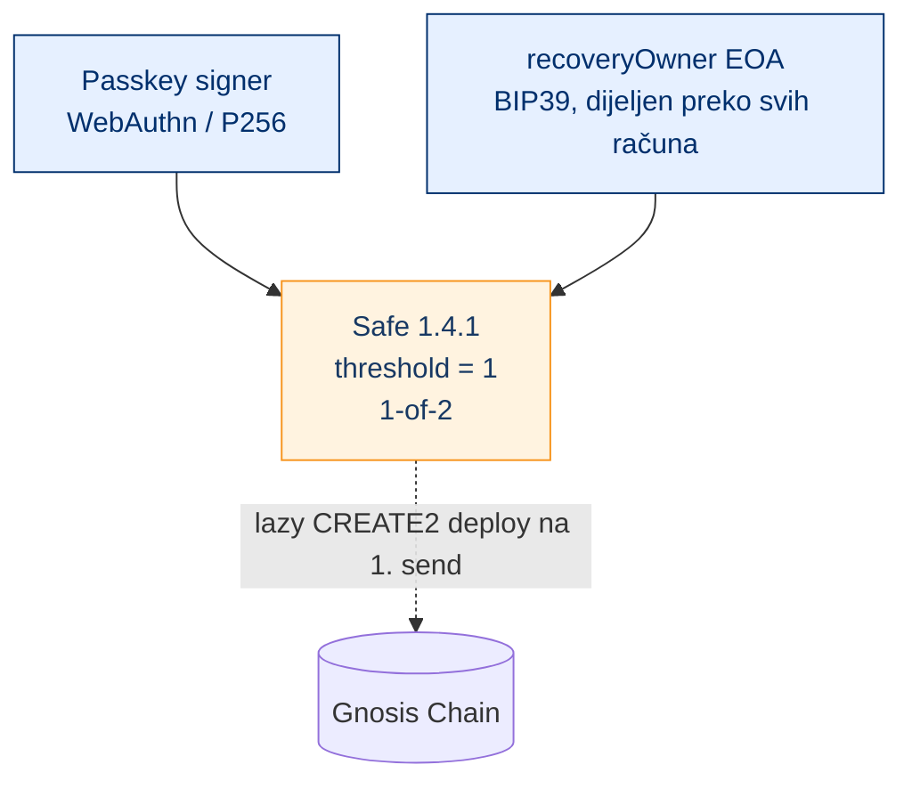

Ključne točke u kodu:
- `wallet/functions/_lib/safe.ts` → `buildSafeInitializer(owners)` hardkodira `setup(owners, 1n, …)`
- `wallet/src/lib/accounts.ts` → `derivedOwners(signer, recovery) = [signerAddress, recoveryOwner]`
- `recoveryOwner` tajna (mnemonic) se **nikad ne persistira** — samo adresa; prikaže se jednom u PDF-u
- Deploy: relayer rekonstruira owner-array **istim kanonskim redoslijedom**

---

## 2. Prostor svih konfiguracija

Korisnik bira tri ortogonalne stvari: **broj extra EOA-a**, **threshold**, i
**je li uključen amount-tiered policy**.

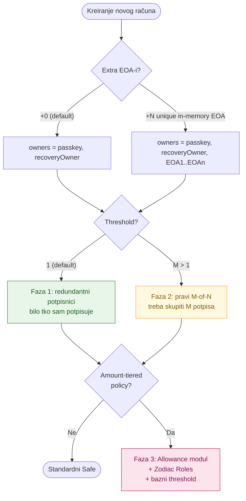

### 2.1. Matrica slučajeva

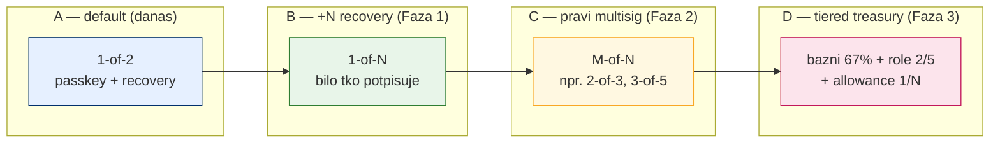

---

## 3. Invarijanta: owner-lista je PODATAK (CREATE2 reproducibilnost)

CREATE2 adresa Safe-a ovisi o **(owners, threshold, saltNonce)**. Extra EOA-i su
**random**, dakle **nisu izvedivi iz passkeya** — pa ako se ne persistiraju, drugi
uređaj ne može rekonstruirati istu adresu pri deployu.

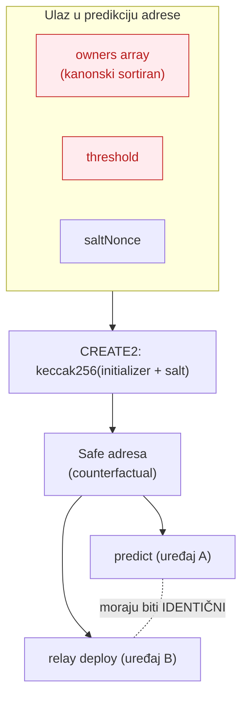

> **Zato:** za napredne račune backend **mora** spremiti eksplicitnu `owners`
> listu + `threshold`. Za default račune (`+0`, threshold 1) ostaje fallback na
> izvedeni `[signer, recoveryOwner]` zbog back-compata.

### 3.1. Promjena modela podataka

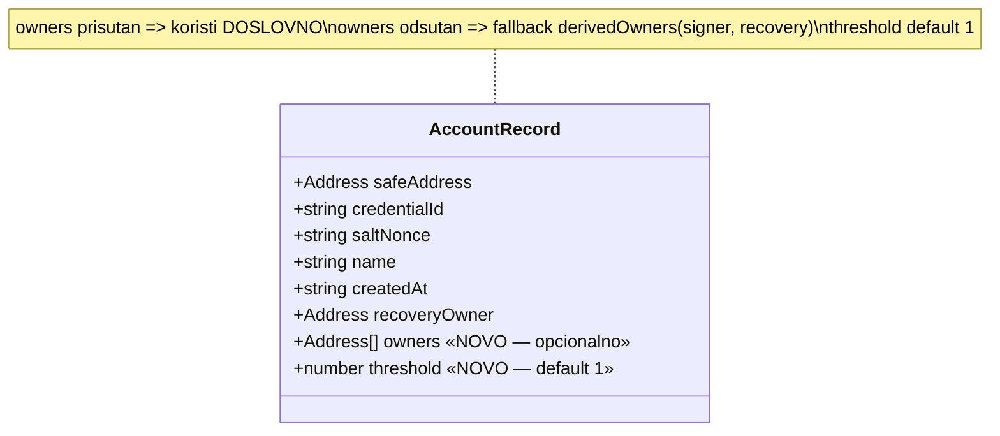

Kanonski redoslijed (dokumentirati i koristiti svugdje — predict + deploy + relay):

```
owners = [ signerAddress, recoveryOwner, ...extraEOAs.sort(asc) ]
```

---

## 4. Faza 1 — "+N backup EOA", threshold = 1

Više vlasnika, ali **svaki sam može potpisati** → čista **redundantna recovery**.
Ne dira relay ni signing UX. Gasi postmortem 0001 (1/1 lost-passkey trap) za pinka.

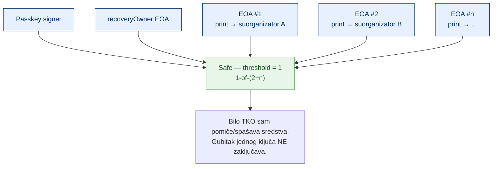

### 4.1. Tok kreiranja (in-app)

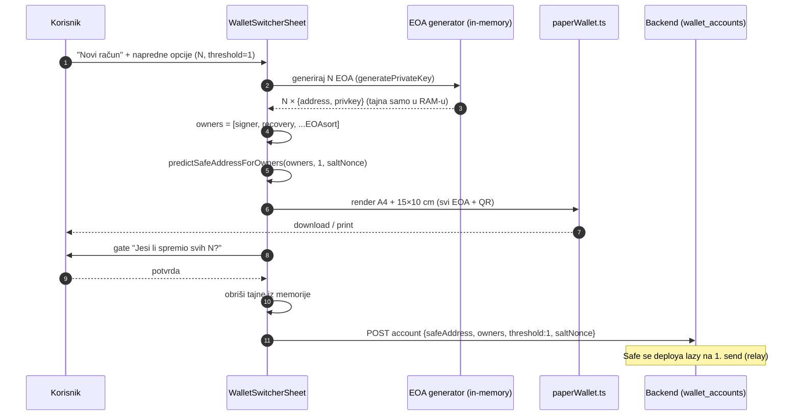

### 4.2. PDF backup (svi formati)

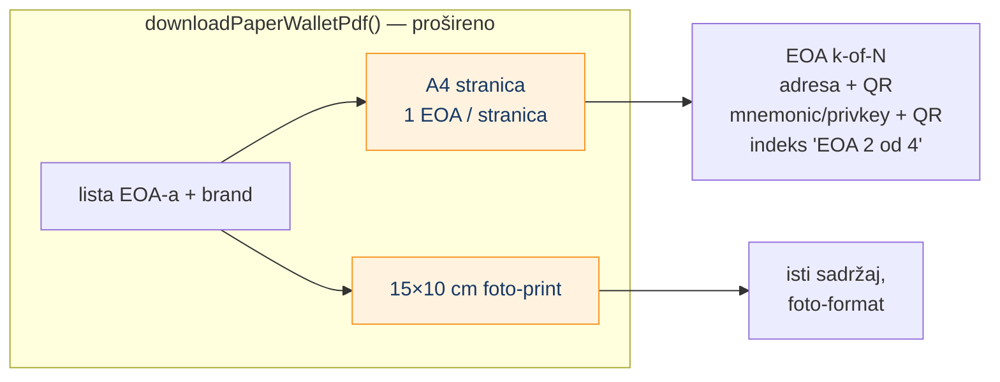

> Napomena o formatu: "15×10 inch" je ~38×25 cm (vrlo veliko). Standardni
> foto-print je **15×10 cm** — pretpostavka u dokumentu. Oba su trivijalna za
> dodati (samo page-size).

---

## 5. Faza 2 — pravi M-of-N (threshold > 1)

Ovdje **pada one-tap relay**: relayer slaže `execTransaction` s **jednim** passkey
ERC-1271 potpisom. Za M-of-N treba **skupiti M potpisa** (passkey + EOA iz PDF-a),
sortirati po owner-adresi i konkatenirati.

```mermaid
sequenceDiagram
  autonumber
  participant U as Korisnik
  participant UI as Send UI (novi co-sign flow)
  participant PK as Passkey (WebAuthn)
  participant K as EOA ključevi (iz PDF-a)
  participant R as Relayer
  participant C as Safe on-chain

  U->>UI: Pošalji X EURe
  UI->>PK: potpis #1 (ERC-1271)
  PK-->>UI: signature(passkey)
  loop dok skupiš M potpisa
    UI->>K: uvezi/potpiši EOA (privkey)
    K-->>UI: signature(EOA_i)
  end
  UI->>UI: sortiraj potpise po owner-adresi, konkateniraj
  UI->>R: execTransaction(to, value, data, signatures[M])
  R->>C: relay
  C-->>U: tx hash
  Note over UI,C: Gubitak PDF-a + M&gt;1 = TRAJNO zaključana sredstva ⚠️
```

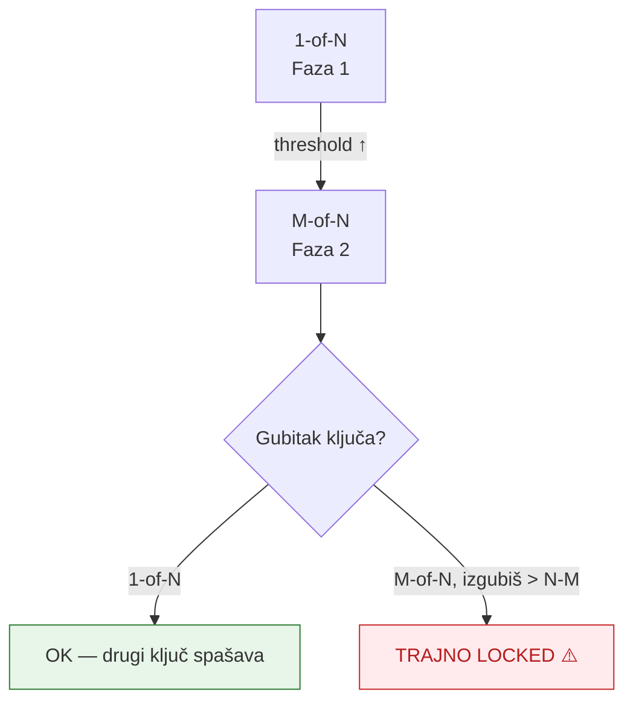

---

## 6. Faza 3 — amount-tiered policy (usvojiti gotovo, NE graditi u core)

Safe nema native tiering. Mature rješenje = **slojevi modula** (Gnosis Guild
Zodiac + Safe Allowance). Ovo vaš MPT već koristi (Safe 2/3 + Zodiac Roles).

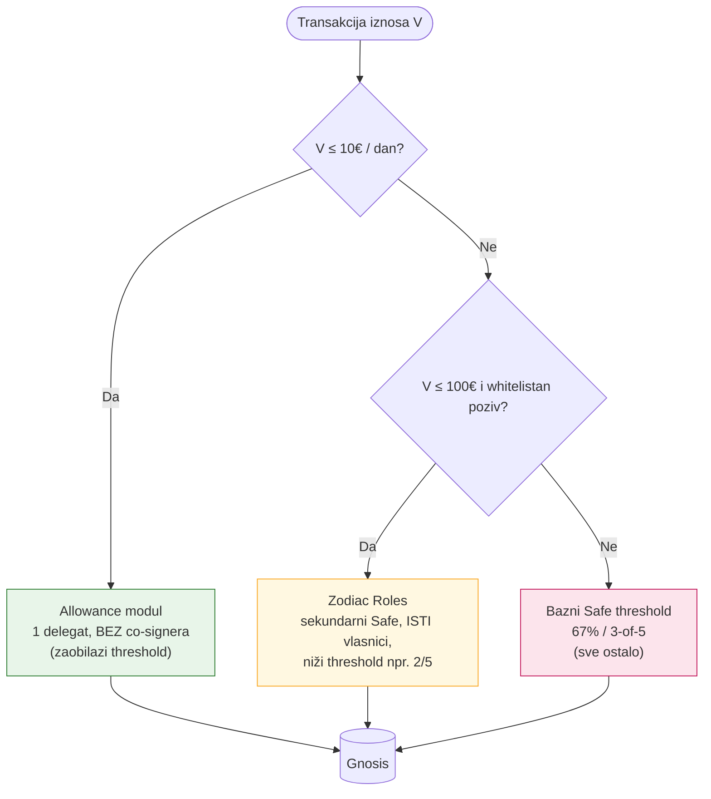

### 6.1. Arhitektura modula

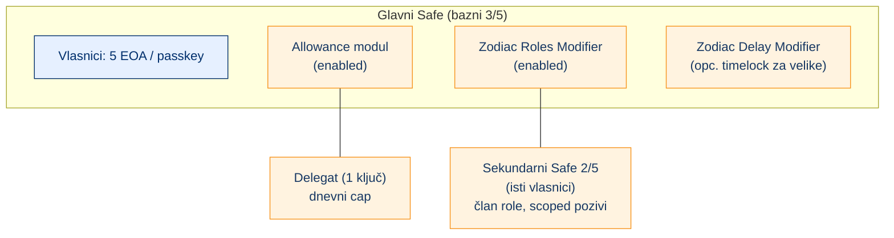

### 6.2. Gotova rješenja (research) — što već postoji

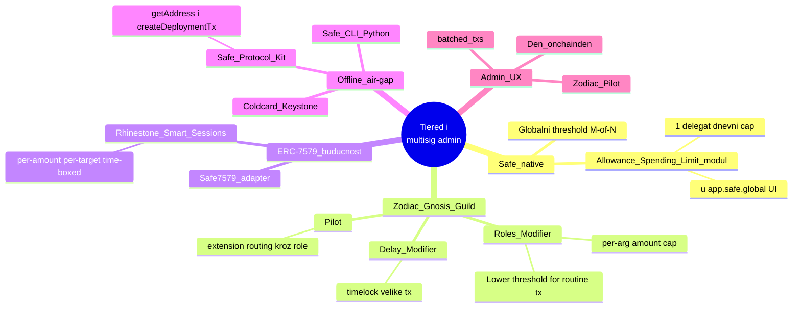

---

## 7. SDK / pinka handoff (gdje napredna opcija ulazi)

Pinka kampanja traži novčanik preko `dw_create_account` handoffa. Napredne opcije
prenose se kao dodatni query parametri; potvrda i generiranje EOA-a ostaju u
wallet origin-u (self-custody — tajne nikad ne napuštaju wallet domenu).

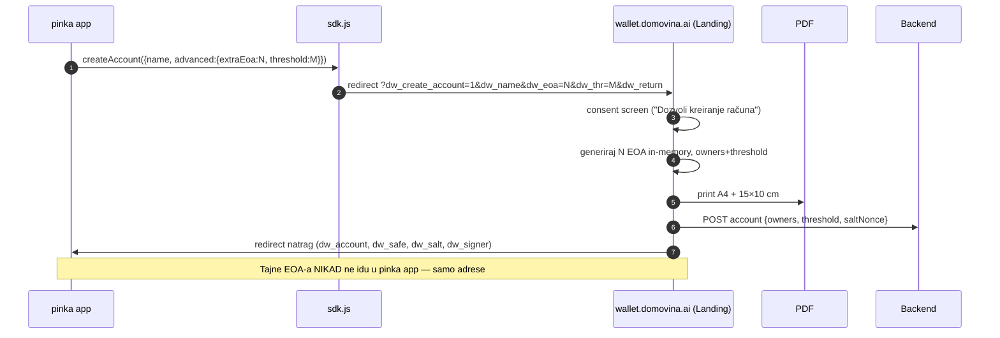

---

## 8. Stablo odluke — što odabrati za koji slučaj

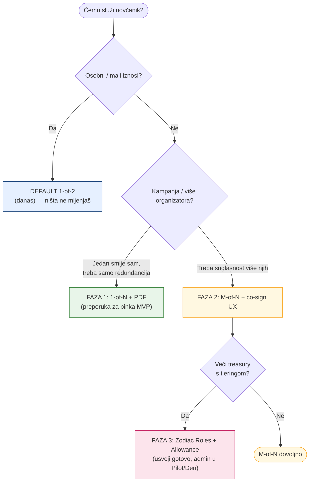

---

## 9. Sažetak preporuke

1. **Faza 1 odmah** — `owners`-as-data + `threshold` polje (default 1) + `+N` EOA
   + prošireni PDF. Ne dira relay. Gasi pinka 1/1 trap.
2. **Faza 2 kasnije** — M-of-N traži zaseban co-signing UX; PDF postaje kritičan.
3. **Faza 3 nikad u core** — Zodiac Roles + Allowance modul; admin kroz Pilot/Den,
   ne reimplementirati app.safe.global.

**Invarijanta:** owner-lista + threshold se **persistiraju** (CREATE2
reproducibilnost preko uređaja); tajne EOA-a se **prikažu jednom** (PDF) i nikad
ne spremaju — isti obrazac kao postojeći `recoveryOwner`.

---

### Izvori (research)

- Zodiac Roles — [Lower Threshold for Routine Transactions](https://docs.roles.gnosisguild.org/tutorials/lower-threshold-routine-transactions)
- Safe — [Spending Limits](https://help.safe.global/en/articles/40842-set-up-and-use-spending-limits) · [Smart Account Modules](https://docs.safe.global/advanced/smart-account-modules)
- Safe — [ERC-7579 / Safe7579](https://docs.safe.global/advanced/erc-7579/7579-safe) · [Smart Sessions](https://github.com/erc7579/smartsessions)
- Safe — [Protocol Kit Deployment](https://docs.safe.global/sdk/protocol-kit/guides/safe-deployment) · SEAL [Secure Multisig Best Practices](https://frameworks.securityalliance.org/wallet-security/secure-multisig-best-practices/)
