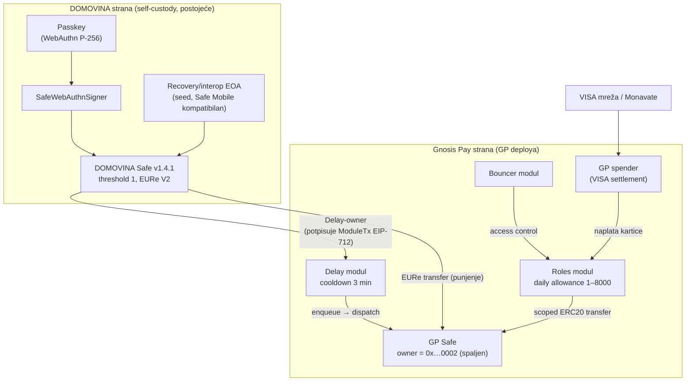
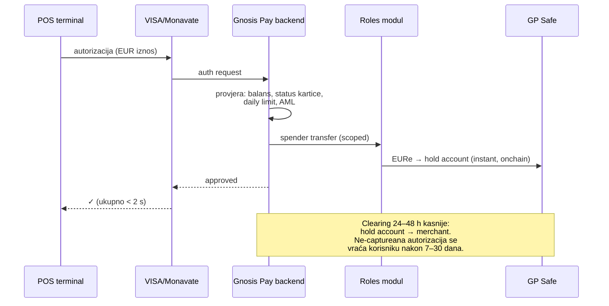
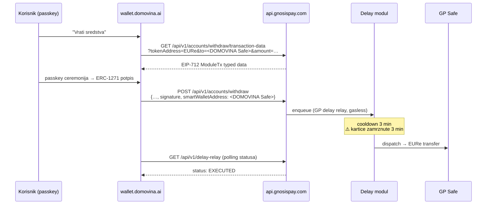

# 01 — Arhitektura: Two-Safe model i GP onchain mehanika

## Zašto dva Safe-a

Gnosis Pay **ne prima postojeći Safe**. `POST /api/v1/safe/deploy` deploya novi Safe na GP-ovoj
infrastrukturi ("the user can deploy the Safe without having to sign the data"), a setup
(account-kit `accountSetup.ts`):

- **spaljuje vlasništvo**: owner Safe-a postaje `0x0000000000000000000000000000000000000002`
- omogućuje **Delay modul** (cooldown tipično 3 min = 180 s) — jedini kanal korisničke kontrole
- omogućuje **Roles modul** (Zodiac) — allowance za GP-ov card-settlement spender, scoped na
  ERC-20 `transfer` ciljanog tokena; ownership Roles modula ide na **Bouncer modul**
- inicijalni owner (SIWE signer korisnika) dobiva **Delay-module ownership**

To je isti Zodiac Roles obrazac koji već koristimo u MPT routingu — GP-ova kartična naplata je
"spender s dnevnim allowanceom", naša korisnička kontrola je "owner s 3-min odgodom".

## Tok novca

### Punjenje kartice (zero GP API)
Običan ERC-20 transfer EURe s DOMOVINA Safe-a na adresu GP Safe-a — naš postojeći
passkey→relay→MultiSend rail radi bez ijedne izmjene. GP Safe je običan token holder.

⚠️ Provjeriti **EURe V1 vs V2**: physical-card payment dokumentacija još citira V1
(`0xcB444e90…`); za GP Safe valutu provjeriti u `github.com/gnosispay/account-kit` token
registryju prije spajanja funding flowa. Mi indexiramo V2 (`0x420CA0f9…`).

### Kartična naplata (bez delaya)

### Povlačenje natrag u DOMOVINA Safe (3-min delay, gasless)

## Signer strategija (ključna odluka)

GP API na **svim** potpisnim mjestima podržava i EOA (ECDSA) i smart account (ERC-1271):

> "Our API accepts signatures from Externally Owned Accounts (EOAs) and Smart Accounts (EIP-1271)."
> "For smart contract wallets, signatures are verified using ERC-1271 standard … you must include
> the `smartWalletAddress` field in the request body."

| Mjesto | Potpis | ERC-1271? |
|---|---|---|
| SIWE login (`POST /api/v1/auth/challenge`) | SIWE poruka | ✅ eksplicitno |
| Add/remove Delay-owner (`POST/DELETE /api/v1/owners`) | EIP-712 ModuleTx | ✅ `smartWalletAddress` |
| Daily limit (`PUT /api/v1/accounts/daily-limit`) | EIP-712 ModuleTx | ✅ `smartWalletAddress` |
| Withdraw (`POST /api/v1/accounts/withdraw`) | EIP-712 ModuleTx | ✅ `smartWalletAddress` |
| Webhook opt-in (`POST /api/v1/webhooks/subscribe/{partnerId}`) | SIWE poruka | ⚠️ docs kažu "user's verified EOA" — testirati |

**Plan A — DOMOVINA Safe kao GP identitet (ERC-1271):**
- Sve potpisuje passkey (ista ceremonija kao naš Send), UX bez novih ključeva.
- GP Safe Delay-owner = DOMOVINA Safe → kartična sredstva pod kontrolom passkeya.
- Uvjeti: Safe mora biti **deployan** (counterfactual nema koda → 1271 pada; postojeći
  pre-flight `getCode` house rule); GP mora verificirati na Gnosis chainu (nije dokumentirano —
  empirijski test).
- Rizik: endpoint familija se zove `eoa-accounts`; deploy vraća `403 Missing signer address` ako
  signer nije registriran — ponašanje sa smart accountom nepoznato. **Faza 0 test.**

**Plan B — korisnikov interop EOA kao GP identitet:**
- Svaki korisnik već ima (ili može dobiti kroz "Aktiviraj račun") seed-backed EOA koji ownuje
  njegove Safe-ove — isti taj EOA radi SIWE `personal_sign` i postaje inicijalni Delay-owner.
- Zatim se DOMOVINA Safe doda kao drugi Delay-owner (`POST /api/v1/owners`) pa passkey dalje
  upravlja withdrawalima.
- Trošak: korisnik mora imati seed (bootstrap-swap korisnici ga nemaju) i potpisivati MetaMask-
  style — lošiji UX, ali 100% kompatibilno.

**Nikad**: server-held ključ kao Delay-owner ili SIWE signer (self-custody princip; relayer EOA
je dijeljen → 409 kolizija ionako).

⚠️ **Nepovratnost**: jedna adresa pripada jednom GP useru zauvijek
("409 Wallet address already associated with another account"). Test accounti samo s throwaway
EOA-ima, nikad s pravim korisničkim adresama.

## Daily limit i balansi

- Default pri deployu: **350** (whole token units); raspon **1–8000**; promjena = EIP-712 +
  3-min delay; `GET /api/v1/accounts/daily-limit` → `{dailyLimit, dailyRemaining}`.
- `GET /api/v1/account-balances` → `{total, spendable, pending}` — `pending` = hold-account
  iznos u autorizaciji. Za UI prikazujemo *spendable*, za rekoncilijaciju uspoređujemo s
  onchain EURe balansom GP Safe-a.
- ⚠️ Nedosljednost jedinica u docs (whole units vs base units) — verificirati empirijski.

## Exit / fail-safe scenariji

- **GP nestane / relay stane**: Delay-owner može enqueue/dispatch **direktno onchain** preko
  account-kit funkcija (`populate…Enqueue/Dispatch`) — sredstva nisu zarobljena, samo UX pati.
  → u Fazi 3 dodati "ručni exit" runbook u docs.
- **`safe-replacement` migracije**: GP povremeno mijenja Safe adrese (aktivna migracija
  `safe-replacement-2026-06`!) — adresu GP Safe-a **nikad ne hardkodirati**; čitati iz
  `GET /api/v1/user` (`safeWallets`) / `GET /api/v1/safe/migration` prije svakog punjenja.
- **Reset**: `DELETE /api/v1/safe/reset` briše GP-ov DB zapis (ne i onchain Safe) — recovery od
  failed deploya; zahtijeva nulti balans i nijednu aktivnu karticu.

## Postmortem-0001 lekcija primijenjena

GP Safe kontrolira SIWE signer (Delay-owner). Ako korisnik izgubi taj ključ, kartična sredstva
su zarobljena — ista zamka kao 1/1 passkey Safe. Pravilo: **prije produkcije svaki GP account
mora imati ≥2 Delay-ownera** (DOMOVINA Safe + interop EOA), enforced u onboarding flowu.
