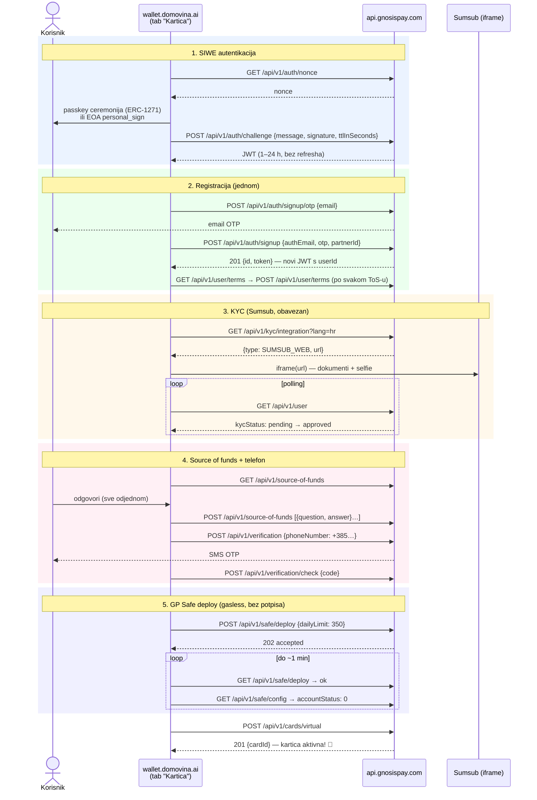
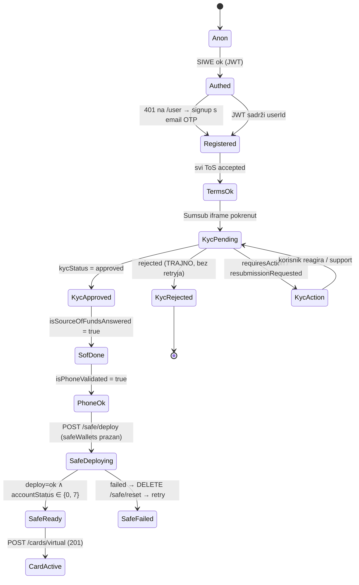

# 02 — Onboarding: SIWE → KYC → GP Safe

Base URL: `https://api.gnosispay.com` · Auth: `Authorization: Bearer {jwt}` (SIWE) ·
OpenAPI: `https://api.gnosispay.com/api-docs/spec.json` · Referentni FE: `github.com/gnosispay/ui`

**Bitno svojstvo**: cijeli onboarding je dizajniran da se zove **direktno iz browsera**
(CORS + domain whitelist + user-scoped JWT). Naš backend za ovaj dio nije obavezan.

## Sequence dijagram — kompletan put do kartice

## State machine — izvor istine je `GET /api/v1/user`

Router "sljedećeg koraka" se derivira čisto iz user objekta (+ JWT decode za `userId`):

`kycStatus` vrijednosti: `notStarted`, `documentsRequested`, `pending`, `processing`,
`approved`, `resubmissionRequested`, `rejected` (final), `requiresAction` (ručni review →
prikazati support kontakt).

`AccountIntegrityStatus`: `Ok(0)`, `SafeNotDeployed(1)`, `SafeMisconfigured(2)`,
`RolesNotDeployed(3)`, `RolesMisconfigured(4)`, `DelayNotDeployed(5)`, `DelayMisconfigured(6)`,
`DelayQueueNotEmpty(7)` (validan), `UnexpectedError(8)`.

## Endpoint referenca (onboarding domena)

| Korak | Endpoint | Napomene |
|---|---|---|
| Nonce | `GET /api/v1/auth/nonce` | plain-text, svježi po loginu |
| Login | `POST /api/v1/auth/challenge` | `{message, signature, ttlInSeconds≤86400}`; EOA i ERC-1271 |
| Email OTP | `POST /api/v1/auth/signup/otp` | `{email}` |
| Signup | `POST /api/v1/auth/signup` | `{authEmail, otp, partnerId?}`; **409 = adresa/email već vezani**; partnerId SAMO ovdje (atribucija nepovratna) |
| ToS lista | `GET /api/v1/user/terms` / public `GET /api/v1/terms` | tipovi: `general-tos`, `card-monavate-tos`, `cashback-tos`, `privacy-policy` |
| ToS accept | `POST /api/v1/user/terms` | `{terms, version}`, checkbox obavezan u UI |
| KYC web | `GET /api/v1/kyc/integration?lang=hr` | Sumsub URL za iframe; `lang=hr` radi |
| KYC SDK | `GET /api/v1/kyc/integration/sdk` | za budući native app |
| SoF | `GET`/`POST /api/v1/source-of-funds` | sve odgovore u jednom POST-u, uključiti tekst pitanja |
| Telefon | `POST /api/v1/verification` + `/check` | **gated iza KYC approved**; zamjenjuje postojeći broj; 429 rate limit |
| Profil | `GET /api/v1/user` | izvor istine za state machine |
| Deploy | `POST /api/v1/safe/deploy` | `{dailyLimit?}` default 350; idempotentan; 202 |
| Deploy status | `GET /api/v1/safe/deploy` | `processing/ok/failed/not_deployed` |
| Konfiguracija | `GET /api/v1/safe/config` | `address`, `tokenSymbol`, `accountStatus`, `accountAllowance` |
| Dodatne adrese | `GET/POST/DELETE /api/v1/eoa-accounts` | SIWE identiteti, NISU Safe owneri |

## DOMOVINA-specifični detalji

- **Valuta**: country-based — GB→GBPe, BR→USDCe, **ostali (HR)→EURe**. Ništa ne biramo.
- **Telefon**: GP-ov OTP je neovisan o našem otp.domovina.ai bindingu → korisnik verificira broj
  dvaput; UX copy to mora objasniti ("GP zahtijeva vlastitu verifikaciju za VISA mrežu").
  Postojeće pravilo: telefon = verifikacija, NE recovery.
- **Email**: GP traži email (unique per user) — imamo li ga? Wallet danas ne skuplja email →
  novi input u onboarding UI.
- **JWT**: nema refresha; max 24 h pa puna SIWE re-auth = jedna passkey ceremonija. Lazy re-auth
  na 401.
- **Sumsub iframe u PWA**: standardni web-SDK URL; kamera radi u Safari PWA kontekstu (provjeriti
  na iOS — poznata ograničenja getUserMedia u standalone modu → test u Fazi 1; fallback: otvoriti
  u Safari tabu).
- **KYC podatke ne diramo**: sve ide kroz Sumsub iframe; mi ne pohranjujemo ništa osim statusa →
  minimalan GDPR scope.
