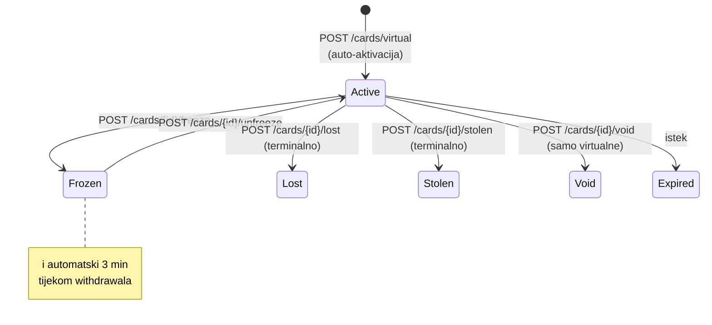
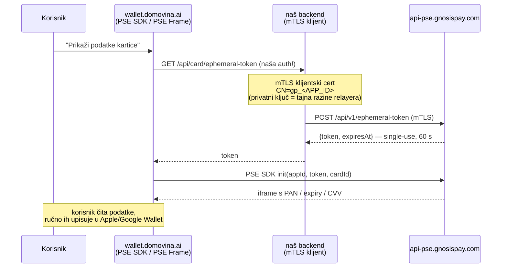

# 03 — Virtualne kartice, PSE i Apple/Google Pay

## Virtualna kartica

- **Besplatna, instantna, auto-aktivirana**: "Cards are automatically created and activated when
  the order is placed." Jedan poziv: `POST /api/v1/cards/virtual` → `201 {cardId}`.
- Bez PIN-a — "the user's phone number is used as second factor authentication for some online
  payments" (zato je GP-ova phone verifikacija obavezna).
- "Virtual cards work either online or tap in presence (with Apple Pay and Google Pay)" —
  uz ogradu "**some regions are not yet available**" (HR status nepoznat → pitanje za GP).
- Max **5 aktivnih kartica** (virtualne + fizičke; voided/lost/stolen se ne broje).
  (Jedan 422 primjer još kaže "(3)" — potvrditi s GP-om.)

Preduvjeti (doslovno iz 422 liste): KYC approved · SoF ispunjen · risk score Green/Orange ·
verificiran telefon · ime bez nevaljanih znakova · adresa postavljena · podržana zemlja ·
GP Safe ispravno konfiguriran · <5 aktivnih kartica · nema postojeće narudžbe u tijeku (409).

## Lifecycle kartice

Status kodovi (`GET /api/v1/cards`): 1000 Active, 1006 Pin Blocked, 1009/1199 Void, 1041 Lost,
1043 Stolen, 1054/1154 Expired, 1062 Restricted… `GET /api/v1/cards/{id}/status` →
`{isFrozen, isStolen, isLost, isBlocked, isVoid, statusCode}`.

## PSE — prikaz PAN/expiry/CVV (Partner Secure Elements)

PSE je GP-ov servis koji **izolira PCI scope**: osjetljivi podaci kartice se renderiraju u
**GP-serviranim iframeovima** unutar našeg UI-ja. SDK: `@gnosispay/pse-sdk` (npm), RN varijanta
`@gnosispay/pse-react-native`. Bez PSE-a (permissionless tier) **ne smijemo prikazati broj
kartice** — kartica postoji, ali korisnik je ne vidi.

Ključne činjenice:
- **Ephemeral token se MORA dohvaćati s backenda** — "An mTLS authentication can only be
  performed from a back-end." Token je single-use, 60 s; generirati novi za svaku upotrebu;
  naš endpoint mora autenticirati NAŠEG korisnika prije izdavanja (procureni token = 60 s prozor
  do tuđeg PAN-a).
- **Cert ceremonija**: mi generiramo EC P-256 ključ + CSR (`CN=gp_<APP_ID>`), CSR ide GP-u kroz
  Partners Dashboard, vraćaju potpisani cert chain.
- **⚠️ CF Workers rizik**: Workers `fetch` ne može prezentirati proizvoljan klijentski cert
  vanjskom originu. Opcije: (a) CF mTLS certificate binding (`wrangler mtls-certificate upload`
  — podržava custom certove, **provjeriti da radi s GP-ovim chainom**), (b) mali Node servis
  (Hetzner/Fly) samo za token-proxy. Faza 3 spike.
- **Styling iframea**: isključivo CSS file koji autoriramo i **šaljemo GP timu** da ga deployaju
  u iframe (`<partner_name>.css`); iteracija kroz devtools pa submit. Elementi:
  `#pse-card-data-container`, `.pse-card-field/.pse-card-label/.pse-card-value`,
  `#pse-set-pin-form`…
- **WebView/PWA put**: RN docs potvrđuju obrazac "PSE Frame = mala HTML stranica na NAŠOJ
  (whitelistanoj) domeni koja učita PSE JS SDK i fetcha token s našeg backenda" — referenca
  `github.com/gnosispay/ui/blob/main/pse-backend-demo/src/static/native-webview.html`. Isti
  obrazac radi za naš React PWA i budući native app.
- **PIN**: virtualnoj kartici ne treba. (Za fizičke: PSE mijenja samo *online* PIN; offline PIN
  se sinkronizira tek operacijom na bankomatu — support-script detalj.)
- Stari encryption flow (`GET /user/card-public-key`, `POST /cards/verify`, `pinData`) je
  **deprecated** — ne koristiti, drži nas izvan PCI scopea.

## Apple Pay / Google Pay — realno stanje

### ✅ Hrvatska JE podržana regija (potvrđeno 2026-06-11)

- **Apple Pay**: Gnosis Pay je na Appleovoj službenoj listi banaka/izdavatelja koji podržavaju
  Apple Pay (stranica za Hrvatsku): https://support.apple.com/hr-hr/109516
- **Google Wallet**: Gnosis Pay je u službenoj tablici za Hrvatsku kao **"Gnosis Pay | Visa
  Debit"**: https://support.google.com/wallet/answer/12059326?hl=en&co=GENIE.CountryCode%3DHR
- **Empirijski dokaz**: Apple Wallet na iPhoneu 15 Pro (HR) u "Add Card → Debit or Credit Card →
  Choose a bank" pretragom "gno" nudi **Gnosis Pay** kao banku (screenshot 2026-06-11).
  Gnosis Pay je dakle registrirani issuer u Apple Wallet bank pickeru za HR.

Doc-fraza "some regions are not yet available" za HR dakle **ne vrijedi** — tokenizacija
GP BIN-a radi u Hrvatskoj za oba wallet ekosustava.

### Push provisioning (one-click "Add to Apple Wallet" à la Revolut)

**NIJE u javnoj partner dokumentaciji.** Grep cijelog docs cachea: jedina dva spomena
Apple/Google Paya su u opisu virtualnih kartica. Nema `PKAddPaymentPassViewController`, nema
Google TapAndPay, nema wallet-provisioning endpointa.

Revolutov one-tap UX je **issuer-level native integracija**: Apple entitlement
`com.apple.developer.payment-pass-provisioning` dodjeljuje se issuerovoj native aplikaciji
(Revolut = vlastiti issuer). Za treće strane (nas) to po javnoj dokumentaciji ne postoji.

| Put | Izvedivost | Napomena |
|---|---|---|
| **Ručni unos PAN-a iz PSE-a u Wallet** | ✅ jedini dokumentirani put za naš UI | korisnik prepiše broj/expiry/CVV; tokenizacija kroz issuera (Monavate) radi jer je HR podržana |
| Apple Wallet bank picker → "Gnosis Pay" | ❓ vjerojatno vodi u službenu GP app / issuer flow | testirati što se događa nakon odabira banke; možda traži GP-ovu native aplikaciju |
| Službena Gnosis Pay mobilna app | ❓ | korisnikov GP account je isti (SIWE) — teoretski može instalirati GP app, ulogirati se istim walletom i odande push-provisionati; provjeriti kako se GP app autenticira |
| Push provisioning iz naše PWA | ❌ nemoguće | Apple entitlement ne postoji za web |
| Push provisioning iz našeg budućeg native appa | ❓ | treba i Apple entitlement i GP partner podršku koja nije dokumentirana → **pitanje za GP call** |

**UX plan**: nakon izdavanja kartice prikazati vodič "Dodaj u Apple Pay" s PSE prikazom +
koracima za ručni unos (3 ekrana, hrvatski). Jednom dodana u Wallet, kartica radi beskontaktno
na svakom POS-u — *cilj iz vizije je ostvariv i bez push provisioninga*, samo je prvi unos ručni
(~1 min, jednokratno po kartici).

## Cashback (sekundarno)

`GET /api/v1/cashback` → `{isOg, gnoBalance, cashbackRate (0–5%), weeklyCapUsd}`. Rate ovisi o
GNO balansu **u GP Safe-u** + OG NFT bonus; bez GNO = 0%. (Poznato iz ranije analize: cashback
je GNO subvencija, ne yield.) Ne gradimo ništa u v1 osim read-only prikaza ako je trivijalno.

## Fizičke kartice (kasnije, van scopea v1)

30.23 EURe, order state machine (`PENDINGTRANSACTION→…→READY→CARDCREATED`), plaćanje EURe
transferom na `0x3D4FD6a1…` (docs citiraju **EURe V1** adresu!), kupon `GPDOCS` za besplatnu
karticu u testiranju, shipping samo u KYC zemlju, ENS personalizacija ≤24 znaka.
