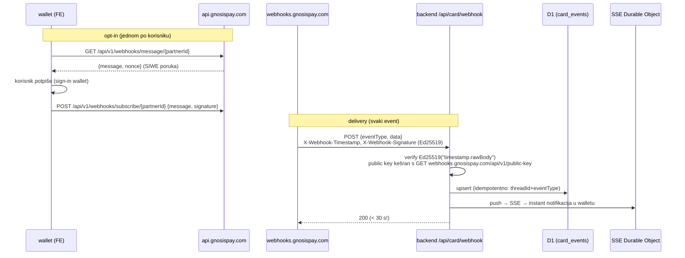
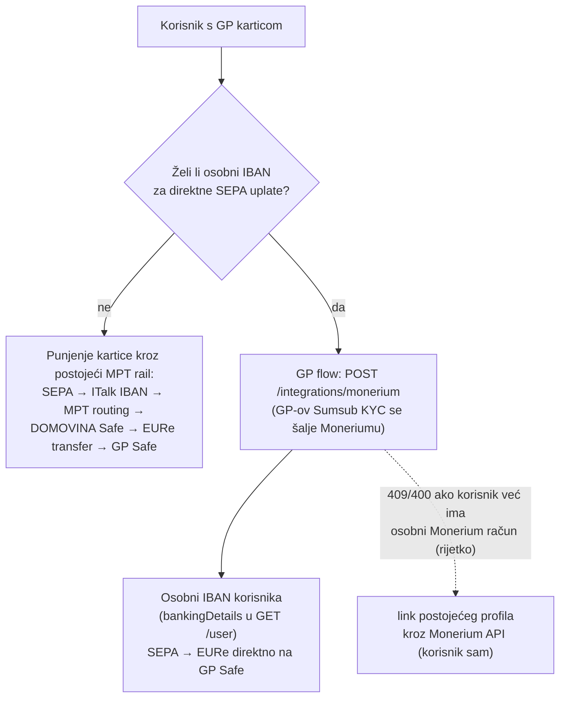

# 04 — Backend: webhooks, baza, rekoncilijacija, Monerium kolizija

## Načelo: backend je tanak

GP API je user-JWT (SIWE) scoped i CORS-friendly — **frontend zove api.gnosispay.com direktno**.
Server ne može mintati user JWT-ove, pa "server u ime korisnika" ne postoji by design. Backend
treba samo za: (1) webhook receiver, (2) PSE mTLS token-proxy, (3) keš/state sync, (4) postojeći
relay za funding transfer (već postoji).

## Webhook receiver

Zahtijeva **Partnership tier** (besplatan, self-service) + per-user opt-in:



- **Potpis: Ed25519** (asimetrični, ne HMAC) — `${timestamp}.${rawBody}`; verifikacija raw
  bodyja PRIJE parsanja; WebCrypto `crypto.subtle.verify("Ed25519", …)` radi na Workersima
  (format public keya iz endpointa neprovjeren — PEM ili raw; spike).
- **Retry: samo 3× (1/5/15 min)** → nakon ~21 min outagea eventi su izgubljeni → rekoncilijacija
  obavezna (dolje).
- Sami nametnuti timestamp freshness (±5 min) — docs ne mandatiraju replay zaštitu.
- Payloadi nose **kompletne entitete** (jer user JWT istječe) — obično nema follow-up API poziva.
- Idempotencija: postojeći obrazac iz Monerium webhooka (existing-forward check).

### Event katalog (bitniji)
- `card.transaction.created` (autorizacija — **trigger za instant push "−12,50 € Konzum"**),
  `…cleared`, `…declined`, `…reversed`, `…refunded`, `…confirmed`/`…failed` (onchain leg)
- `card.status.changed`, `virtual.card.issued`
- `kyc.status.changed`, `kyc.phone-validation.changed`, `kyc.source-of-funds.changed`,
  `user.created`, `user.tos.accepted` (server-side onboarding tracking bez pollanja!)
- `account.balance.changed {total, spendable, pending}`, `account.limit.changed`,
  `account.withdrawal.completed/failed`
- `safe.created`, `safe.modules.deployed`, `safe.owner.added/removed`
- `iban.created`, `iban.status.changed` (`NOTSTARTED|PENDING|PENDING_OAUTH|ASSIGNED`)

## Transakcije — API + prikaz

- `GET /api/v1/cards/transactions` — paginirano (`limit≥10`, `offset`, `next`/`previous`),
  filtri: `cardTokens`, `before/after`, `mcc`, `transactionType`, valute.
- Event = `threadId` (ključ za dedupe i dispute; auth+clearing+reversal dijele thread),
  `isPending`, `billingAmount` (**minor units string**, npr. `'2550'` + `decimals: 2` = 25,50 €),
  `merchant {name, city, country}`, `mcc`, `transactions[]` s onchain `hash` →
  link na Gnosisscan u Activity UI.
- Kind: `Payment` (odmah, status enum: `Approved | InsufficientFunds | IncorrectPin |
  ExceedsApprovalAmountLimit | …`), `Refund` (tek nakon clearinga), `Reversal`.
- **Dispute**: `GET /api/v1/transactions/dispute` (razlozi) →
  `POST /api/v1/transactions/{threadId}/dispute`; ⚠️ razlog
  `unrecognized_transaction_report_fraudulent` **odmah restrikta karticu** — warning u UI.
  Nema endpointa za status disputea (ide kroz GP support).

## D1 shema (nove tablice u backend/migrations)

```sql
-- 0012_gnosispay.sql
CREATE TABLE gp_users (
  credential_id   TEXT NOT NULL,            -- naš identitet (FK wallet_registry)
  safe_address    TEXT NOT NULL,            -- DOMOVINA Safe vezan uz GP account
  gp_user_id      TEXT,                     -- GP userId (iz JWT-a)
  gp_signer       TEXT NOT NULL,            -- adresa koja je GP SIWE identitet (NEPOVRATNO)
  gp_safe_address TEXT,                     -- GP Safe (refresh kroz /safe/migration!)
  onboarding_step TEXT NOT NULL,            -- mirror state machinea (analytics/support)
  kyc_status      TEXT,
  webhook_opt_in  INTEGER DEFAULT 0,
  created_at      INTEGER NOT NULL,
  updated_at      INTEGER NOT NULL,
  PRIMARY KEY (credential_id, safe_address)
);

CREATE TABLE gp_events (                    -- webhook log + dedupe + Activity keš
  id          TEXT PRIMARY KEY,             -- threadId:eventType:clearedAt|status
  gp_user_id  TEXT,
  event_type  TEXT NOT NULL,
  thread_id   TEXT,
  raw_json    TEXT NOT NULL,
  received_at INTEGER NOT NULL
);
CREATE INDEX idx_gp_events_user ON gp_events (gp_user_id, received_at DESC);
```

Bez pohrane PAN-a, imena, adresa, KYC podataka — samo statusi i event log. Kartice (`cardId`,
`lastFourDigits`) čita FE direktno od GP-a.

## Rekoncilijacija

Webhooci su lossy (3 retryja); server ne može pollat u ime korisnika (nema JWT). Strategija:
1. **Webhook = primarni kanal** (full entiteti).
2. **Client-triggered sync**: svaki put kad korisnik otvori tab Kartica s validnim JWT-om, FE
   povuče `/cards/transactions` + `/account-balances` i POST-a diff našem backendu (keš za
   support/analytics; FE je ionako izvor prikaza).
3. **Onchain backstop**: mi već indexiramo EURe transfere — GP Safe adrese su nam poznate →
   neovisno vidimo punjenja i settlement transfere na chainu.

⚠️ jedinice: webhook `account.balance.changed` kaže "in wei", REST vraća stringove, kartični
iznosi su minor-units — kalibrirati na stvarnim payloadima prije ikakve matematike.

## IBAN / Monerium — kako se GP-ov IBAN odnosi na naš MPT rail

**Točan model našeg postojećeg raila (korekcija 2026-06-11):** Monerium odnos ima **samo ITalk
d.o.o.** (prošao **KYB**, business onboarding) — *krajnji korisnici nikad nisu prošli nikakav
Monerium KYC i nemaju Monerium profile*. SEPA uplate idu uvijek na **ITalk-ov IBAN (Estonija,
LHV)**; Monerium izdaje EURe na ITalk-ov default Gnosis address; MPT detektira uplatu po
**referenci** i radi custom routing (Zodiac Roles) na specifični korisnikov Safe. Zato u
DOMOVINA Walletu uvijek piše "primatelj: ITalk d.o.o., isti IBAN". Nismo (još) službeni
Monerium partner — plan je javiti se Moneriumu nakon MVP-a.

GP nudi "IBAN za GP Safe" kao **tanki wrapper oko Moneriuma** (KYC passporting): GP-ov
**per-user KYC** (Sumsub) se šalje Moneriumu i korisnik dobiva **vlastiti osobni IBAN**:
`GET /api/v1/ibans/available` → `GET /api/v1/ibans/signing-message` (potpisuje **verificirani
EOA**: "I hereby declare that I am the address owner.") → `POST /api/v1/integrations/monerium`.

Posljedica korekcije: **kolizije za naše korisnike NEMA** — oni nemaju Monerium profile, pa je
GP-ov IBAN flow za njih čist (constraint "Monerium only allows the user to have one single
account" pogađa samo korisnike koji su *negdje drugdje* već otvorili osobni Monerium račun —
rubni slučaj, pre-check u UI). Štoviše, GP-ov IBAN je **feature koji danas ne možemo sami
ponuditi**: osobni IBAN po korisniku, bez da ITalk postane Monerium partner.



Strateški zaključak: dva komplementarna on-rampa — **MPT rail** (ITalk IBAN + referenca,
landing na DOMOVINA Safe, naš kontrolirani routing) ostaje primarni; **GP osobni IBAN**
(landing direktno na GP Safe) je opcionalni dodatak za korisnike kartice. Budući službeni
Monerium partnerski odnos (post-MVP) otvara treću opciju: osobni IBAN-i vezani na DOMOVINA
Safe-ove kroz naš vlastiti integration — tada redizajnirati ovu sekciju.

KYC sharing: **isključivo GP→partner** (tripartitni ugovor GP+Sumsub+partner; Noah, BRLA).
U GP se ne može uvesti nikakav vanjski KYC — ni Moneriumov ni naš. Za nas sharing nije
potreban ni u jednom smjeru.

## Tajne (wrangler secrets)

| Tajna | Svrha | Higijena |
|---|---|---|
| `GNOSISPAY_PSE_KEY` | mTLS privatni ključ (EC P-256) | razina relayer ključa; trim/0x normalizacija N/A (PEM) |
| `GNOSISPAY_PSE_CERT` | potpisani cert chain | uz ključ |
| `GNOSISPAY_PARTNER_ID` | atribucija u signup + webhook rute | nije tajna ali env |
| (nema API keya) | GP nema partner API key — sve je SIWE/mTLS | — |
