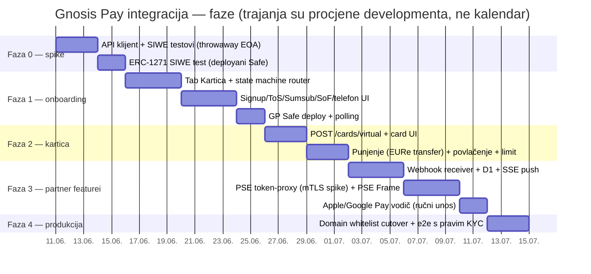

# 05 — Roadmap implementacije

Sve faze osim označenih 🔑 (TODO-MATIJA.md) Claude radi autonomno. Faze 0–2 su izvedive **odmah,
prije pilota i prije partner registracije** (permissionless + localhost whitelist).

## Faza 0 — Spike: dokazati auth pretpostavke (bez UI-ja)

Cilj: empirijski odgovoriti na pitanja koja određuju Plan A vs Plan B (vidi 01-arhitektura).

1. `wallet/src/lib/gnosispay.ts` — tanki typed klijent (nonce, challenge, user, signup…),
   plus Node test skripta (`scripts/gp-spike.mjs`).
2. Testovi s **throwaway EOA-ima** (nikad prave adrese — vezanje je nepovratno!):
   - SIWE login s EOA → JWT ✓
   - SIWE login s **deployanim passkey Safe-om (ERC-1271)** → radi li? na kojem chainu verificiraju?
   - signup → 201; drugi signup istom adresom → 409 (potvrda nepovratnosti)
   - `POST /safe/deploy` sa smart-account signerom → prolazi li `403 Missing signer address`?
3. Dokumentirati nalaze u `docs/plans/gnosis-pay-cards/findings-faza0.md` → odluka Plan A/B.

**Izlazni kriterij**: znamo točno koja adresa postaje GP identitet naših korisnika.

## Faza 1 — Onboarding u walletu (localhost)

1. Ruta `/kartica` u `wallet/src/App.tsx` + ulaz s home ekrana (poštivati simple-mode).
2. `gp` slice u Zustand storeu (JWT u memoriji, korisnikov GP state).
3. Onboarding wizard po state machineu iz 02-onboarding.md: email+OTP → ToS (hrvatski nazivi) →
   Sumsub iframe (`lang=hr`) → SoF upitnik → telefon OTP (+385 default; words-not-numbers
   pravilo za countere) → "Otvori karticu" (deploy + polling).
4. Backend: `gp_users` tablica + sync endpoint (mirror onboarding koraka, za support).
5. Test: Sumsub iframe na iOS Safari PWA (kamera!) — fallback "otvori u Safariju".

## Faza 2 — Kartica živi

1. `POST /cards/virtual` + prikaz kartice (lastFour, status) — bez PAN-a (PSE tek u Fazi 3;
   do tad korisnik podatke vidi na app.gnosispay.com — prijelazno stanje, jasno komunicirati).
2. **Punjenje**: postojeći Send flow s destinacijom = GP Safe (adresa iz `/user.safeWallets`,
   refresh kroz `/safe/migration`); preset iznosi; provjera EURe verzije (V1/V2!) prije prvog
   pravog transfera.
3. **Povlačenje**: typed-data → potpis → `POST /accounts/withdraw` → `/delay-relay` polling +
   "kartica zamrznuta 3 min" UX.
4. **Dnevni limit**: get/set + 3-min pending state.
5. Freeze/unfreeze/void/lost/stolen + Activity prikaz (`/cards/transactions`, group by
   `threadId`, minor-units formatiranje, Gnosisscan linkovi).
6. **Drugi Delay-owner enforced** (postmortem-0001): nakon deploya odmah dodati drugi owner
   (interop EOA ili Safe, ovisno o Planu A/B) prije nego dopustimo punjenje > 50 €.

## Faza 3 — Partner featurei (🔑 treba PartnerID/APP_ID + cert)

1. Webhook receiver `/api/card/webhook` (Ed25519 verify, idempotent upsert, D1 `gp_events`,
   SSE push kroz postojeći DO) + per-user opt-in UI.
2. PSE: 🔑 CSR ceremonija → mTLS spike (CF mtls-certificate binding vs mali Node servis) →
   token-proxy endpoint → PSE Frame stranica → "Prikaži podatke kartice" UI.
3. Apple/Google Pay vodič: 3 ekrana ručnog unosa s PSE prikazom (hrvatski).
4. Partner CSS za PSE iframe (DOMOVINA navy/red brand) → 🔑 submit GP timu.

## Faza 4 — Produkcija

1. 🔑 Domain whitelist (wallet.domovina.ai + staging) u Partners Dashboardu.
2. E2E s pravim hrvatskim KYC-om (🔑 Matija osobno = prvi korisnik): KYC → kartica →
   Apple Pay ručni unos → kupnja na pravom POS-u → webhook → Activity.
3. Runbookovi: GP outage / ručni onchain exit (account-kit enqueue/dispatch), support skripte
   (KYC rejected/requiresAction, dispute, izgubljeni signer).
4. Brand-as-data: kartični feature iza feature flaga po tenantu (default on za domovina).

## Što NE gradimo u v1

- Fizičke kartice (state machine dokumentiran u 03, čeka potražnju)
- Push provisioning (ne postoji u API-ju; revisit ako GP da pilot pristup)
- GNO cashback UI (osim read-only retka ako trivijalan)
- GP-ov IBAN wrapper za postojeće Monerium korisnike (kolizija — vidi 04; samo za nove)
- KYC sharing (nije potreban ni u jednom smjeru)

## Ovisnosti na vanjske odgovore (ne blokiraju Faze 0–2)

| Pitanje | Blokira | Kanal |
|---|---|---|
| ~~Apple/Google Pay regija HR?~~ | — | ✅ POTVRĐENO 2026-06-11 (Apple/Google službene HR liste + Apple Wallet bank picker; linkovi u 03) |
| Push provisioning za partnere? | ništa (nice-to-have) | GP call |
| Hrvatska u supported countries za KYC/izdavanje? | Fazu 4 (e2e KYC) | empirijski u Fazi 1 / GP call (HR na Apple/Google listama = jak pozitivan signal) |
| Max 5 vs 3 kartice? | ništa | GP call |
| CF Workers mTLS s GP certom? | samo PSE dio Faze 3 | spike |
