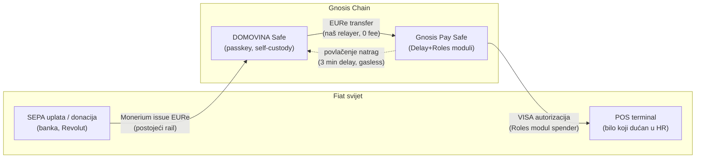

# Gnosis Pay VISA kartice za DOMOVINA wallet — plan integracije

> Status: **PLAN** (2026-06-11) · Izvor: rekurzivna analiza https://docs.gnosispay.com/
> (101 stranica cachirana u `~/.cache/gnosispay-docs/pages/`, 4 paralelne subagent-analize)
> Kontekst: pre-pilot dogovor s Gnosis Pay ekipom — "dođi maksimalno daleko s javnom dokumentacijom".

## Dokumenti

| Dokument | Sadržaj |
|---|---|
| [01-arhitektura.md](01-arhitektura.md) | Two-Safe model, GP Safe moduli (Delay/Roles/Bouncer), signer strategija, punjenje/povlačenje sredstava |
| [02-onboarding.md](02-onboarding.md) | SIWE auth, signup, ToS, Sumsub KYC, source-of-funds, telefon OTP, deploy GP Safe-a — sequence + state machine |
| [03-kartice-pse.md](03-kartice-pse.md) | Virtualne kartice, PSE (prikaz PAN/CVV), Apple Pay / Google Pay realnost, lifecycle kartice |
| [04-backend-webhooks-iban.md](04-backend-webhooks-iban.md) | Webhook receiver (Ed25519), D1 sheme, rekoncilijacija, Monerium one-account kolizija |
| [05-roadmap.md](05-roadmap.md) | Faze implementacije — što Claude radi autonomno, kojim redom |
| [TODO-MATIJA.md](TODO-MATIJA.md) | **Isključivo ručni koraci** koje samo Matija može napraviti |

## Executive summary

Cilj: korisnik DOMOVINA walleta s EURe na svom self-custody Safe-u dobiva **besplatnu virtualnu
Gnosis Pay VISA karticu**, doda je u Apple Pay / Google Pay i instantno troši EURe na bilo kojem
POS-u u Hrvatskoj. Time se zatvara puni krug: SEPA/donacija → EURe onchain → P2P → POS potrošnja,
sve bez transakcijskih naknada, sva infrastruktura onchain na Gnosis EVM.

## Ključni nalazi (TL;DR)

1. **Možemo krenuti danas, bez ičijeg odobrenja.** "Permissionless integration" tier: nema API
   ključeva, nema ugovora. Auth je čisti SIWE → JWT. `localhost` je automatski whitelistan za
   development. Cijeli onboarding + izdavanje kartice se može izgraditi i testirati prije pilota.
2. **Partner registracija je self-service i instantna** (partners.gnosispay.com → PartnerID +
   APP_ID). Treba nam za: production domain whitelist (wallet.domovina.ai), webhooks, atribuciju
   i PSE (prikaz broja kartice). *Bez nje produkcija ne radi* — SIWE s ne-whitelistane domene pada.
3. **Virtualna kartica = besplatna, instantna, auto-aktivirana**, bez PIN-a, max 5 aktivnih po
   korisniku. Jedan poziv: `POST /api/v1/cards/virtual`.
4. **GP deploya VLASTITI Safe po korisniku** — naš postojeći Safe se NE može uvesti. Vlasništvo GP
   Safe-a se spaljuje na `0x…0002`; kontrola ide isključivo kroz Delay modul (3-min cooldown).
   → **Two-Safe model**: DOMOVINA Safe (štednja, puna sloboda) + GP Safe (potrošni račun kartice).
   Punjenje kartice = običan EURe transfer, naš postojeći send-rail radi bez izmjena.
5. **ERC-1271 eksplicitno podržan svugdje** — SIWE login i sva 4 signing endpointa (add/remove
   owner, daily limit, withdraw) primaju smart-account potpise (`smartWalletAddress` polje).
   Passkey Safe može biti GP identitet; fallback je korisnikov recovery/interop EOA.
6. **Apple Pay / Google Pay rade u Hrvatskoj — POTVRĐENO** (2026-06-11): Gnosis Pay je na
   službenoj Apple listi za HR (https://support.apple.com/hr-hr/109516), u Google Wallet HR
   tablici kao "Gnosis Pay | Visa Debit"
   (https://support.google.com/wallet/answer/12059326?hl=en&co=GENIE.CountryCode%3DHR), i
   pojavljuje se u Apple Wallet bank pickeru na iPhoneu u HR (empirijski screenshot). **Ali
   push provisioning (one-click add à la Revolut) NE postoji u partner API-ju** — korisnik
   ručno upisuje PAN iz PSE iframea u Wallet (jednokratno, ~1 min). Detalji u 03-kartice-pse.md.
7. **KYC = Sumsub, obavezan za svakog korisnika, embedan u naš UI.** Naši korisnici nikad nisu
   prošli nikakav KYC (MPT rail počiva na ITalk-ovom KYB-u) — kartica im pokreće GP-ov vlastiti
   Sumsub KYC unutar našeg walleta; korisnik postaje GP/Monavate klijent, mi smo distribucijski
   frontend. Vanjski KYC se u GP ne može uvesti (sharing je samo jednosmjeran GP→partner).
8. **Monerium**: odnos s Moneriumom ima samo ITalk (KYB, firmin IBAN + MPT routing po
   referenci) — korisnici nemaju Monerium profile, pa GP-ov osobni-IBAN flow za njih radi čisto
   i zapravo je feature koji sami danas ne možemo ponuditi. Detalji u 04.
9. **Webhooks** (partner tier): Ed25519 potpisi, 3 retryja kroz 21 min, potpuni event katalog
   (transakcije, KYC, kartice, Safe, IBAN). Per-user opt-in potpisanom porukom.
10. **PSE zahtijeva mTLS backend** (klijentski cert `CN=gp_<APP_ID>`) — jedini dio koji možda ne
    stane u CF Workers; vidi 03 i 04.

## Glavna arhitektonska odluka

**GP identitet korisnika = korisnikov vlastiti ključ, nikad naš server.** (self-custody princip,
server-recovery trajno odbijen). Preferirani redoslijed:

1. **DOMOVINA Safe kao SIWE signer (ERC-1271)** — passkey ceremonija potpisuje sve; GP Safe-om
   upravlja naš Safe kao Delay-owner. Uvjet: Safe mora biti deployan (counterfactual ne prolazi
   1271 provjeru). → empirijski test u Fazi 0.
2. **Fallback: korisnikov interop EOA** (seed koji već izvozi u Safe Mobile) kao SIWE signer +
   inicijalni Delay-owner, pa se DOMOVINA Safe doda kao drugi owner kroz `POST /api/v1/owners`.

⚠️ Jedna adresa = jedan GP user zauvijek (409 na ponovni signup). Izbor adrese je nepovratan —
nikad relayer EOA, nikad dijeljena adresa.
