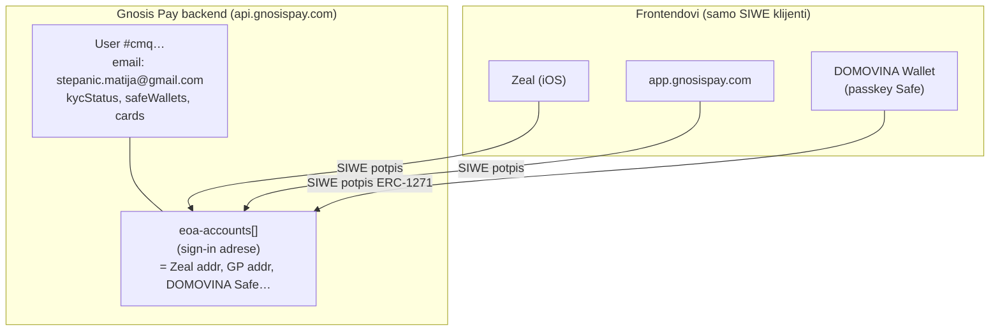
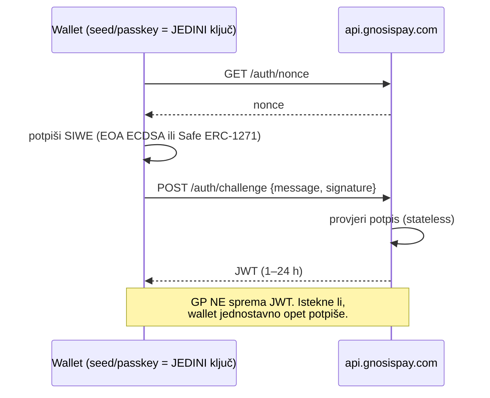
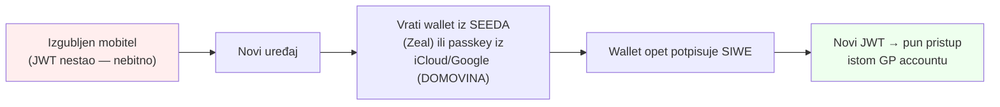
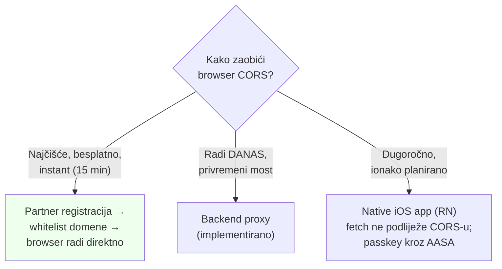
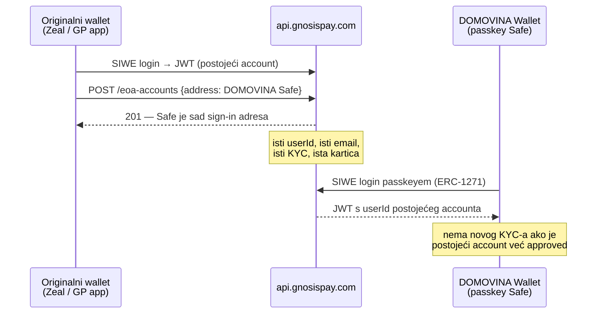
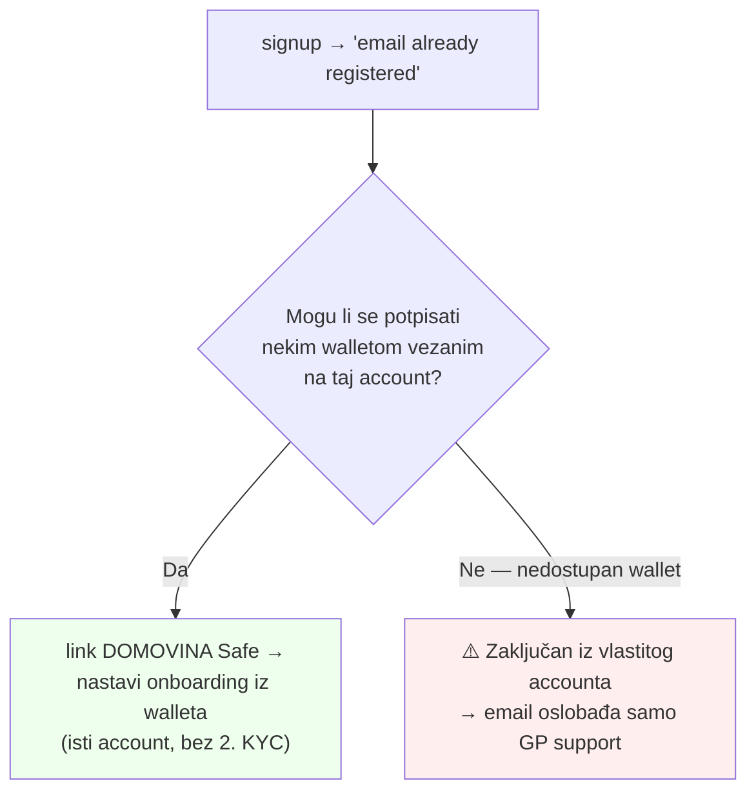

# GP account model, SIWE auth i CORS — trajno znanje

> Datum: 2026-06-12 · Izvor: empirijski rad (Faze 0–2 + e2e pokušaj na stagingu) ·
> Povezano: [findings-faza0.md](findings-faza0.md), [02-onboarding.md](02-onboarding.md),
> [04-backend-webhooks-iban.md](04-backend-webhooks-iban.md)

Ovaj dokument fiksira tri stvari koje su se iskristalizirale tek kad smo pokušali pravi
e2e onboarding: (1) kako GP modelira korisnika kroz više frontenda, (2) zašto je JWT
sesija a ne identitet (i što to znači za recovery), (3) kako browser CORS blokira pozive
s ne-whitelistane domene i kako ga zaobići backend proxyjem.

---

## 1. Jedan GP backend, više frontenda — jedan korisnik

Gnosis Pay ima **jedan globalni korisnički prostor**. `partnerId` je samo atribucijska
oznaka na signupu — **ne izolira korisnike po tenantu**. Isti čovjek koji se prijavi kroz
Zeal, kroz app.gnosispay.com i kroz DOMOVINA Wallet je **isti `userId`** u GP backendu,
keyiran na email + skup sign-in wallet adresa.



Posljedica koju smo uživo pogodili: **signup s već registriranim emailom → "email already
registered"** nije Monerium kolizija i nije tenant-lock — to je **tvoj postojeći GP account**
(iz Zeala / GP appa) koji drži email. DOMOVINA Safe je GP-u nova adresa pa SIWE-login da JWT
bez `userId` → wizard te šalje na signup → sudar na emailu.

**Ispravan fix nije novi email** (to fragmentira identitet na dva accounta + dva KYC-a), nego
**povezati DOMOVINA Safe kao dodatnu sign-in adresu na postojeći account** (sekcija 4).

---

## 2. JWT je sesija, NE identitet — i zašto je to čisti self-custody

Najvažnija konceptualna točka. Identitet prema GP-u **nije** spremljeni JWT — nego
**sposobnost walleta da potpiše SIWE poruku**.

- JWT je stateless, potpisan (HS256), kratak vijek (signup JWT **exp = 1 h**, SIWE challenge
  JWT do **24 h**). GP **ne pamti** JWT na svom serveru kao tvoju sesiju — pri svakoj prijavi
  samo **provjeri potpis**.
- Re-autentikacija = **ponovno potpišeš** SIWE, dobiješ novi JWT. Nema refresh-tokena, nema
  email-logina, nema API ključa — **i to je ispravan dizajn, ne nedostatak**. Endpoint za
  "novi JWT" JEST `POST /auth/challenge`, ali samo s tvojim svježim potpisom.
- **Nitko (ni server, ni mi, ni partnership) ne može izvući tuđi JWT iz emaila.** Da može,
  to bi bila kritična enumeracijska rupa.



### Lost-phone scenarij = self-custody radi, ne pada



Recovery ovisi **isključivo o ključu walleta (seed/passkey)**, nikad o spremljenom JWT-u. Da
Zeal i sprema JWT na svoj server, to ne bi narušilo custody — JWT je re-derivabilan iz ključa,
a ključ je u walletu.

---

## 3. CORS / WAF: zašto puca s ne-whitelistane domene i kako zaobići

### Što GP filtrira

GP-ova zaštita gleda **stvarni `Origin` HTTP header koji browser šalje**, NE `domain` polje u
SIWE poruci. Dvije razine, obje empirijski potvrđene (Faza 0 + e2e):

| Provjera | Ponašanje | Gdje |
|---|---|---|
| **CORS** | `Access-Control-Allow-Origin` se vraća **samo za `http://localhost:5173`**; svaka druga domena → preflight pada (nema ACAO headera) | browser |
| **WAF (TLS fingerprint)** | 403 `WAFForbidden` na Node/undici fetch; **curl i CF Workers fetch prolaze** s browser headerima | server-side |
| **WAF (loopback u bodyju)** | 403 na SVAKI `localhost`/`127.0.0.1` URL u SIWE poruci → "localhost whitelist" je u praksi neupotrebljiv izvan browsera | server-side |
| **App-level domain** | `wallet.domovina.ai` → 403 "SIWE domain not allowed" dok nije partner-whitelistan | aplikacija |

**Ključni uvid:** CORS provodi **samo browser**. Ne-browser klijent (curl, server-to-server
fetch, native RN fetch) ga uopće ne provjerava. To je temelj svih zaobilaznih putova.

### Opcija 2 — backend proxy (implementirano, radi)

Naš Worker zove GP server-to-server i provlači zahtjev + korisnikov JWT. Browser ↔ naš Worker
ima CORS; Worker ↔ GP nema (nije browser). **Empirijski potvrđeno 2026-06-12: CF Workers fetch
PROLAZI GP WAF** (nonce 200, pun SIWE challenge → JWT kroz proxy).

```mermaid
sequenceDiagram
    participant B as Browser<br/>(wallet-staging.domovina.ai)
    participant P as Naš Worker<br/>/api/gp-proxy/* (mpt.domovina.ai)
    participant GP as api.gnosispay.com
    B->>P: fetch /api/gp-proxy/api/v1/...<br/>(CORS OK — naša domena)
    Note over P: doda browser UA + Origin localhost;<br/>provuče SAMO korisnikov Bearer JWT
    P->>GP: isti zahtjev (server-to-server, BEZ CORS-a)
    GP-->>P: odgovor (prolazi WAF)
    P-->>B: odgovor + naš ACAO header
```

- **Self-custody netaknut**: kroz proxy prolazi samo korisnikov vlastiti JWT; **potpisivanje
  (passkey/ERC-1271) ostaje na klijentu**. Nikad server-held ključ.
- Kod: `backend/src/gnosispay/proxy.ts` (pure passthrough), mount `/api/gp-proxy`.
- FE prebacivanje: `VITE_GP_API_BASE=https://mpt.domovina.ai/api/gp-proxy` (vidi
  `wallet/src/lib/gnosispay.ts`).
- ⚠️ Proxy je **privremeni most do partner registracije** (TODO-MATIJA #1) — nakon whitelista
  FE ide direktno na GP, proxy se može ukloniti.

### Tri puta naprijed (od najčišćeg)



### Native app (opcija 3) — bilješke za budućnost

- **Sam WebView NE zaobilazi CORS** — WKWebView (Expo `react-native-webview`) provodi CORS
  za in-page `fetch`/XHR kao Safari.
- **Pravi RN `fetch` NE podliježe CORS-u** (ide kroz native URLSession/OkHttp). Tako rade
  Daimo, Coinbase Smart Wallet.
- **Passkey u native iOS**: `AuthenticationServices` + Associated Domains entitlement
  (`webcredentials:domovina.ai`) + AASA na `/.well-known/apple-app-site-association`. Nema
  ručnog Apple review-a — automatski handshake. **Postojeći browserski passkey (RP ID
  `domovina.ai`) RADI u native appu** koji tvrdi istu domenu (i obrnuto).
- Poklapa se s ADR 0014 (fork Safe monorepo apps/mobile) + wallet-mobile Expo scaffoldom.

---

## 4. Povezivanje DOMOVINA Safe-a na postojeći GP account

Endpoint: `POST /api/v1/eoa-accounts {address}` ("Add a new account address for
authentication"). Traži **samo adresu, bez potpisa**, ali zahtijeva da si **autenticiran kao
postojeći account** (njegov JWT). Nova adresa dokazuje vlasništvo tek **pri prijavi**
(SIWE ERC-1271 potpis).



**Alat:** `scripts/gp-account.mjs`
- `dump <jwt>` — povuče user/eoa-accounts/cards/safe/kyc/iban/cashback + ispiše ANALIZU
  (popis vezanih adresa, je li account prazan/KYC-done/ima karticu, preporuka).
- `link <jwt> <safeAddress>` — doda DOMOVINA Safe.
- `siwe-dump <privateKey>` — fallback ako kontroliraš wallet ključem (EOA export).

JWT se dobiva iz žive GP sesije (DevTools Network → `Authorization: Bearer`), npr. desktop
`app.gnosispay.com` + Zeal preko **WalletConnecta** (bez key-exporta, bez DevToolsa na iOS-u).

### Odluka i rizik



⚠️ Zato je prvi korak **dump dok još imaš pristup nekoj vezanoj adresi** — da vidimo na što je
account vezan prije nego išta diramo. Ako je vezan isključivo na wallet kojim se više ne možeš
potpisati, GP support je jedini put do oslobađanja emaila.

---

## Sažetak invarijanti (ne kršiti)

1. Jedan GP user globalno; frontend je nebitan; `partnerId` ne izolira.
2. JWT = kratkotrajna sesija, ne identitet; recovery ide kroz seed/passkey, ne kroz JWT.
3. Nema email-lookupa ni refresh-tokena — re-auth je uvijek svjež SIWE potpis.
4. CORS provodi samo browser → proxy/native zaobilaze ga legitimno; potpis uvijek na klijentu.
5. Email kolizija = postojeći account → `link` Safe, NIKAD drugi email.
6. Adresa ↔ GP user je nepovratna (409) — proxy/link ne mijenjaju to pravilo.
