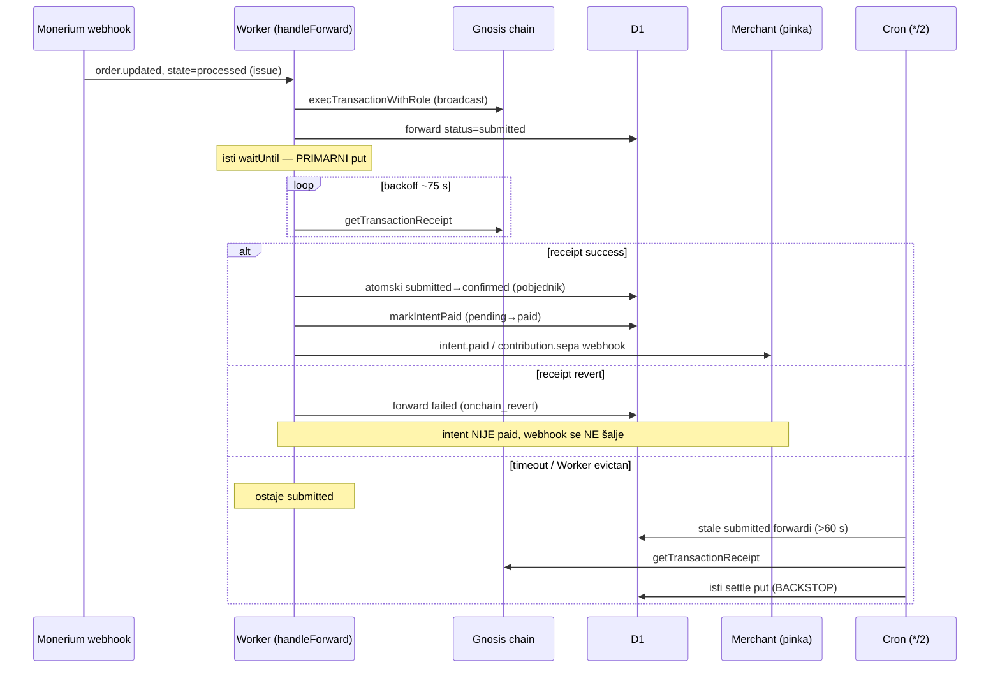
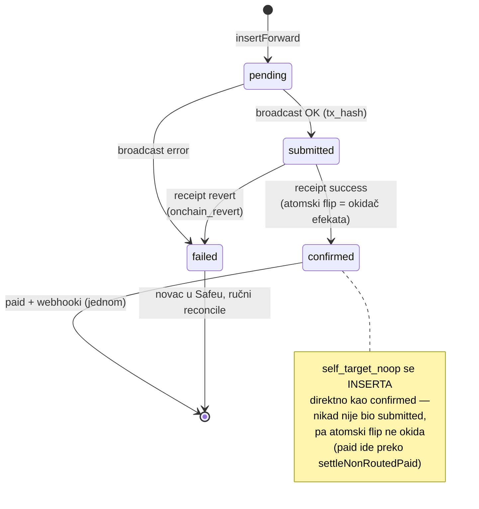
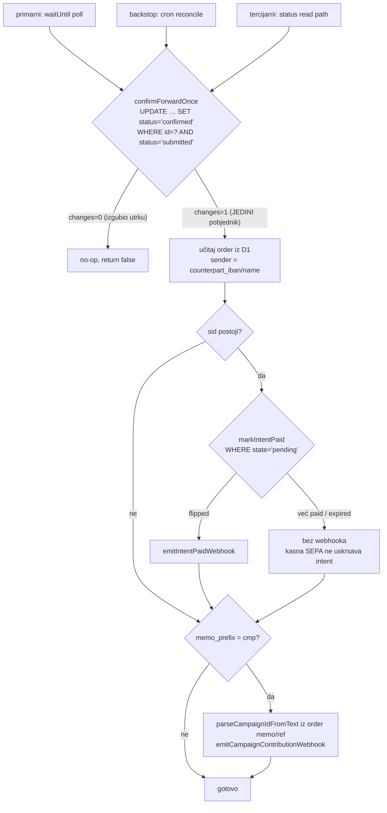

# Paid-on-confirmed settlement — „plaćeno" tek na on-chain potvrdi

_Shipped 2026-07-07 na `main` (grana `feat/paid-on-confirmed`). Follow-up na
payment-status-timeline (67ec7ca). Handoff koji je ovo definirao:
`docs/prompts/paid-on-confirmed-handoff.md`._

## Problem koji je riješen

Na MPT railu je `paid` (i merchant webhook `intent.paid`) okidao čim relay
**broadcasta** forward TX (EURe → primatelj kroz Safe + Zodiac Roles), tj. na
status `submitted`. Broadcast nije potvrda: TX može **revertirati**, a trgovac
je već dobio „plaćeno" dok je novac zapravo ostao u MPT Safeu (povrativ, ne
izgubljen). Timeline UI (`stage=settled`) je već čekao `confirmed`, pa su se
„paid" (trgovac) i „settled" (UI) razilazili.

**Odluka (opcija A):** paid-flip **i** svi izlazni webhooki (merchant
`intent.paid` + campaign `contribution.sepa`) okidaju tek kad je forward
**`confirmed`** on-chain. Reversal webhook (opcija B) nije u opsegu.

## Arhitektura — tri neovisna puta potvrde

Kritični zahtjev: potvrda mora biti **server-driven** — ne smije ovisiti o
tome gleda li netko checkout/status endpoint.

Treći, **tercijarni** put je postojeći read-path `confirmForwardIfMined`
(poziva se iz `buildIntentStatus` u `waitUntil` dok klijent polla status) —
sad također prolazi kroz settle, pa i on smije flipati paid+webhook ako je
prvi vidio receipt.

## Životni ciklus forwarda

## Single-fire idempotencija (dva zasuna)

Sva tri puta lijevkaju u `settleConfirmedForward`
(`backend/src/intents/confirm.ts`):

1. **Atomski uvjetni UPDATE** `submitted → confirmed` — samo jedan od tri
   puta izvršava efekte. Ovo prvi put daje single-fire i za `cmp:`
   contribution webhook (prije se oslanjao na to da maybeForward dođe do
   broadcasta točno jednom).
2. **`markIntentPaid` guard** `pending → paid` — drugi sloj za merchant
   webhook; ujedno pokriva kasnu SEPA-u nakon isteka (expired ostaje
   expired, novac se svejedno ruta).

## Rail matrica — kad se paid flipa

| Rail | Signal za `paid` | Zašto |
|---|---|---|
| routirani (`mpt:`/`gnosis:` s targetom ≠ Safe) | forward `confirmed` on-chain | broadcast može revertirati |
| `cmp:` campaign QR | forward `confirmed` (contribution webhook, nema intenta) | isto |
| self_target_noop (memo target = MPT Safe) | Monerium order `processed` (`settleNonRoutedPaid`, `forward_tx_hash=null`) | mint iza `processed` je već on-chain potvrđen; nema forward hopa za čekati |
| bez routing targeta | nikad (forward `failed`, `no_routing_target`) | novac parkiran u Safeu, ručni reconcile |

Monerium webhook gating netaknut: forward se pokreće **samo** na
`kind='issue' && order.updated && state='processed'` (vidi
`feedback_monerium_webhook_race` memoriju + `index.ts`).

## Ops bilješke

- **Poll raspored** `CONFIRM_POLL_DELAYS_MS` = 5,5,5,10,15,15,20 s (~75 s).
  Gnosis blokovi ~5 s → prve provjere hvataju tipičan slučaj. `waitUntil`
  može biti evictan prije kraja — zato cron backstop postoji i to NIJE bug.
- **Cron reconcile** vozi se na svakom `*/2` ticku (`reconcileSubmittedForwards`),
  uzima `submitted` starije od 60 s (`RECONCILE_MIN_AGE_SECONDS` — ne utrkuje
  se s primarnim pollom), LIMIT 50 po prolazu. Prazan set = jedan jeftin SELECT.
- **`failed` forward smije retry** na Monerium webhook replay (postojeće
  ponašanje za tranzijentne RPC greške) — pravi on-chain revert bi revertirao
  ponovno; novac ostaje u Safeu.
- **Stage machine (`computeStage`) NIJE diran** — `settled` je već značio
  forward `confirmed`; sad su `paid` i `settled` poravnati.

## Mapa koda

| File | Što |
|---|---|
| `backend/src/intents/confirm.ts` | settle/poll/reconcile jezgra, `ConfirmDeps` injekcija (testabilno bez D1/RPC) |
| `backend/src/monerium/db.ts` | `confirmForwardOnce` (atomski flip), `listSubmittedForwardsOlderThan` |
| `backend/src/index.ts` | `handleForward` (poll nakon broadcasta; self-target settle), cron registracija |
| `backend/src/intents/stage.ts` | `confirmForwardIfMined` → settle put |
| `backend/test/confirm.test.ts` | 11 testova: confirmed-ne-submitted, revert, dvostruka potvrda, expired, cmp, ne-routed, cron reconcile |
