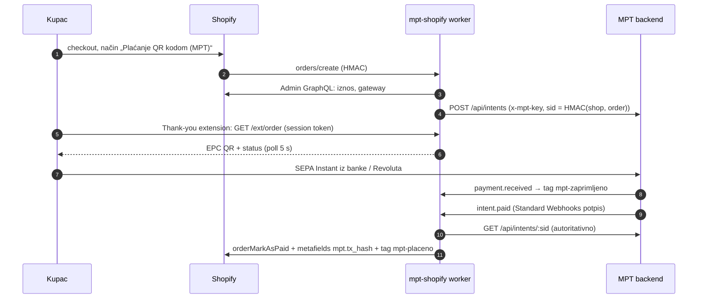

# MPT za Shopify (put B: ručni način plaćanja + automatika)

Svaki Shopify trgovac može primati SEPA uplate preko MPT-a bez da Shopify
odobri payment partnera. Kupac odabere ručni način plaćanja „Plaćanje QR
kodom (MPT)“. Na Thank-you stranici i na stranici statusa narudžbe prikaže
mu se EPC QR. Kad novac stigne na Safe trgovca, narudžba se sama označi
plaćenom.

Pozadina i usporedba s pravim payment appom (put A): [docs/integrations/shopify-woocommerce-gateway.md](../docs/integrations/shopify-woocommerce-gateway.md).

## Dijelovi

| Dio | Što radi |
|---|---|
| `shopify.app.toml` | Shopify app konfiguracija: scopes `read_orders,write_orders`, webhookovi `orders/create`, `app/uninstalled` i GDPR. Ujedno predložak za appove po trgovcu |
| `shopify.app.<trgovac>.toml` | Custom-distribution app jednog trgovca, generiran skriptom `scripts/new-merchant-app.sh` |
| `extensions/mpt-payment-qr/` | Checkout UI extension (Preact, API 2026-07): `purchase.thank-you.block.render` i `customer-account.order-status.block.render`. Prikazuje nativni `s-qr-code`, IBAN i opis plaćanja te status uživo. Za narudžbe koje nisu plaćene MPT-om ne prikazuje ništa |
| `worker/` | CF Worker `mpt-shopify.domovina.ai`: OAuth instalacija, Shopify i MPT webhookovi, API za extension, operatorski `/admin`, cron svake 2 min. D1 baza `mpt_shopify`. Jedan worker poslužuje sve appove |

Backend (`backend/`) se **ne mijenja**. Worker je običan klijent intent API-ja s
tenant ključem i prima outbound webhookove tenanta (ADR 0017).

## Tok



Ako se extension i `orders/create` utrkuju, oba izvode isti sid. Onaj koji
stigne drugi dobije 409 i samo pročita postojeći intent. Ako webhook ne stigne,
cron svake 2 minute pita intent API.

### Pravila statusa

- **paid**: `paid_at` postoji (on-chain potvrđen forward) i primljeni iznos je ≥ iznosa narudžbe. Tek tada ide `orderMarkAsPaid`.
- **underpaid**: stiglo je manje novca. Narudžba se **ne** označava plaćenom, dobiva tag `mpt-manjak` i rješava je čovjek.
- **received**: Monerium drži novac. Narudžba dobiva tag `mpt-zaprimljeno`, a kupac vidi „zaprimljeno“, uz napomenu o mogućem pregledu ako je prva uplata s tog IBAN-a.
- **expired**: intent je istekao (zadano 24 h). Narudžba dobiva tag `mpt-isteklo`, ili se otkazuje s povratom zalihe ako je `auto_cancel` uključen.
- **Kasna uplata nakon isteka** (`payment.late`) i dalje označava narudžbu plaćenom. Ako je narudžba već otkazana, dobiva tag `mpt-placeno-nakon-otkazivanja` i treba povrat ili ponovnu aktivaciju.
- **rejected**: Monerium je odbio uplatu i vraća novac. Tag `mpt-odbijeno`.

Status se uvijek čita iz intent API-ja. Tijelo webhooka je samo okidač.

## Jedan app po trgovcu

Custom distribution veže app za **jednu** trgovinu, i to se ne može poništiti
(isti model koristi BTCPay Server Shopify v2). Zato svaki trgovac dobiva svoj
app u Dev Dashboardu, sa svojim client ID-jem i secretom. Kod je isti za sve:

- **Shopify strana**: `shopify.app.<trgovac>.toml` se razlikuje od
  `shopify.app.toml` samo u `client_id` i `name`. Isti extension (`handle =
  "mpt-payment-qr"`) deploya se u svaki app s `--config <trgovac>`.
- **Worker**: tablica `apps` u D1 (client ID → shop + šifrirani secret).
  Worker prepoznaje app ovako:
  - install upit i Shopify webhookovi: po secretu čiji HMAC prolazi, među appovima te trgovine;
  - OAuth callback: po `client_id` spremljenom uz `state`;
  - session token iz extensiona: po `aud`, a zatim provjera potpisa tim secretom.

  Custom app vrijedi samo za svoju trgovinu. Token s `dest` druge trgovine se odbija.
- **Dijeljeni app** (`SHOPIFY_API_KEY` / `SHOPIFY_API_SECRET` u workeru) je
  opcionalan, za unlisted javni app ako ga jednom napravimo. Prazan znači da ga nema.
- Svaka trgovina pamti `client_id` appa koji ju je instalirao, jer je to app
  koji drži tokene i radi refresh. `app/uninstalled` drugog appa ne briše te tokene.

### Adresa workera je u configu appa

Sve adrese appa (install, OAuth, webhookovi i API koji zove QR extension)
dolaze iz **`application_url`** u `shopify.app.<trgovac>.toml`.
Extension ne može čitati config u runtimeu, pa `scripts/deploy-app.sh` prije
deploya upiše tu adresu u `extensions/mpt-payment-qr/src/config.js`, a nakon
deploya vrati commitanu vrijednost (zajednički worker). Zato se appovi deployaju
**samo** preko `./scripts/deploy-app.sh <trgovac>` (ili `npm run deploy -- <trgovac>`),
nikad izravno sa `shopify app deploy`.

### Zajednički ili standalone worker

| | Zajednički (zadano) | Standalone po trgovcu |
|---|---|---|
| Worker | `mpt-shopify.domovina.ai` | `mpt-shopify-<trgovac>.domovina.ai` (`wrangler deploy --env <trgovac>`) |
| D1, `TOKEN_KEK`, `SID_SECRET`, `ADMIN_TOKEN` | zajednički | vlastiti |
| App trgovca | redak u `apps` (`PUT /admin/apps`) | `SHOPIFY_API_KEY`/`SECRET` tog workera |
| Shopify config | `new-merchant-app.sh <trgovac> <client_id>` | isto + `--worker-url https://mpt-shopify-<trgovac>.domovina.ai` |
| Proboj workera otkriva | tokene i MPT ključeve svih trgovaca | samo tog trgovca |

Novac je odvojen u oba slučaja: svaki trgovac ima vlastiti Monerium račun,
MPT tenant i Safe s whitelistom, a worker nikad ne drži sredstva. Primjer
`[env.<trgovac>]` je na dnu `worker/wrangler.toml`.

## Jednokratni setup (mi)

1. **Worker**:
   ```bash
   cd shopify/worker && npm install
   npx wrangler d1 create mpt_shopify        # id → wrangler.toml
   npm run db:migrate:prod
   for s in TOKEN_KEK SID_SECRET ADMIN_TOKEN; do npx wrangler secret put $s; done
   npm run deploy
   ```
   `TOKEN_KEK`, `SID_SECRET` i `ADMIN_TOKEN` generirati s `openssl rand -base64 32`.
   **`SID_SECRET` se nikad ne rotira**: novi ključ bi postojećim narudžbama izveo drukčije sidove.
   **Ni `TOKEN_KEK` se ne mijenja bez re-enkripcije**: pod njim su secreti svih appova i tokeni svih trgovina.
2. `cd shopify && npm install` (Shopify CLI i extension).
3. **Distribucija**: custom distribution po trgovcu (dolje). Javno listanje u App Storeu vjerojatno ne bi prošlo review jer pravila zabranjuju appove koji „register transactions through the Shopify API“ mimo payment procesiranja.

## Onboarding trgovca (~45 min)

0. **Shopify app trgovca**:
   1. Dev Dashboard → *Create app* (naziv npr. „MPT — Croatisimo“) → *Distribution* → **Custom distribution** → domena trgovine `<shop>.myshopify.com`. Ovo je nepovratno.
   2. Kopirati *Client ID* i *Client secret*.
   3. Generirati config i deployati ga zajedno s extensionom:
      ```bash
      cd shopify
      ./scripts/new-merchant-app.sh croatisimo <client_id> --name "MPT — Croatisimo"
      ./scripts/deploy-app.sh croatisimo
      ```
      `shopify.app.croatisimo.toml` se commita (client ID nije tajna).
   4. U Dev Dashboardu za taj app zatražiti *Protected customer data access* (potreban za `orders/*` webhookove i čitanje narudžbi; ime, email i adresa nam ne trebaju) i *Network access* za UI extension.
   5. Registrirati secret u workeru **prije** instalacije. Bez toga worker odbija install jer ne može provjeriti HMAC:
      ```bash
      curl -X PUT https://mpt-shopify.domovina.ai/admin/apps/<client_id> \
        -H "authorization: Bearer $ADMIN_TOKEN" -H 'content-type: application/json' \
        -d '{"shop":"<shop>.myshopify.com","client_secret":"<secret>","label":"Croatisimo"}'
      ```
      `GET /admin/apps` daje popis (bez secreta). Rotacija secreta je isti `PUT`.
1. **MPT tenant** (ADR 0017, `/admin` → Tenanti): trgovčev vlastiti Monerium KYB, IBAN, Safe za isplatu na whitelisti.
   - `outbound_webhook_url` = `https://mpt-shopify.domovina.ai/webhooks/mpt`
   - `outbound_webhook_secret` = novi `whsec_…`
2. Trgovac instalira app preko install linka iz *Distribution* stranice appa.
3. Trgovac u **Settings → Payments → Manual payment methods → Create custom payment method**:
   - Naziv: `Plaćanje QR kodom (MPT)`. Mora sadržavati `gateway_match`, zadano `MPT`.
   - Dodatne informacije: „Nakon narudžbe prikazat ćemo vam QR kod. Skenirajte ga u aplikaciji banke i narudžba je plaćena.“
4. Trgovac u **Checkout editoru** doda blok „MPT QR plaćanje“ na *Thank you* i na *Order status* stranicu.
5. Mi aktiviramo trgovinu:
   ```bash
   curl -X PUT https://mpt-shopify.domovina.ai/admin/shops/<shop>.myshopify.com \
     -H "authorization: Bearer $ADMIN_TOKEN" -H 'content-type: application/json' \
     -d '{"mpt_api_key":"<tenant key>","mpt_webhook_secret":"whsec_…","target_address":"0x<Safe>","active":true}'
   ```
   Opcionalno: `gateway_match`, `intent_ttl_seconds` (600–86400), `auto_cancel`.
   Pregled zadnjih narudžbi: `GET /admin/shops/<shop>`. Ručni resync: `POST /admin/orders/<sid>/resync`.
6. Testna narudžba od 1 €, plaćena iz banke. Narudžba treba prijeći u *Paid* i imati metafield `mpt.tx_url`.

## Poznata ograničenja (MVP)

- **Svaki novi trgovac traži ručni korak u Dev Dashboardu** (app, distribucija, zahtjevi za pristup). Shopify za to nema API.
- **Session token ne veže narudžbu.** Svaki kupac iste trgovine s valjanim tokenom može upitati status i QR tuđe narudžbe ako pogodi njezin ID. Vidi iznos, broj narudžbe i QR, ali ne i osobne podatke. Ispravak bi bio vezati narudžbu uz `checkoutToken` ili `sub` iz tokena.
- **Jedan tenant ima jedan outbound webhook URL.** Tenant koji koristi Shopify ne može istodobno slati evente drugom primatelju (npr. pinka). Cron ionako pokriva sve.
- **Povrati su ručni** iz Safea trgovca. Refund u Shopifyju ne pokreće povrat novca.
- **Order status extension** radi samo s novim customer accountsima. S klasičnima kupac QR vidi samo na Thank-you stranici.
- **Refresh tokena**: dva istovremena refresha (cron i webhook) mogu se sudariti. Drugi tada padne, prvi spremi novi token, a sljedeći poziv radi.
- Još nije testirano na stvarnoj trgovini. Unit testovi pokrivaju potpise, izvođenje sida, enkripciju i logiku statusa (`cd worker && npm test`).
