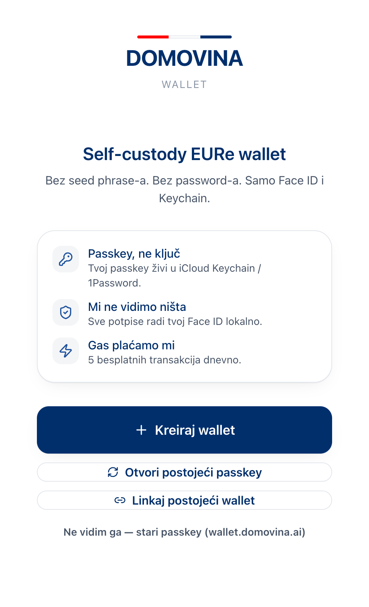
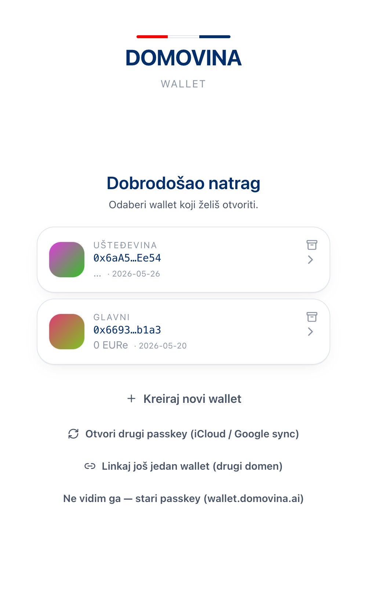
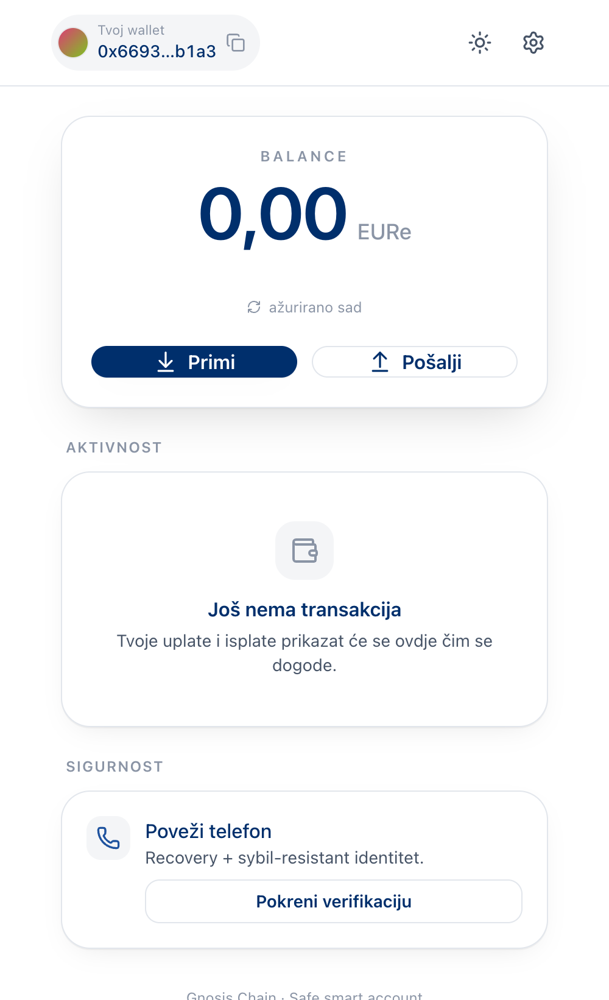
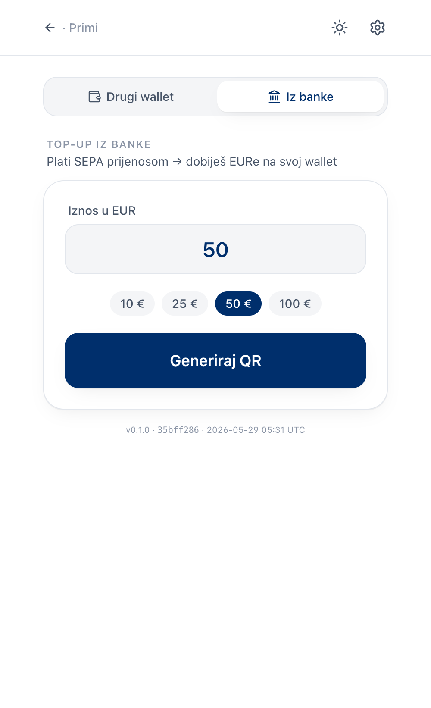
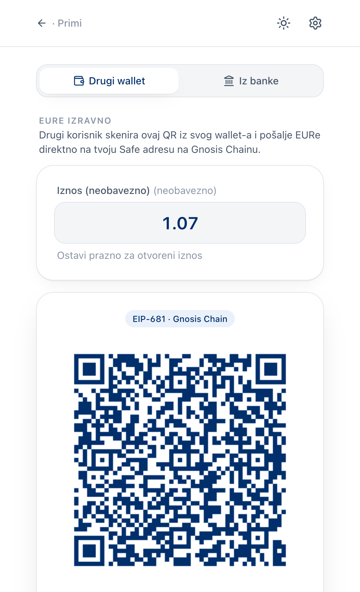
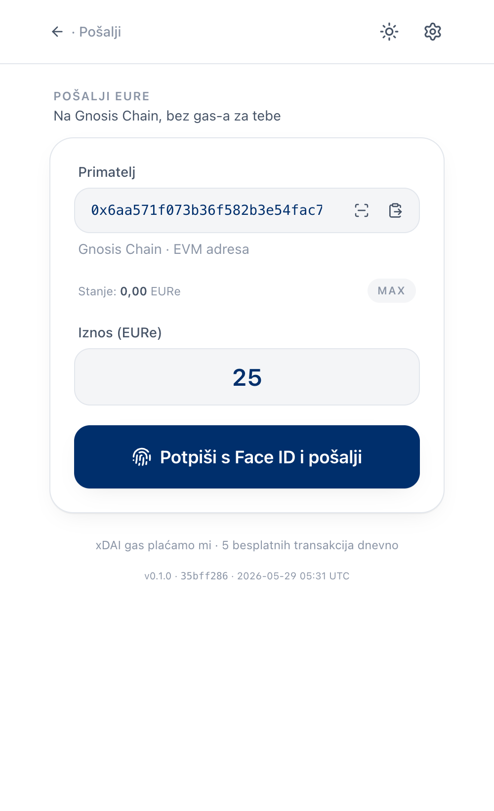
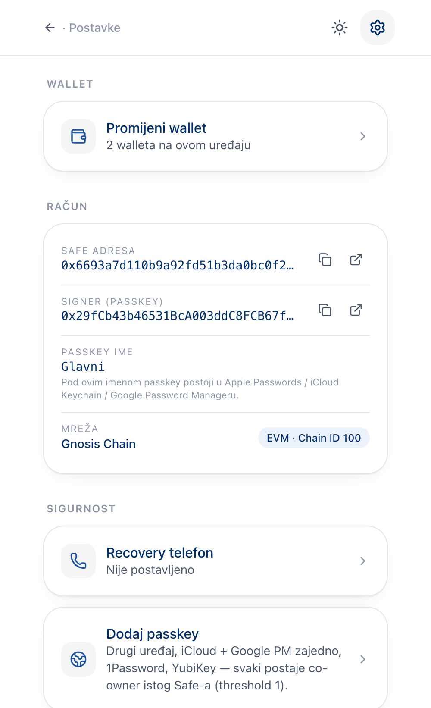
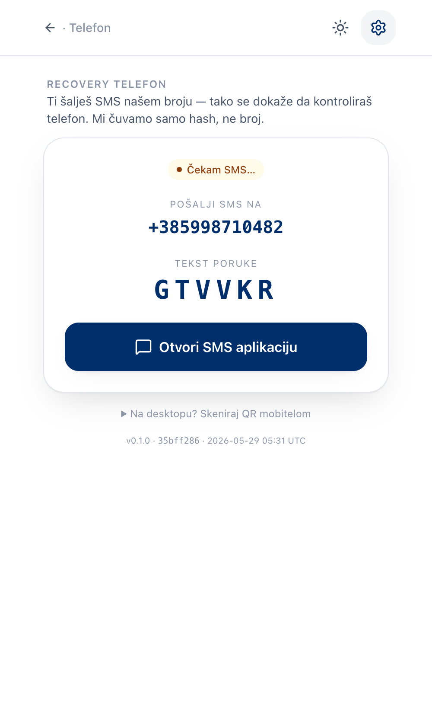
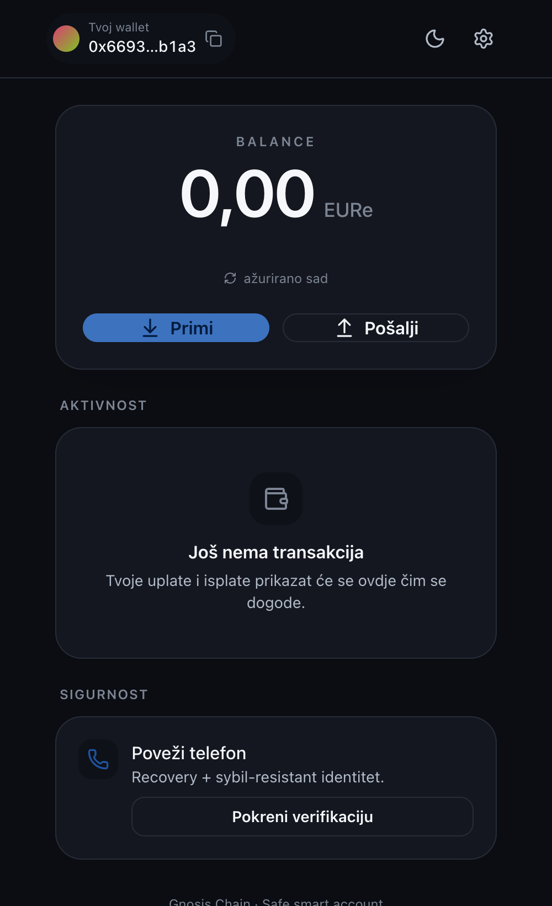

# wallet.domovina.ai

Self-custody EURe wallet na Gnosis Chainu. Passkey potpisivanje, bez seed
phrase-a. Top-up SEPA prijenosom kroz postojeći `pay.domovina.ai` rail; send
P2P kroz vlastiti gas-sponzorirani relayer.

> **Status:** Live na [wallet.domovina.ai](https://wallet.domovina.ai). Send
> pipeline validiran na pravoj Gnosis transakciji 2026-05-22 (vidi
> [`docs/decisions/0001-no-server-side-recovery.md`](../docs/decisions/0001-no-server-side-recovery.md)
> za self-custody granice).

<p align="center">
  
</p>

## Što radi

- **Passkey wallet** — kreiraj wallet jednim Face ID-om; passkey ide u iCloud Keychain / 1Password; cross-device login preko backend registry-ja
- **Primanje EURe**
  - **Iz banke** — SEPA QR (EPC) preko Monerium payment intent rail-a; status uplate live preko SSE
  - **Drugi wallet** — EIP-681 QR za on-chain transfer; **Podijeli** native share sheet (QR PNG + clickable deeplink); **Spremi QR** download
- **Slanje EURe**
  - AddressInput s paste + **scan QR** (kamera ili upload iz galerije) + nedavni primatelji chips
  - Live validacija adrese, comma/dot decimal input, EIP-681 dekoder
  - Face ID → Safe execTransaction → CF Worker relay → tx na Gnosis Chainu, gas plaća app (5 free tx/dan)
- **Aktivnost** — onchain EURe Transfer feed na home-u (in/out, counterparty, iznos, vremenska oznaka, link na Gnosisscan)
- **Recovery telefon** — reverse OTP verifikacija preko [`otp.domovina.ai`](https://otp.domovina.ai); čuvamo samo hash + sybil-resistant istraživanje
- **Settings** — Račun (Safe + Signer adresa, Gnosisscan), Sigurnost, Tema (sustav/svjetlo/tama), O aplikaciji, Odjava
- **Premium UI sloj** — dark mode, page transitions, haptics, iOS PWA safe-area padding, in-app **UpdateBanner** snackbar kad novi build stigne, deep linkovi (`/send?to=…&amount=…`)

## Screenshots

<p align="center">
  
  
  
</p>
<p align="center">
  
  
  
</p>
<p align="center">
  
  
  
</p>

Vidi [`docs/screenshots/README.md`](docs/screenshots/README.md) za listu screenshot-ova koje treba uhvatiti na pravom iPhone-u.

## Tech stack

| Sloj | Izbor |
|---|---|
| Build | Vite 5 + React 18 + TypeScript |
| Router | wouter (1.5kb, hooks API) |
| Styling | Tailwind 3 s brand tokenima (`brand.navy.*`, `brand.red.*`, surface + ink CSS vars) |
| UI primitive | Custom `src/ui/` — Button, Card, Sheet (Radix Dialog), Toast (Radix Toast), Field/Input/AmountInput/AddressInput, SegmentedControl, BalanceDisplay, AddressChip, StatusPill, Skeleton, EmptyState |
| Ikone | lucide-react |
| Web3 | viem + `@safe-global/protocol-kit` + `@safe-global/safe-passkey` |
| State | Zustand (identity); local component state za UI flows |
| PWA | `vite-plugin-pwa` s `registerType: 'prompt'` + in-app UpdateBanner |
| QR | `qr-code-styling` (generate) + `qr-scanner` (decode camera + image) |
| Hosting | Cloudflare Pages (`wallet-domovina` projekt) + CF Pages Functions za `/api/relay` |
| Relay | viem na Gnosis RPC; KV za rate-limit; RELAYER_PRIVATE_KEY secret |

## Routing

| Path | Screen |
|------|--------|
| `/` | Home (Wallet) — balance, akcije, aktivnost, sigurnost |
| `/receive` | Receive — Tab "Iz banke" (SEPA) ili "Drugi wallet" (P2P EURe) |
| `/send` | Send — paste/scan/recent, validacija, Face ID |
| `/send?to=ADDR&amount=DEC` | Send sa prefilled deep-linkom (strip-a query nakon prefill-a) |
| `/settings` | Settings hub |
| `/settings/phone` | Phone-binding wizard (OTP) |
| `/ui-preview` | Design system gallery (uvijek dostupan; ne zahtijeva login) |
| anything else | fallback na home |

Auth gate: ako `safeAddress` u zustand store-u je null, svaka non-preview ruta renderira Landing.

## Arhitektura

```
[Korisnik]
   │ Otvori Wallet → WebAuthn create/get (Face ID + iOS Keychain)
   │ Predict signer + Safe adresu (counterfactual)
   ▼
[wallet.domovina.ai PWA]
   │
   ├─ Primanje SEPA:
   │    POST mpt.domovina.ai/api/payment-intent { destination, amount }
   │    EPC QR  → Revolut/banka → Monerium → MPT Safe + Zodiac Roles
   │    Routing šalje EURe na korisnikov Safe (NO backend changes here).
   │
   ├─ Primanje P2P (Drugi wallet):
   │    EIP-681 QR + https deep link → drugi wallet skenira/klikne
   │    → on-chain ERC-20 transfer izravno na korisnikov Safe.
   │
   ├─ Aktivnost feed:
   │    viem getLogs filtriran po topic1/topic2 == safeAddress;
   │    block timestamps batched po unique blocku.
   │
   └─ Slanje:
        Safe.execTransaction payload → passkey signature
                                    → POST /api/relay
                                    → CF Worker submitta on-chain
                                    → relayer wallet plaća xDAI gas
                                    → 5 free tx/dan/passkey (KV brojač)

[Backend registry @ mpt.domovina.ai]
   POST /api/wallets        — register on passkey create (fire-and-forget)
   GET  /api/wallets/:credId — cross-device login fallback
   POST /api/wallets/:credId/bind-phone — phone recovery binding
   GET  /admin/wallets      — Basic Auth admin lista
```

Registry drži samo public info (credentialId, P-256 pubkey, Safe adresa, phone hash). Nikakvih private ključeva, nikakvih Safe-authoritative podataka. Vidi
[`docs/decisions/0001-no-server-side-recovery.md`](../docs/decisions/0001-no-server-side-recovery.md).

## Design system

Tokeni se nalaze u [`tailwind.config.js`](tailwind.config.js) i CSS variables u [`src/styles/index.css`](src/styles/index.css). Glavne odluke:

- **Brand paleta** — `brand.navy.{50…900}` + `brand.red.{50…700}`; navy 700 je primary brand, navy 400 je primary u dark modu (lighter za bolji contrast na crnoj).
- **Semantičke površine** — `surface.{base,raised,sunken,muted,border}` i `ink.{primary,secondary,muted,inverse}` su CSS varijable; toggle-anje `.dark` na `<html>` flipa cijeli sustav.
- **Tipografija** — system-ui kroz cijelu app; brojevi koriste `font-variant-numeric: tabular-nums` (`.tabular` utility) tako da iznosi ne plešu.
- **Radii** — 2xl za inpute/gumbe, 3xl za kartice, `pill` za chip-ove i status-pillove.
- **Shadows** — `card` (1px hairline + 8px blur), `elevated` (1px + 16px blur), `glow` (brand fokus prsten).
- **Motion** — `transitionTimingFunction.spring` (cubic-bezier(.34,1.56,.64,1)); `animate-route-enter` keying na URL change u AppShell-u; reduced-motion media query globalno skida sve animacije.

Primitive (svi pod `src/ui/`):
- `Button` / `IconButton` — CVA varijante primary/secondary/ghost/danger × sm/md/lg/xl
- `Card` / `Section` — elevation + radius + padding varijante; Section ima title + description + action
- `Field`, `Input`, `AmountInput`, `AddressInput` — labelirani inputi s invalid/focus state-om
- `Sheet` — Radix Dialog, bottom-sheet na mobile, centered na desktop, s drag-handle-om i close-om
- `Toast` provider + `useToast()` — Radix Toast, haptic-aware
- `Skeleton` / `EmptyState` / `StatusPill` / `Badge` — feedback primitive
- `AddressChip` — gradient avatar (HSL hash adrese) + truncated address + copy
- `BalanceDisplay` — veliki tabular numeric s last-updated indikatorom
- `SegmentedControl` — N-option radiogroup s iOS pill-on-track izgledom

Tour svih primitiva: [`/ui-preview`](https://wallet.domovina.ai/ui-preview).

## Dev

```bash
cd wallet
npm install
cp .dev.vars.example .dev.vars   # popuni RELAYER_PRIVATE_KEY za relay test
npm run dev                       # Vite na :5173

# CF Pages Functions lokalno (relay endpoint):
npx wrangler pages dev dist --kv RELAY_KV
```

Za scan QR testiranje na desktopu — kamera radi samo s HTTPS-om; koristi `npx wrangler pages dev` (HTTPS preko Cloudflare Quick Tunnel) ili `vite dev` s lokalnim mkcert sertifikatom.

## Build + deploy

```bash
npm run build                          # tsc --noEmit && vite build
npm run deploy                          # wrangler pages deploy dist --project-name=wallet-domovina
```

Production deploy zahtijeva `CLOUDFLARE_ACCOUNT_ID` env var:

```bash
CLOUDFLARE_ACCOUNT_ID=7dc7167b7e2e00923bfa7cd697df14e4 \
  npx wrangler pages deploy dist --project-name=wallet-domovina --branch=main
```

Potrebno prije prvog deploya:
- CF Pages projekt `wallet-domovina` kreiran u dashboardu
- Custom domain `wallet.domovina.ai` zakvačen
- KV namespace kreiran i ID upisan u [`wrangler.toml`](wrangler.toml)
- Secret `RELAYER_PRIVATE_KEY` postavljen kroz `wrangler pages secret put`
- Relayer xDAI account funded (~$10 xDAI pokriva ~15,000 tx)

## PWA install (korisnička perspektiva)

**iOS Safari (iPhone, iPad)**
1. Otvori [wallet.domovina.ai](https://wallet.domovina.ai) u Safariju
2. Share gumb → **Dodaj na početni zaslon** ("Add to Home Screen")
3. Otvori s home screena → puni standalone mod s vlastitim splash-om i bez Safari chrome-a
4. Update detekcija — kad deploy-amo novu verziju, unutar minute se pojavi snackbar **"Nova verzija je spremna"**. Klikni Ažuriraj.

**Android Chrome / Edge**
1. Otvori wallet.domovina.ai
2. Menu → **Install app** ili automatski prompt
3. Update detekcija isto kao iOS

## Ključne adrese (Gnosis Chain — chainId 100)

Iz `safe-global/safe-modules-deployments` v0.2.1:

- `SafeWebAuthnSignerFactory` — `0x1d31F259eE307358a26dFb23EB365939E8641195`
- `SafeWebAuthnSharedSigner` — `0x94a4F6affBd8975951142c3999aEAB7ecee555c2`
- `DaimoP256Verifier` (fallback) — `0xc2b78104907F722DABAc4C69f826a522B2754De4`
- `P256 precompile` — `0x0000000000000000000000000000000000000100` (status na Gnosisu još nepotvrđen; verifier param u factoryju kodira (precompile || fallback))
- `EURe` — `0xcB444e90D8198415266c6a2724b7900fb12FC56E`

## ADRs (architecture decision records)

- [0001 — No server-side recovery (self-custody principle)](../docs/decisions/0001-no-server-side-recovery.md)
- [0002 — Phase 5 onchain phone attestation](../docs/decisions/0002-phase-5-onchain-phone-attestation.md)
- [0003 — Phase 5 PhoneSBT contract design](../docs/decisions/0003-phase-5-sbt-design.md)
- [0004 — Phase 5c Android verifier custody](../docs/decisions/0004-phase-5c-android-verifier.md)

## Roadmap

**Phase 5 — Onchain phone attestation** (planirano, vidi ADR 0002 + 0003)
- PhoneSBT contract na Gnosisu; passkey-signed claims; sybil-resistant reputation
- Verifier potpisuje attestation poruke; otvoreno pitanje custody (CF Worker secret vs Pi-in-office signing service)

**Phase 6+ — Polishing kandidati**
- ENS resolution u activity feed (rendering 0x adrese kao .eth imena gdje su dostupna)
- Address book — manualne oznake za recipient chip-ove
- Multi-passkey (1/N → 2/N s "Add another device" flow-om)
- WalletConnect support za korištenje sa drugim dApp-ovima

## Otvorena pitanja

- **RIP-7212 na Gnosisu** — DaimoP256Verifier fallback je sigurnosna mreža (200k gas vs 3.5k za precompile). Treba potvrditi precompile status; nije blocker.
- **iCloud Keychain sync vs lokalni passkey** — cross-device login radi preko backend registry-ja, ali tek nakon što Apple sinkronizira passkey; vremenske latencije variraju.
- **Edge case: Safe nije deployan kad korisnik šalje** — trenutno `multiSend` deploy+transfer batch radi pouzdano; pripaziti ako se Safe singleton ikada mijenja.

## Licenca

Ovaj projekt je dio obitelji **Domovina** (vidi [domovina.tv](https://domovina.tv)).

🤖 Generated with [Claude Code](https://claude.com/claude-code).
