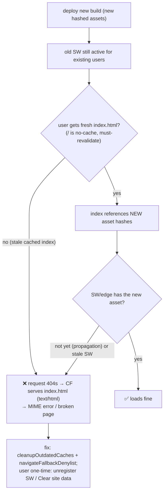

# Deploy & PWA/service-worker gotchas

This wallet is a **vite-plugin-pwa** app (`registerType: 'prompt'`) on Cloudflare
Pages. The PWA service worker is the source of most "why am I seeing old behavior"
confusion. Read this before debugging a "my change didn't show up" report.

## Deploy

From the repo on `main`:

```
BRAND_PROJECT=wallet-domovina npm run deploy   # build:default + wrangler pages deploy
# or: npm run ship:default
```

Default brand → project **`wallet-domovina`** = **wallet.domovina.ai** (the live wallet).
Other brands: `wallet-sportklub`, `wallet-zupa`, plus a `wallet-staging` target.
Verify the SDK after deploy:

```
curl -s https://wallet.domovina.ai/sdk.js | grep _version
```

`Domovina._version` is the **SDK loader** version — it only exists on a page that
LOADED `sdk.js` (a tenant dApp like **pinka.io**), **NOT** on wallet.domovina.ai
itself (the wallet app doesn't load its own SDK). Don't look for it on the wallet home.

## The stale-service-worker trap (the #1 "my fix didn't show up")

After a deploy the OLD service worker keeps serving the OLD bundle until the in-app
"Ažuriraj" banner is accepted. Two failure modes we hit and fixed:

1. **"Ažuriraj" did nothing.** Across rapid deploys the waiting SW was already gone by
   the time the user tapped → `updateServiceWorker(true)` had nothing to skip →
   `controllerchange`/reload never fired. **Fix (shipped):** `UpdateBanner.applyUpdate`
   now also forces `location.reload()` after 2s as a fallback.
2. **MIME error: "Refused to apply style … MIME type ('text/html')".** Cloudflare Pages
   serves `index.html` (text/html, 200) for ANY path with no file — so a request for a
   hashed asset that the SW/edge doesn't have yet (deploy-propagation window, or a stale
   cached `index.html` referencing an old hash) returns HTML and the browser rejects it.
   **Fixes (shipped):** `cleanupOutdatedCaches: true` + a `navigateFallbackDenylist` that
   excludes `/assets/`, `/.well-known/`, and known static extensions, so the SW never
   returns `index.html` for an asset request.



**Catch-22:** a fix to the SW can't reach a user whose SW is already stuck. To force
it once: **DevTools → Application → Service Workers → Unregister** (or **Clear site
data**), then reload. On iPhone: Settings → Safari → Advanced → Website Data → remove
wallet.domovina.ai. The `_headers` already sets `/index.html`, `/sw.js`, `/registerSW.js`
to `no-cache`; `/sdk.js` is short-cache (but a zone-level Browser-Cache-TTL can still
make browsers hold it a few hours → hard-refresh).

## `_headers` invariants

- `/embed` keeps `frame-ancestors *` + `publickey-credentials-get/create` — it MUST be
  framable cross-origin (that's the send() iframe). Nothing else should be framable
  (the old `/link` page + its `frame-ancestors *` were removed as dead attack surface).
- `/assets/*` is `immutable, max-age=1yr` (content-hashed); `/index.html` + `/sw.js` are
  `no-cache`.
