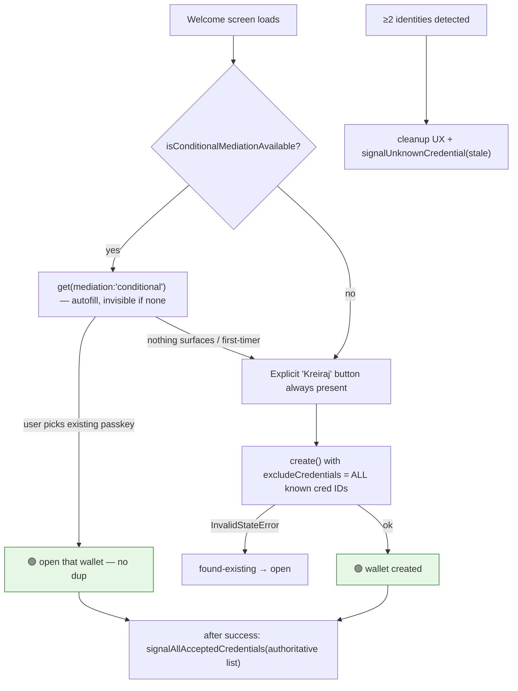

# Passkey onboarding — industry standards & Coinbase comparison

Research-backed reference (2026-06-10) for how a passkey-owned smart wallet should
handle create-vs-open, duplicate prevention, and cleanup. Sourced from primary docs
(W3C/passkeys.dev/Chrome/Apple/Google), the Coinbase Smart Wallet open-source repos,
and a packet capture of the keys.coinbase.com ceremony. Supersedes the fix plan
sketched in [user-flows.md](./user-flows.md) §8.2.

## TL;DR — the three findings that change our plan

1. **Coinbase does NOT solve duplicates better than us at the WebAuthn layer.** A
   capture of the live keys.coinbase.com registration shows `excludeCredentials: []`
   (empty), a **random per-create `user.id`**, `displayName: "Smart Wallet <date>"`,
   and **no get-first probe** — the same gaps we have. They tolerate duplicate
   passkeys because account identity is anchored to an **email/OTP + recovery-phrase
   server session**, not to the passkey. splits.org (hands-on) confirms: *"you can
   always just have a bunch of wallets."* We are **self-custody with no email/server
   account** ([[project_self_custody_principle]]), so we cannot copy their masking
   trick — we must fix it at the WebAuthn layer.
2. **The keys.coinbase.com onboarding frontend is closed-source.** Only the
   *contracts* and the *connector SDK* are open (MIT). There is no Coinbase UI repo to
   copy the create/recover/add-device flow from. The reusable standard is the W3C /
   passkeys.dev / Chrome guidance below, not Coinbase's UI.
3. **Our architecture is validated by Coinbase's contracts.** Their recovery model is
   *recovery-EOA-as-extra-owner* — identical to our 1-of-2 `[passkey, recovery EOA
   seed]` (ADR 0012/0013). Coinbase is hard **1-of-N with no threshold**; Safe gives us
   a configurable threshold, which is strictly better and is exactly what avoids
   Postmortem 0001 (1/1 passkey-only traps funds). We are not behind the market leader
   here — we match it and, via Safe, slightly exceed it.

## 1. Coinbase Smart Wallet — what's open source

| Repo | License | Contents | Open? |
|---|---|---|---|
| [coinbase/smart-wallet](https://github.com/coinbase/smart-wallet) | MIT | ERC-4337 account: `CoinbaseSmartWallet`, `…Factory`, `MultiOwnable`, `ERC1271` | ✅ contracts |
| [base/webauthn-sol](https://github.com/base/webauthn-sol) | MIT | `WebAuthn.sol` — on-chain assertion verify, RIP-7212→FreshCryptoLib fallback | ✅ lib |
| [base-org/fresh-crypto-lib-audit](https://github.com/base-org/fresh-crypto-lib-audit) | (FCL upstream) | secp256r1 `ecdsa_verify` fallback | ✅ lib |
| [daimo-eth/p256-verifier](https://github.com/daimo-eth/p256-verifier) | MIT | the P256 verifier pattern (we already use Daimo's) | ✅ lib |
| [coinbase/MagicSpend](https://github.com/coinbase/MagicSpend) | MIT | ERC-4337 paymaster — spend Coinbase balance for gas/in-tx | ✅ contracts |
| [coinbase/spend-permissions](https://github.com/coinbase/spend-permissions) | MIT | manager-as-owner for recurring/session spend | ✅ contracts |
| [coinbase/coinbase-wallet-sdk](https://github.com/coinbase/coinbase-wallet-sdk) | permissive | EIP-1193 connector that opens a popup to keys.coinbase.com | ✅ SDK glue only |
| keys.coinbase.com onboarding UI | — | the create/sign-in/recover/add-device **frontend** | ❌ **closed** |
| [code-423n4/2024-03-coinbase](https://github.com/code-423n4/2024-03-coinbase) | audit snapshot | all contracts at audit time, single tree (convenient read) | ✅ mirror |

**Portable to our Safe wallet:** `base/webauthn-sol`'s `WebAuthnAuth` struct + the
RIP-7212-first / FCL-fallback verify (we do the equivalent with Daimo P256 — worth
cross-checking our `webauthnSig.ts` parsing + `s > n/2` malleability guard against
it). **Not portable:** their ERC-4337/bundler/MagicSpend stack (we use a direct CF
relayer + ERC-1271), Solady ERC-1967 proxy (we use SafeProxyFactory), and the closed
onboarding UI.

## 2. WebAuthn duplicate-prevention — the actual standard

### `excludeCredentials` — necessary but NOT sufficient
Pass the user's known credential IDs; if the authenticator already holds one,
`create()` rejects with **`InvalidStateError`** (catch → "already enrolled"). Limits
that matter for us ([web.dev](https://web.dev/articles/webauthn-exclude-credentials)):
- only the **provider holding a matching `id`** short-circuits — a *different* provider
  (iCloud vs 1Password) or a second device sees no match and **creates a duplicate**;
- the RP can only list IDs it knows — ours come from **clearable localStorage**, so a
  cleared/cross-context store ⇒ empty list ⇒ duplicate;
- it has even been **fragile within one provider**: Safari 17.4 *stopped honoring
  `excludeCredentials`* entirely and minted duplicates ([WebKit #270553](https://bugs.webkit.org/show_bug.cgi?id=270553)).
> **Lesson: `excludeCredentials` is a UX optimization, not a correctness guarantee.**

### Conditional mediation (autofill) — the trap-free existence probe
`PublicKeyCredential.isConditionalMediationAvailable()` → `navigator.credentials.get({
mediation: 'conditional' })` surfaces existing passkeys in autofill **and renders
nothing when none exist** — so it is simultaneously the discovery affordance for
returning users AND an existence probe that **cannot trap a first-timer** (no modal to
dismiss). This is the spec-blessed answer to the "picker with no Create option traps
users" problem that made us remove our old modal probe
([Chrome](https://developer.chrome.com/docs/identity/webauthn-conditional-ui),
[passkeys.dev](https://passkeys.dev/docs/use-cases/bootstrapping/)).

### WebAuthn Signal API — the ONLY standard way to *remove* a duplicate
`excludeCredentials` only *prevents*; it can never *clean up* a duplicate that already
exists. Three static methods push state back to the password manager
([Chrome](https://developer.chrome.com/docs/identity/webauthn-signal-api),
[MDN](https://developer.mozilla.org/en-US/docs/Web/API/PublicKeyCredential/signalUnknownCredential_static)):

| Method | Effect |
|---|---|
| `signalAllAcceptedCredentials({rpId, userId, allAcceptedCredentialIds})` | hides PM entries **not** in the list (call after each successful open) |
| `signalUnknownCredential({rpId, credentialId})` | authenticator is *expected to delete* that credential (works unauthenticated) |
| `signalCurrentUserDetails({rpId, userId, name, displayName})` | updates the entry's labels only |

Support: Chrome/Edge **132+**, Safari **26+/iOS 26+** (with a known promise-resolution
bug, WebKit #298951), Firefox none — *"Limited availability."* Deletion is **advisory**
(authenticator decides), so treat as best-effort.

### `user.id` semantics — confirms our choice
`user.id` is an opaque ≤64-byte handle; re-using the same `(rpId, user.id)` on
`create()` **overwrites** the existing credential — Apple documents this as the
intended way to replace a credential
([passkeys.dev/iOS](https://passkeys.dev/docs/reference/ios/),
[Google](https://developers.google.com/identity/passkeys/developer-guides/server-registration)).
For a wallet, overwrite destroys the keypair that owns the Safe → orphaned funds. So a
**stable `user.id` is unacceptable** and our **random-per-create `user.id` is correct**;
there is no "stable handle without overwrite" option. get-first + excludeCredentials is
the sanctioned substitute for the dedup a stable handle would give — minus the
destruction.

### Distinguishable labels
Two random-`user.id` credentials with the **same** `user.name`/`displayName` show as
two indistinguishable entries — worsening "which one do I tap." ADR 0011's
address-as-name (`DOMOVINA_0x…`) already solves this; the identity slug
`domovina-wallet-v1` does not. Consider putting the Safe address (or a short suffix) in
the visible label so any duplicate that slips through stays selectable.

## 3. Revised fix plan (supersedes user-flows §8.2)

**Phase 1 — conditional-mediation discovery on the welcome screen (THE probe).**
Replace the removed modal probe with `mediation:'conditional'` autofill, gated on
`isConditionalMediationAvailable()`. Invisible to first-timers (no trap), surfaces the
synced passkey to returning/cleared-storage/cross-device users so they **open** instead
of creating a second wallet. Keep the explicit "Kreiraj" button as the always-available
fallback (and for browsers without conditional UI). *This merges the old Phase 1+2 —
the research is explicit that a modal get()+fallthrough is the inferior form.*

**Phase 2 — `excludeCredentials` at ALL create sites, from the widest source we have.**
`Landing.runCreate` already passes local IDs; make `ExpandAccess.runExpand` do the same
(currently passes none). Seed the list from every durable source we have (local
registry + any backend-registry IDs we can resolve) — knowing it's still partial.

**Phase 3 — duplicate detection + Signal API cleanup (load-bearing, not optional).**
Because self-custody gives us no authoritative server enumeration, `excludeCredentials`
is permanently partial → cleanup is the real safety net. When ≥2 identities exist
(esp. sharing `domovina-wallet-v1`): show each wallet's EURe balance + a cleanup
affordance; call `signalAllAcceptedCredentials` after each open to hide non-authoritative
entries, and `signalUnknownCredential` to ask the PM to delete a confirmed-empty stale
one (feature-detected, best-effort, with the manual "delete in Apple Passwords"
instruction as fallback).

**Phase 4 — distinguishable labels.** Move the visible passkey label toward the
ADR-0011 address-as-name (or append a short Safe-address suffix) so unavoidable
duplicates remain selectable.

**Unchanged invariants:** random `user.id` (never stable — overwrite orphans funds);
never ship 1/1 passkey-only ([[feedback_passkey_only_traps_funds]]) — the duplicate
problem is one more reason recovery paths must exist independent of dedup hygiene.

## 4. Irreducible limits (set expectations)
- `excludeCredentials` binds only the provider holding the match → **cross-provider /
  cross-device duplicates cannot be prevented**, only detected + cleaned after the fact.
- Signal API deletion is **advisory** and not yet on Firefox / pre-26 Safari.
- A user can always choose "Svejedno kreiraj novi" — intentional dups stay possible.
- We will **not** adopt Coinbase's email/server account anchor — it breaks self-custody
  ([[project_self_custody_principle]]). Our nearest durable anchor is the password
  manager itself (passkey-name-equals-Safe-address) + conditional-mediation discovery.

## Sources
Coinbase/Base: [coinbase/smart-wallet](https://github.com/coinbase/smart-wallet) ·
[base/webauthn-sol](https://github.com/base/webauthn-sol) ·
[coinbase/MagicSpend](https://github.com/coinbase/MagicSpend) ·
[Corbado capture of keys.coinbase.com](https://www.corbado.com/blog/smart-wallets-passkeys) ·
[splits.org hands-on](https://splits.org/changelog/coinbase-smart-wallet-passkeys/) ·
[Coinbase Help — Smart Wallet passkeys](https://help.coinbase.com/en/wallet/getting-started/smart-wallet-passkeys).
Standards: [web.dev excludeCredentials](https://web.dev/articles/webauthn-exclude-credentials) ·
[Chrome conditional UI](https://developer.chrome.com/docs/identity/webauthn-conditional-ui) ·
[Chrome Signal API](https://developer.chrome.com/docs/identity/webauthn-signal-api) ·
[passkeys.dev bootstrapping](https://passkeys.dev/docs/use-cases/bootstrapping/) ·
[passkeys.dev iOS](https://passkeys.dev/docs/reference/ios/) ·
[Google server registration](https://developers.google.com/identity/passkeys/developer-guides/server-registration) ·
[WebKit #270553 (Safari dropped excludeCredentials)](https://bugs.webkit.org/show_bug.cgi?id=270553).
