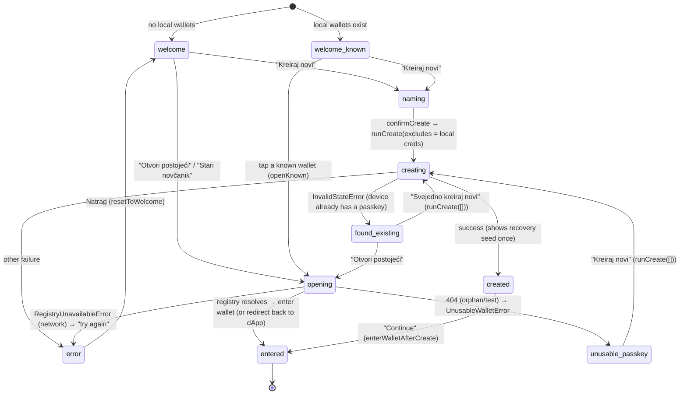

# Passkey onboarding (create / open) — model, state machine & hard-won rules

**Applies to:** `src/routes/Landing.tsx` + `src/lib/passkey.ts`. The wallet identity
IS a passkey (ADR-0013: one passkey → many Safes via `recoveryOwner`). This doc
records WHY the create/open flow is shaped the way it is, because the obvious
designs all fail in non-obvious ways.

## The five rules (learned the hard way)

1. **NEVER get-first before create.** A `navigator.credentials.get()` (a "probe")
   renders the OS sheet titled **"Use a saved passkey"** and ONLY lists existing
   passkeys — it *never* offers "create". A probe-before-create therefore traps the
   user (Apple Passwords shows only existing/broken ones, no way to make a new one).
   **Diagnosing rule:** the OS sheet TITLE tells you the ceremony —
   **"Use a saved passkey" = get()**, **"Save a passkey" = create()**.
2. **Create goes STRAIGHT to `create()`** with `excludeCredentials = locally-known
   creds`, so the authenticator REFUSES a same-device duplicate (`InvalidStateError`
   → `found-existing`). No probe.
3. **Never use a stable `user.id`** to force dedup. Apple/iCloud dedupe on
   `(rpId, user.id)`; a stable id would make `create()` OVERWRITE the existing passkey
   → new keypair → the funded Safe is orphaned. We use a **random `user.id`** on
   purpose (anti-overwrite). The cost: cross-device / cleared-storage dedup is
   impossible without showing the picker, so that rarer case can still produce a
   duplicate wallet (benign — archivable). "Otvori postojeći" / "Svejedno kreiraj" are
   the explicit escapes.
4. **A passkey that authenticates but maps to no usable wallet** (404 in the registry —
   orphan/test) routes to `unusable-passkey` → guided "Kreiraj novi", NOT a dead error.
   A *network/5xx* lookup (`lookupWalletStrict` → `RegistryUnavailableError`) shows
   "try again" — we must NOT tell a user with a real funded wallet that it "doesn't
   exist".
5. **The dApp can never present a clean passkey chooser — only the RP-owning origin
   (this wallet) can**, because WebAuthn gives the RP no control over the OS picker.
   That's why cross-origin connect redirects here (see `cross-origin-wallet-connect.md`).

> Environment note: on macOS Chrome/Brave with BOTH a LastPass extension AND Apple
> Passwords, `create()` summons LastPass's "Save?" prompt first; dismissing it falls
> through to the native sheet. That's the OS/extension, not our bug — the RP can't
> filter providers.

## State machine

Notes:
- `found-existing` reached from `InvalidStateError` carries no credentialId, so
  "Otvori" falls back to `openExisting()` (the OS picker). "Svejedno kreiraj novi"
  uses `runCreate([])` (no excludes) — the one deliberate dup-allowing path.
- When opened via the **SDK connect handoff** (`?dw_connect=1`), every "wallet ready"
  exit (`openKnown` / `openExisting` / `enterWalletAfterCreate`) redirects the identity
  back to the dApp instead of entering the wallet UI (`maybeReturn`). See
  `cross-origin-wallet-connect.md`.

## RP IDs / backward compatibility

- Current RP = **`domovina.ai`** (parent-domain, so one passkey works across every
  `*.domovina.ai` site). Legacy passkeys created pre-migration are scoped to
  **`wallet.domovina.ai`** (`LEGACY_RP_ID`); a `get()` under `domovina.ai` won't surface
  them, so "Otvori postojeći" tries the current RP then legacy, and there's a dedicated
  "Stari novčanik (prije svibnja 2026)" legacyOnly path.
- `signWithPasskey` MUST pass the per-record `rpId` (the browser does no implicit
  parent/child fall-through).

## Known open items

See `wallet-audit-followups` (in the agent memory) — notably: cross-device restore
drops `recoveryOwner` (backend `WalletRegistryView` doesn't return it) so "Novi račun"
is disabled on restored devices until the backend plumbs `recovery_owner` through.
