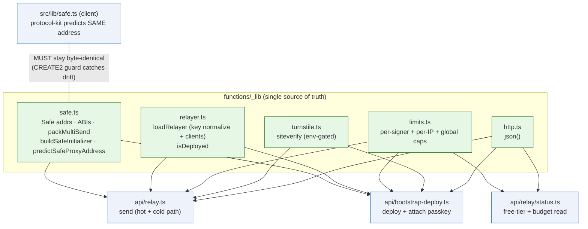
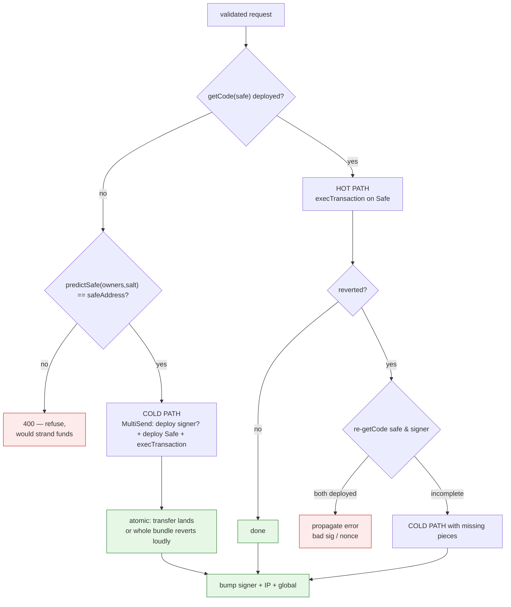
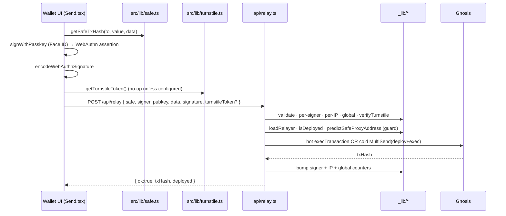

# Relayer architecture & the shared `_lib`

How the gas-sponsoring Workers are structured, and **why the CREATE2-critical code
lives in exactly one place**. Read this before editing anything under
`functions/`.

## 1. Why a shared module exists

`relay.ts` and `bootstrap-deploy.ts` both deploy Safes at **counterfactual
addresses the client has already funded**. The deployed address is fully
determined by the `setup()` initializer bytes and the salt. If either Worker's
`buildSafeInitializer` / `predictSafeProxyAddress` drifts from the client's by a
single byte, the relayer deploys a Safe at address *X* while the user's funds sit
at address *Y* — and because an EVM call to a code-less address returns
`status=1` with no revert (see memory `evm-call-to-empty-address`), the loss is
**silent and permanent**.

Before the refactor, both Workers carried byte-for-byte **copies** of this logic,
kept in sync by hand-discipline alone (the code literally said *"Mirrors relay.ts
verbatim"*). That is a latent fund-stranding bug waiting on one careless edit.
Now there is a single source of truth.

> The client (`src/lib/safe.ts`, via Safe `protocol-kit`) and the Workers
> (`functions/_lib/safe.ts`, hand-rolled viem) derive the address through two
> independent implementations. That redundancy is intentional — and the cold-path
> **CREATE2 guard** (`predictSafeProxyAddress(owners, salt) === safeAddress`) is
> the runtime net that refuses to deploy if they ever disagree, *before* funds can
> strand. Keep them in lockstep so the guard never has to fire.

## 2. Module responsibilities

| File | Owns | Notes |
|---|---|---|
| `_lib/safe.ts` | Safe v1.4.1 + Passkey constants, ABIs, `packMultiSend`, `encodeVerifiers`, `buildSafeInitializer`, `predictSafeProxyAddress` | **CREATE2-critical.** Owner array order is part of the preimage. |
| `_lib/relayer.ts` | `loadRelayer()` (trim → `0x` → 64-hex validate → viem clients), `isDeployed()` | Centralises the `RELAYER_PRIVATE_KEY` normalization (wrangler secrets arrive without `0x` / with whitespace). |
| `_lib/limits.ts` | Per-signer free tier + per-IP + global budget counters + key formats | Read path (status) and write path (relay/bootstrap) share these, so they can't drift. |
| `_lib/turnstile.ts` | `verifyTurnstile()` siteverify | Env-gated; fail-open when unconfigured, fail-closed on verify error when configured. |
| `_lib/http.ts` | `json()` | Trivial shared response helper. |

## 3. The send decision flow (`api/relay.ts`)

The hardest logic in the relayer is choosing the **hot** vs **cold** path without
ever silently dropping a send. The driver is that `execTransaction` on an
*undeployed* Safe does **not** revert — it succeeds as a ~21k-gas no-op — so we
can never rely on a hot-path revert to detect "Safe isn't deployed yet".

Key invariants encoded here:

- **The CREATE2 guard runs on the cold path only.** An already-deployed
  ADR-0011/0012 bootstrap Safe has an *ephemeral-EOA* initializer owner, so
  `predictSafe(passkeySigner) ≠ safeAddress` for it — correct and expected. It
  only ever takes the hot path, so guarding unconditionally would wrongly reject
  every bootstrap send.
- **Pre-flight `getCode` is mandatory** (memory `relay-hot-first`): hot-first
  alone once silently lost 1.05 EURe to a call-to-empty-address.
- **Counters bump only on a landed tx**, and now include the per-IP + global gas
  budget (see [relayer-threat-model.md](./relayer-threat-model.md)).

## 4. Request lifecycle (end to end)

## 5. Editing rules

1. **Never re-inline** a Safe constant, ABI, or CREATE2 derivation into a Worker.
   Import from `_lib/safe.ts`. If the client side changes its derivation, change
   `_lib/safe.ts` in the same PR.
2. **Owner array order is consensus-critical** — `[signer]`, `[ownerEoa]`, or
   `[signer, recoveryOwner]` (ADR-0013) must match the client's `derivedOwners()`
   order exactly.
3. **New sponsored path** → reuse `readAbuseState` / `capExceeded` / `bumpAbuse`
   and `verifyTurnstile`; don't hand-roll a counter.
4. **Secrets** flow through `loadRelayer()` — don't call `privateKeyToAccount`
   directly (it's strict about the `0x` prefix and whitespace).
