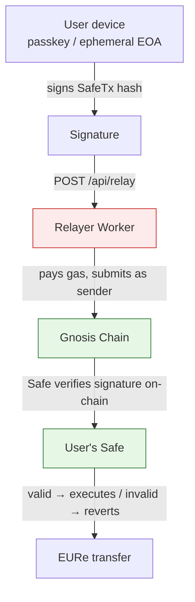
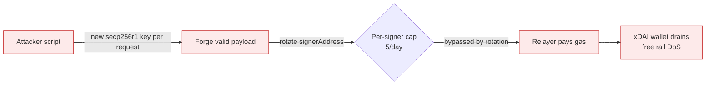
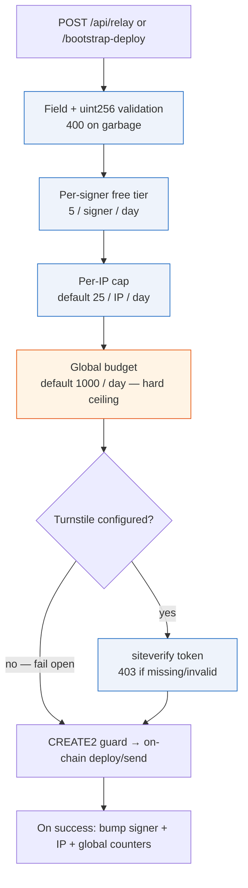
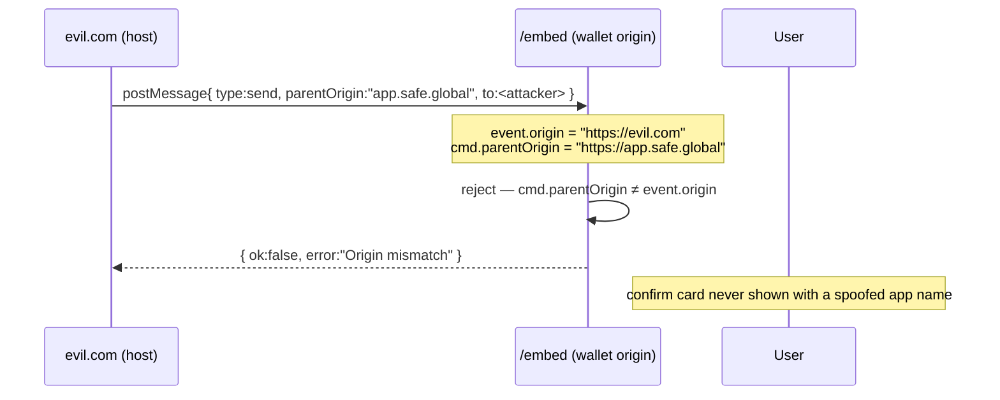

# Relayer threat model & abuse defenses

Durable security knowledge for the two gas-sponsoring Workers
(`functions/api/relay.ts`, `functions/api/bootstrap-deploy.ts`) and the `/embed`
bridge. Read this before touching anything that sponsors gas or accepts a
cross-origin message — the safe-looking shortcuts here fail in expensive ways.

## 1. What the relayer is — and what it can and cannot do

The relayer is an **xDAI funding wallet** that submits user-signed Safe
transactions as an *external sender* and pays the gas. It is **never a Safe
owner**. Every state-changing operation it broadcasts must carry a signature the
on-chain Safe (and its WebAuthn signer) verifies. That gives us one strong
invariant and one soft spot.

- ✅ **Custody invariant (strong):** the relayer cannot move third-party funds.
  It can only submit transactions the user already signed against a Safe the user
  controls. A malicious or compromised relayer can censor or delay, not steal.
- ⚠️ **The only asset the relayer exposes is its own xDAI gas balance.** The
  threat is therefore **griefing / cost** (drain the operator's wallet → DoS the
  free rail), not theft.

## 2. The headline threat: offline-forgeable payloads

The Safe Passkey signer (`SafeWebAuthnSignerSingleton`) verifies a P-256 signature
over `sha256(authenticatorData ‖ sha256(clientDataJSON))`. It does **not** check
attestation, nor that a real authenticator/Face-ID ceremony ever happened.

So an attacker needs **no passkey and no device**. They can, fully offline:

1. generate an arbitrary secp256r1 keypair → choose `pubKeyX/Y`;
2. fabricate `authenticatorData` + `clientDataJSON` embedding the SafeTx hash as
   the challenge;
3. sign the digest with their own private key;
4. send a valid cold-path request that the relayer deploys (Safe + signer) and
   pays for.

Because the per-signer free-tier counter is keyed by `signerAddress` — which the
attacker chooses — **rotating the key resets the limit**. The per-signer cap is a
free-tier accounting control, *not* an abuse defense.

## 3. Defense-in-depth (what actually bounds the drain)

We layer cheap, always-on caps with an optional human-attestation gate. No single
layer is sufficient; together they make drain impractical while keeping the rail
free and frictionless for real users.

| Layer | Key | Default | Tunable | Bypassable by key rotation? |
|---|---|---|---|---|
| Per-signer free tier | `relay:<signer>:<day>` | 5/day | code const | **Yes** (accounting only) |
| Per source IP | `gas:ip:<ip>:<day>` | 25/day | `RELAY_IP_DAILY_LIMIT` | No (needs many IPs) |
| Global budget | `gas:global:<day>` | 1000/day | `RELAY_GLOBAL_DAILY_LIMIT` | No (hard ceiling) |
| Turnstile | — (per request) | off | `TURNSTILE_SECRET` + `VITE_TURNSTILE_SITE_KEY` | No (challenge per token) |

The per-IP + global caps are **shared across both endpoints**, so a script cannot
dodge them by alternating `/api/relay` and `/api/bootstrap-deploy`.

### Turnstile is the decisive layer

Caps only *slow* a botnet (many IPs) attacker. Cloudflare Turnstile forces a fresh
challenge-backed token per request, which is what actually defeats mass offline
forgery. It is **gated on config** (`TURNSTILE_SECRET` server-side,
`VITE_TURNSTILE_SITE_KEY` at build) so it ships dormant and is switched on with no
code change. With either half unset the feature is a complete no-op (fail-open).

> To provision: create a Turnstile widget in the Cloudflare dashboard (or via the
> `turnstile-spin` skill), set `TURNSTILE_SECRET` as a Pages secret and
> `VITE_TURNSTILE_SITE_KEY` as a build var, rebuild + redeploy.

## 4. Known residual: KV is not atomic

Workers KV has no atomic increment and is eventually consistent. A burst of
concurrent requests can each read the same `used` and all pass a cap before any
write lands — so every counter here is **best-effort, not a hard gate**. Impact is
bounded: at worst a small multiple of a cap leaks under a perfectly-timed burst.

A fully atomic per-counter gate would require a **Durable Object** (we already run
the SSE-DO pattern elsewhere). We deliberately did **not** introduce one here:

- the global budget already caps the *absolute* daily exposure regardless of races;
- Turnstile, once on, attacks the forgery economics directly;
- a DO adds a stateful single-writer hotspot + deploy complexity on the hottest
  path for a marginal tightening of an already-bounded leak.

If abuse is ever observed in practice, the upgrade path is: move `gas:global` and
`gas:ip` counters into a DO with `blockConcurrencyWhile`-guarded increments. Until
then the layered KV caps + Turnstile are the chosen trade-off.

## 5. The `/embed` origin-trust rule

The send iframe (`/embed`) receives `postMessage` commands from host pages. Two
origins are in play and they are **not** interchangeable:

- `event.origin` — set by the browser, **trustworthy**;
- `cmd.parentOrigin` — a field inside the payload, **attacker-controlled**.

**Rule:** the confirm card displays — and every reply `postMessage` targets — the
**verified `event.origin`**, never `cmd.parentOrigin`. Any command whose claimed
`parentOrigin` differs from `event.origin` is rejected outright. The legitimate SDK
sends `parentOrigin = location.origin = event.origin`, so it is unaffected. Without
this, a malicious embedder could render "Aplikacija: app.safe.global" over a
payment whose recipient is the attacker.

## 6. Quick checklist when editing the relayer

- [ ] New numeric input from the body? Parse + uint256-range-check it up-front → 400.
- [ ] New sponsored code path? It must pass the same cap + Turnstile gates and bump
      the counters only on a **landed** tx.
- [ ] Touching CREATE2 derivation? It lives once in `functions/_lib/safe.ts` — see
      [relayer-architecture.md](./relayer-architecture.md). Never re-inline it.
- [ ] New `/embed` message field? Trust `event.origin`, never payload-claimed origin.
