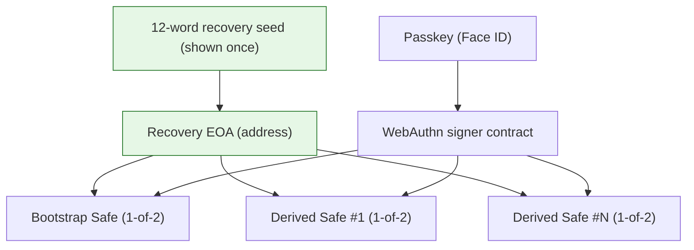
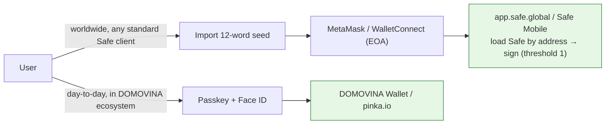

# Using DOMOVINA Safes in standard Safe clients (app.safe.global, Safe Mobile)

The vision: a customer creates a wallet via DOMOVINA Wallet / pinka.io and can use that
same Safe **worldwide** through any standard Safe client. This document records exactly
how compatible it is, the one interop path that works, and the refinements needed.

## What a DOMOVINA Safe actually is

Every account (the bootstrap "default" wallet AND every "Novi račun" / pinka campaign
account) is a **canonical Safe v1.4.1** — same `SafeProxyFactory`, same `SafeL2`
singleton, same addresses every Safe client knows. So they are recognized everywhere.

Owners (threshold **1** = any single owner can sign):

**One EOA owns them all.** `deriveAccount` (src/lib/accounts.ts) builds every derived
account as `owners = [passkeySigner, recoveryOwner]`, threshold 1, where `recoveryOwner`
is the SAME identity EOA address (the bootstrap seed's account) snapshotted onto every
account. So the single 12-word seed, shown once at creation, is a 1-of-2 owner of
**every** DOMOVINA Safe the user ever creates under that passkey (ADR 0013 Decision 2:
back up ONE key, control everything).

## The interop reality — the EOA/seed is the portable key

Verified against the official Safe monorepo (`~/git/safe-global/safe-wallet-monorepo`,
HEAD 52b52134): **app.safe.global (apps/web) has ZERO passkey support**, and `webauthn`
appears only in a mobile constant + test fixtures. So **standard Safe clients cannot
sign with the passkey owner.** That's fine — they don't need to:

**To use a DOMOVINA Safe anywhere else:** import the 12-word seed into MetaMask (or any
wallet) → that EOA is a 1-of-2 owner → open app.safe.global / Safe Mobile, load the Safe
by address → sign and transact normally (threshold 1, no co-signer needed). The passkey
stays the convenient in-app signer; the seed is the universal escape hatch.

> This is exactly why the 1-of-2 `[passkey, EOA]` design is correct: it guarantees
> worldwide interop through the EOA even though Safe's own apps don't speak passkey.

## Refinements for the full "use it anywhere" promise — ALL SHIPPED (2026-06-10)

1. **Derived Safes must be DEPLOYED before they appear in app.safe.global.** A
   counterfactual (never-used) account has no on-chain code yet, and app.safe.global
   rejects it as "not a Safe wallet" (see [[feedback_safe_counterfactual_address]]). The
   bootstrap Safe deploys at creation; derived Safes deploy lazily on first send.
   ✅ *Shipped:* "Aktiviraj račun" in Settings (`src/lib/activate.ts` +
   `routes/Settings.tsx`) — a 0-value self-call through the relay cold path deploys the
   Safe atomically without moving funds (costs one free relay slot). Settings also shows
   an on-chain status row (deployan / counterfactual). Derived-only by design: a
   bootstrap Safe's CREATE2 address derives from the ephemeral-EOA initializer, which
   the relay cold-path guard correctly rejects (it deploys at creation anyway).
2. **The seed is the only portable key — and it's shown once.**
   ✅ *Shipped:* the created screen (`Landing.tsx CreatedView`) now requires an explicit
   choice — after revealing, "Otvori wallet" unlocks only on a "spremio sam svih 12
   riječi" confirmation; skipping without revealing goes through a conscious "Nastavi
   bez seeda" warning step. Settings → Sigurnost carries a permanent reminder ("tvoj
   seed kontrolira ovaj Safe u bilo kojem walletu") with the seed-owner EOA address.
   The seed itself remains shown-once / never stored.
3. **Owner management parity / threshold raised externally.**
   ✅ *Verified:* it DOES break relayed sends — Safe's `checkSignatures` requires
   `threshold` signatures and the relay submits exactly one (passkey), so any
   threshold > 1 reverts every `execTransaction` (confirmed against a live 2/3 Safe:
   `getThreshold` reads work as expected; the hot path would revert at gas estimation
   and surface as an opaque 500). ✅ *Guarded, three layers:*
   - `Send.tsx` reads `getThreshold` on mount **and re-checks right before Face ID**,
     blocking with a clear card (link to app.safe.global, "vrati prag na 1");
   - `Settings.tsx` shows a warning section + a `prag N potpisa` badge when threshold > 1;
   - the relay (`functions/api/relay.ts`) disambiguates a hot-path failure by reading
     the threshold and returning an explicit 409 instead of an opaque "Submit failed" —
     covers Embed/SDK clients too. Owner add/remove at threshold 1 stays fully
     compatible (owners are read on-chain, never cached).

## Bottom line

DOMOVINA Safes are **fully usable worldwide in standard Safe clients**, via the
12-word seed (the EOA owner). The passkey is the in-ecosystem convenience; the seed is
the portable, worldwide-compatible key. All three refinements above are shipped: derived
accounts can be activated on-chain before first use, seed backup is confirm-gated and
permanently surfaced in Settings, and an externally-raised threshold is detected and
explained everywhere instead of failing opaquely.
