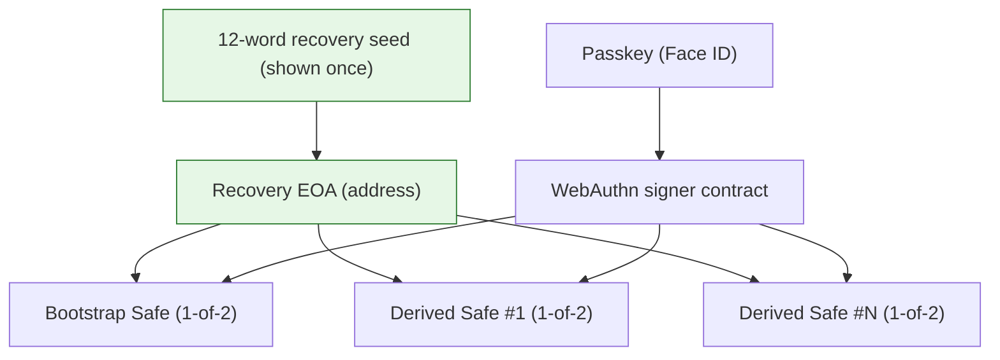
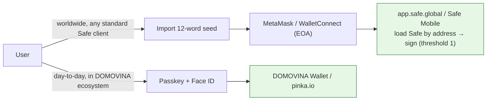

# Using DOMOVINA Safes in standard Safe clients (app.safe.global, Safe Mobile)

The vision: a customer creates a wallet via DOMOVINA Wallet / pinka.io and can use that
same Safe **worldwide** through any standard Safe client. This document records exactly
how compatible it is, the one interop path that works, and the refinements needed.

## What a DOMOVINA Safe actually is

Every account (the bootstrap "default" wallet AND every "Novi račun" / pinka campaign
account) is a **canonical Safe v1.4.1** — same `SafeProxyFactory`, same `SafeL2`
singleton, same addresses every Safe client knows. So they are recognized everywhere.

Owners (threshold **1** = any single owner can sign):

**One EOA owns them all.** `deriveAccount` (src/lib/accounts.ts) builds every derived
account as `owners = [passkeySigner, recoveryOwner]`, threshold 1, where `recoveryOwner`
is the SAME identity EOA address (the bootstrap seed's account) snapshotted onto every
account. So the single 12-word seed, shown once at creation, is a 1-of-2 owner of
**every** DOMOVINA Safe the user ever creates under that passkey (ADR 0013 Decision 2:
back up ONE key, control everything).

## The interop reality — the EOA/seed is the portable key

Verified against the official Safe monorepo (`~/git/safe-global/safe-wallet-monorepo`,
HEAD 52b52134): **app.safe.global (apps/web) has ZERO passkey support**, and `webauthn`
appears only in a mobile constant + test fixtures. So **standard Safe clients cannot
sign with the passkey owner.** That's fine — they don't need to:

**To use a DOMOVINA Safe anywhere else:** import the 12-word seed into MetaMask (or any
wallet) → that EOA is a 1-of-2 owner → open app.safe.global / Safe Mobile, load the Safe
by address → sign and transact normally (threshold 1, no co-signer needed). The passkey
stays the convenient in-app signer; the seed is the universal escape hatch.

> This is exactly why the 1-of-2 `[passkey, EOA]` design is correct: it guarantees
> worldwide interop through the EOA even though Safe's own apps don't speak passkey.

## Refinements needed for the full "use it anywhere" promise

1. **Derived Safes must be DEPLOYED before they appear in app.safe.global.** A
   counterfactual (never-used) account has no on-chain code yet, and app.safe.global
   rejects it as "not a Safe wallet" (see [[feedback_safe_counterfactual_address]]). The
   bootstrap Safe deploys at creation; derived Safes deploy lazily on first send. So a
   brand-new derived account isn't visible in third-party clients until its first tx.
   → *Refinement:* an explicit "Aktiviraj/deploy ovaj račun" action (a 0-value self-call
   through the relay cold path), or clear UX that an account becomes externally visible
   after its first transaction.
2. **The seed is the only portable key — and it's shown once.** If the user didn't back
   it up, they can use the Safe only via the passkey (DOMOVINA ecosystem). The seed
   cannot be re-shown (never stored — see [security-custody-model.md](./security-custody-model.md)).
   → *Refinement:* make seed backup prominent/confirmable at creation; consider a
   "verify you saved your seed" gate; surface "your seed controls this Safe in any wallet"
   in Settings.
3. **Owner management parity.** Adding/removing owners or raising the threshold from
   app.safe.global works (the EOA can do owner-management calls), and those changes are
   reflected back in DOMOVINA (owners read on-chain). No action needed — just verify in
   testing that a threshold change made externally doesn't break the relay's 1-of-2
   assumptions (the relay signs with the passkey; if threshold > 1 it would need 2 sigs).

## Bottom line

DOMOVINA Safes are **fully usable worldwide in standard Safe clients today**, via the
12-word seed (the EOA owner). The passkey is the in-ecosystem convenience; the seed is
the portable, worldwide-compatible key. The only real refinements are (1) deploying
derived accounts so they're externally visible, and (2) making seed backup robust.
