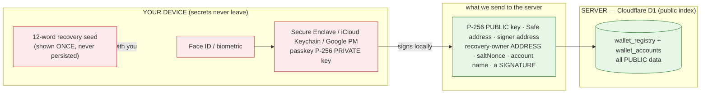
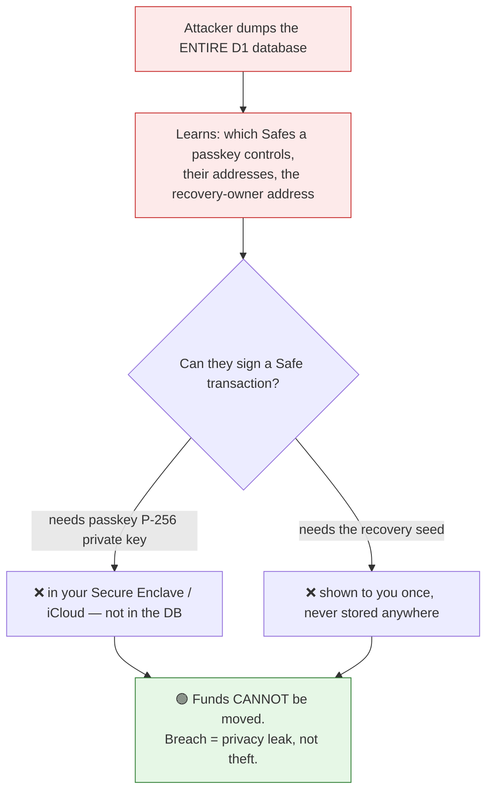
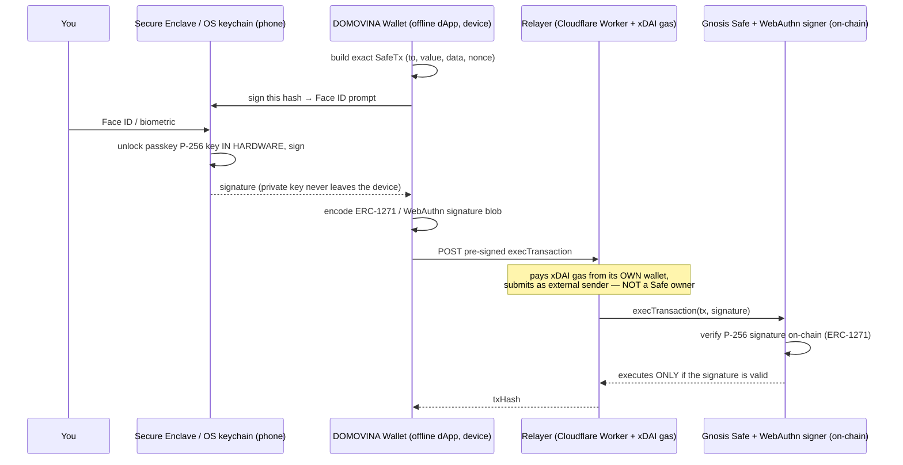
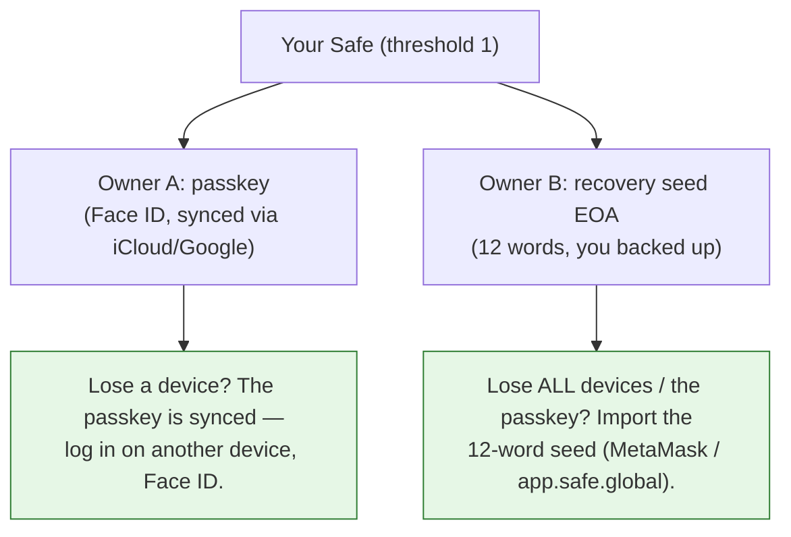

# Security & custody model — why your funds are yours alone

The core promise of DOMOVINA Wallet: **your accounts sync to every device
automatically, but no one — not us, not a database breach, not Cloudflare — can move
a single cent without Face ID / the biometric on your own device.** This document
explains exactly why that is true, what the server does and does not hold, and how
you can verify it yourself.

## TL;DR

- **100% self-custody.** The keys that can authorize a transaction (your passkey's
  P-256 private key, and your 12-word recovery seed) **never leave your device** and
  are **never stored on our server** — not encrypted, not hashed, *not at all*.
- The server (Cloudflare D1) is a **public index**: "this passkey controls these Safe
  addresses." Everything in it is already public or on-chain. A full database dump
  lets an attacker *see the map*; it gives them **zero ability to sign**, so **zero
  ability to steal**.
- We don't "AES-encrypt the secrets on the server" — there is a stronger guarantee:
  **there are no secrets on the server to encrypt.**

## 1. What crosses the wire — secrets stay on the device

The only things that ever reach the server are **public** (addresses, public keys) or
**already-spent authorizations** (a signature for one specific transaction, which
can't be replayed for another). The signing material itself is held by your phone's
hardware + OS keychain and gated by your biometric.

## 2. What the server actually stores

| Field (D1) | What it is | Secret? |
|---|---|---|
| `credential_id` | WebAuthn credential id (public handle) | No |
| `pub_key_x` / `pub_key_y` | passkey **public** key — already on-chain as the Safe owner | No |
| `signer_address` | the WebAuthn signer contract address (on-chain) | No |
| `safe_address` | your Safe address (on-chain, balances already public) | No |
| `recovery_owner` | the recovery EOA's **address** (public) — **not** its key/seed | No |
| `salt_nonce`, `name` | CREATE2 salt + your in-app label | No |
| `phone_hash` | HMAC(server-pepper, phone) — only if you bound a phone | Privacy-only |

There is **no private key, no mnemonic, no password** column. There is nothing to
decrypt and nothing to steal funds with.

## 3. Why a full database breach can't move funds

To move funds out of a Safe you need a valid **owner signature**. The server has none
of the material that produces one.

The same holds for **us** (the operator) and for **Cloudflare**: holding the database,
the servers, or the relayer does not confer the ability to sign. The relayer only
*pays gas* and *submits* transactions you already signed — it is never a Safe owner
(see [relayer-threat-model.md](./relayer-threat-model.md)).

## 4. The signing gate — the entities that carry out a spend

Moving funds involves **five distinct technical entities**. It matters to keep them
separate: only your device holds anything that can *authorize*; the **Relayer is a
separate Cloudflare cloud Worker** that merely *pays the gas* and *submits* your
already-signed transaction — it is NOT part of the offline device, and it is NOT a
Safe owner.

| Entity | Where it runs | Role | Can it authorize a spend? |
|---|---|---|---|
| **You** | — | Provide the biometric | — |
| **Secure Enclave / OS keychain** | your phone (hardware) | Holds the passkey P-256 **private key**; signs in-hardware on Face ID | Signs, but only at your biometric command |
| **DOMOVINA Wallet** (offline dApp) | your device (browser/PWA) | Builds the exact SafeTx, obtains the passkey signature, encodes it | No — only assembles *your* signed tx |
| **Relayer** (Cloudflare Worker + xDAI gas wallet) | Cloudflare cloud | Pays xDAI gas, submits the **pre-signed** `execTransaction` as an external sender | **No** — never a Safe owner; cannot alter the signed tx |
| **Gnosis Safe + WebAuthn signer** | on-chain (Gnosis) | Verifies the P-256 signature (ERC-1271) and executes if valid | It *enforces* — runs ONLY a valid owner signature |

> The **Registry** (Cloudflare D1, §2) is NOT in this path at all — it is a separate
> public index for cross-device discovery, never consulted to authorize a transaction.

**Trust boundary — the Relayer is a convenience, not a custodian.** It exists so you
never need xDAI or a gas token of your own. It can **delay or refuse** to submit
(liveness), but it **cannot forge or tamper**: your signature commits to the exact
`to / value / data / nonce`, so anything the relayer changed would invalidate the
signature and the Safe would reject it on-chain. If the relayer ever vanished, the same
signed transaction could be submitted by anyone (you, paying your own gas) — or you
operate the Safe directly via the seed in any standard Safe client. No Face ID → no
signature → no transaction, by anyone.

### On-chain footprint — what gnosisscan actually shows

A relayed spend has two layers, shown in different places on the explorer:

- **Transaction envelope (top of the page):** `From` = the **relayer's public EOA** — it
  signed the Ethereum transaction and paid the xDAI gas, so it is permanently recorded as
  the sender. `To` = your **Safe** (hot path: a direct `execTransaction`) or
  **MultiSendCallOnly** (cold path: deploy + exec in one tx).
- **Token transfer ("Tokens Transferred"):** the ERC-20 `Transfer` event reads
  `From = your Safe → To = recipient`. This is the layer that shows the Safe addresses —
  the Safe is the *logical* sender of the funds.

So **yes, the relayer's address is visible** — as the transaction sender / gas payer, not
as the source of funds. Because the relayer is a single **shared** gas wallet, all
DOMOVINA-relayed transactions are **linkable** by that common `From` address: an observer
can tell a transaction was relayed by us and see which Safe executed and who received. That
is a transparency / linkability property of gas sponsorship — identical to any
meta-transaction or ERC-4337 bundler — and **not** a custody issue: the relayer is only the
gas-paying submitter and still cannot move funds without your signature. To avoid the
shared-relayer footprint entirely, submit the same signed transaction yourself (or operate
the Safe via the seed in any client) and pay your own gas.

## 5. Two ways YOU (and only you) keep control — recovery

Every account is a **1-of-2** Safe: owner A = your passkey, owner B = your recovery
seed's address. Either can sign; both are held only by you.

This is also why "Novi račun" works on every device without ever creating a duplicate
passkey: a new device recovers the recovery-owner **from your Safe's own on-chain
owners** (trustless), never by trusting the server — so a compromised server can't
inject itself as a co-owner of accounts you later mint.

## 6. "No secrets" beats "encrypted secrets"

A common design is "encrypt the user's key on the server and decrypt it client-side."
We deliberately do **not** do that, because it still puts the ciphertext (and the
custody risk) on the server. Our model removes the server from custody entirely:

- **Encrypted-secrets model:** server holds `Enc(key)`. Compromise the encryption (bug,
  weak KDF, leaked passphrase) → funds at risk. Server is in the custody path.
- **Our model:** server holds **no key at all**. The key is generated and used inside
  your device's secure hardware; only public data + per-transaction signatures are
  shared. The server is a *directory*, not a *vault*. There is no ciphertext to attack.

So there is no AES layer over the server data — not because we skipped it, but because
encrypting public addresses would be theater. The real protection is the **absence** of
any secret server-side.

## 7. Honest caveats — privacy, not custody

We don't overclaim. A database breach would expose, as a **privacy** matter (never a
fund-theft one):

- the **clustering**: which Safe addresses belong to the same passkey/identity (on-chain
  balances are public regardless);
- `phone_hash` (if you bound a phone): an attacker with the DB *and* the server pepper
  could test specific phone numbers for a match (the raw phone is never stored here —
  it lives only at the OTP service). Phone binding is optional.
- the **shared-relayer footprint** (on-chain, public regardless of any breach): every
  relayed transaction is sent `From` the one shared relayer EOA, so an observer can link
  all DOMOVINA-relayed transactions together and see each Safe + recipient (§4 "On-chain
  footprint"). To avoid it, self-submit and pay your own gas.

Neither lets anyone spend your funds. If maximal privacy matters to you, skip phone
binding; custody is identical either way.

## 8. Verify it yourself

- Watch the network tab on send: the request carries a `signature`, never a key/seed.
- Read `src/lib/bootstrap.ts`: the mnemonic is generated, shown once, and only the EOA
  **address** + a SafeTx **signature** are sent — grep shows the mnemonic is never
  POSTed or written to storage.
- Read `backend/src/wallets/db.ts` / `migrations/0008` + `0011`: no key/seed column
  exists.
- Import your 12-word seed into MetaMask → you alone reconstruct the recovery owner;
  we cannot, because we never had it.

**Conclusion: yes — it is really true.** Auto cross-device sync of *which* Safes you
own, and zero ability for anyone but you (via Face ID, or your seed) to move what's in
them.
