# User flows — full path coverage

Combinatorially complete map of every path a user can take through DOMOVINA
Wallet: **happy paths** (green terminals) and **dead-end / sad paths** (red
terminals). Derived directly from the route table (`App.tsx`) and every screen's
state machine. If you add a `stage`/`phase` kind or a `<Route>`, update the
matching diagram here.

> Convention in the diagrams: 🟢 = success terminal · 🔴 = error/dead-end terminal ·
> 🟠 = user-cancel returns to a safe state · 🔷 = a Face ID (WebAuthn) ceremony.

---

## 0. Top-level route gate (`App.tsx`)

Three routes are **public** (no wallet needed); everything else is gated on
`store.safeAddress` — absent → `Landing`, present → the `AppShell` tab UI.

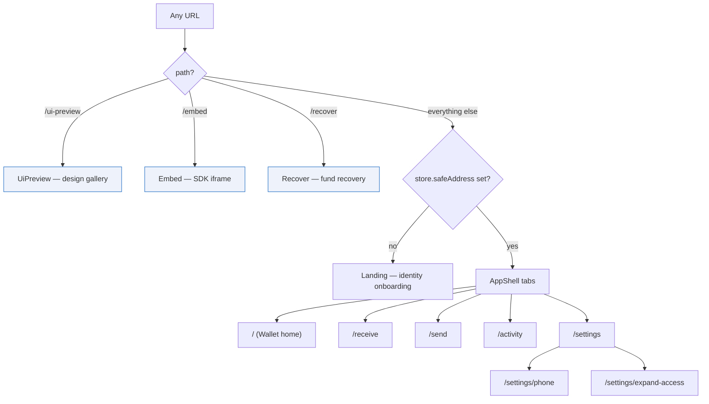

Public routes are deliberate: `/embed` runs under the wallet origin for third-party
dApps; `/recover` must work with **no** local wallet (it finds the controlling
passkey by P-256 pubkey recovery). Everything else needs an identity first.

---

## 1. Landing — identity onboarding (the core state machine)

This is where a passkey identity is created or re-opened. `stage` ∈
{welcome, welcome-known, confirm-create-many, confirm-archive, naming,
found-existing, unusable-passkey, creating, opening, created, error}. An
SDK-connect overlay (`?dw_connect=1`) rides on top and, on success, redirects back
to the host instead of entering the UI.

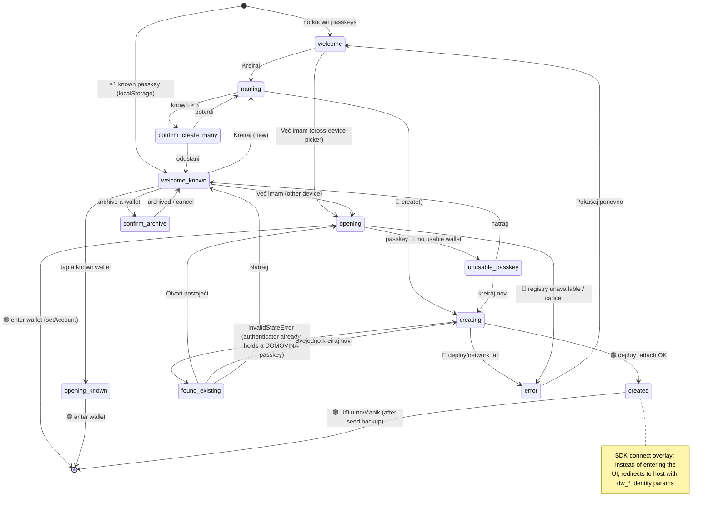

**Happy paths:** `welcome → naming → creating → created → wallet` (brand-new),
`welcome_known → tap → wallet` (returning, same device), `welcome → opening →
wallet` (cross-device via OS picker).
**Dead-ends handled gracefully:** `found-existing` (no silent overwrite),
`unusable-passkey` (orphan passkey → guided create), `error` (retry), registry
blip distinguished from genuine 404 so a funded wallet is never told "create new".

---

## 2. Create-vs-open & the WebAuthn ceremony (where duplicates are born)

The most security-sensitive sub-flow. `confirmCreate()` goes **straight to
`navigator.credentials.create()`** — no get-first probe — passing
`excludeCredentials` = **locally-known** credential IDs only. See §8 for the
duplicate-passkey bug this enables.

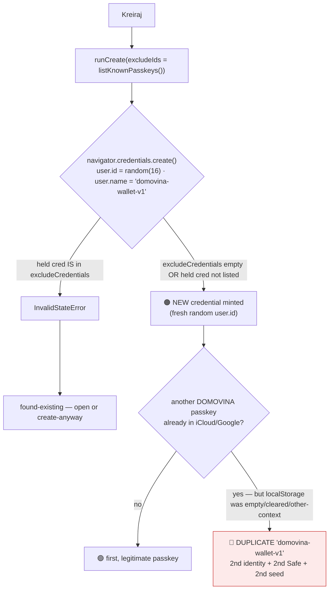

The InvalidStateError safety net **only fires on the same device with intact
localStorage**. Empty/cleared/cross-context `excludeCredentials` → no exclusion →
silent duplicate. Random `user.id` is deliberate (a stable one would **overwrite**
the existing passkey → orphan the funded Safe — strictly worse).

---

## 3. Send (`/send`)

Pre-flight guards burn neither a Face ID ceremony nor a free relay slot on a doomed
transfer. The relay then routes hot vs cold (see
[relayer-architecture.md](./relayer-architecture.md)).

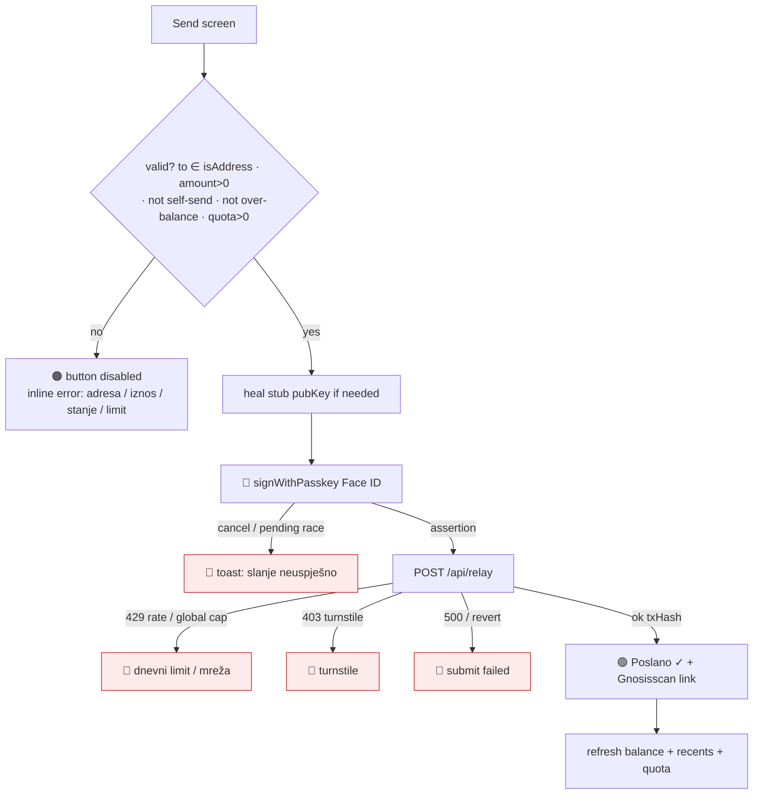

Entry variants: direct tab, deep-link `?to=&amount=` (from /receive share), QR scan,
address-book / recents chip, paste. All converge on the same validation gate.

---

## 4. Receive (`/receive`)

Two tabs. P2P shows the Safe address + an EURe-on-Gnosis QR; SEPA mints a Monerium
payment intent (bank → EURe bridge).

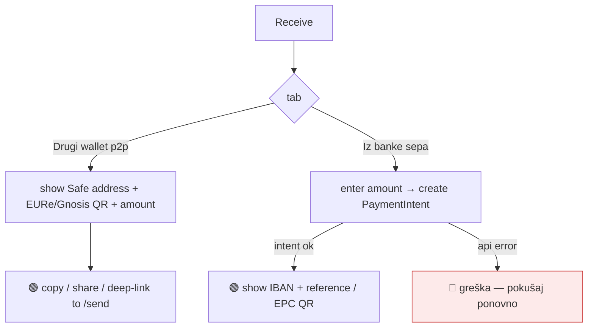

---

## 5. Recover (`/recover`) — public, no wallet needed

Finds the controlling passkey by **P-256 pubkey recovery** (2 candidates from a
WebAuthn assertion → match `predictSafe(signer, salt)` against the target Safe),
then deploys + withdraws via the relay cold path.

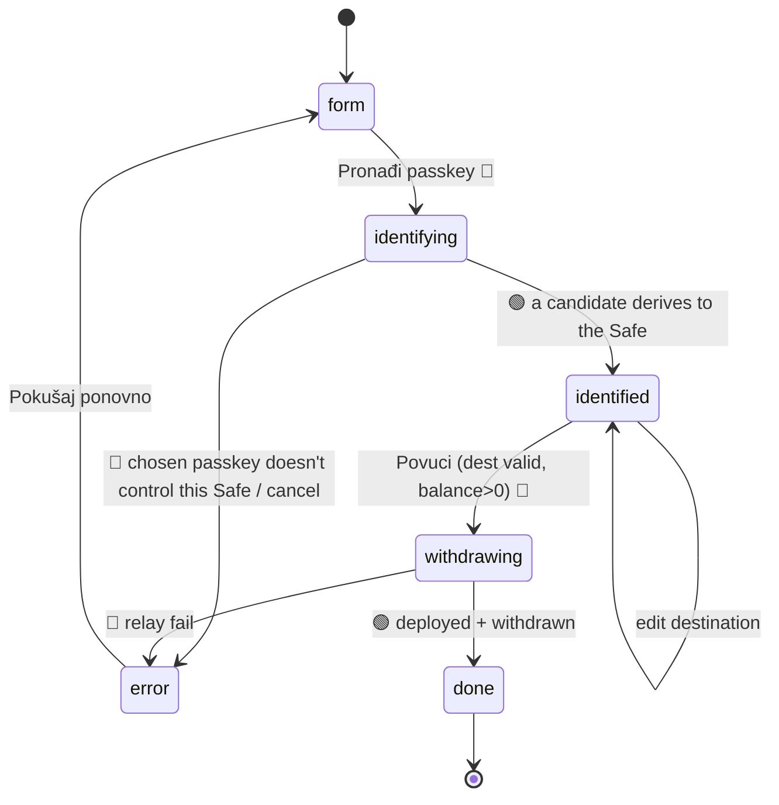

Inputs prefill from URL (`?safe=&campaign=&salt=&to=`) so a pinka campaign can
hand off a one-tap recovery link.

---

## 6. Embed + SDK (`/embed`, public iframe)

Cross-origin. `connect()` is a deterministic full-page redirect (handled in
Landing); `send()` runs in the iframe. Origin is verified against `event.origin`
(see [relayer-threat-model.md](./relayer-threat-model.md) §5).

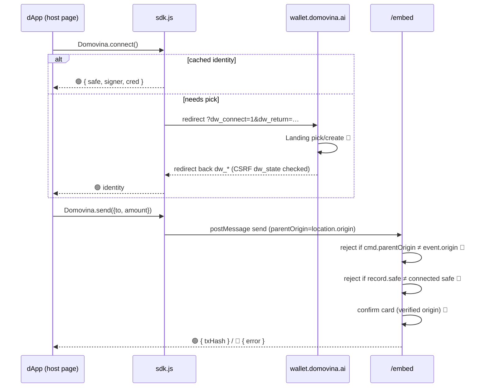

Dead-ends: origin mismatch, not-connected, wallet-mismatch, user-cancel
("Korisnik je odustao"), relay failure — each posts a typed error back to the
verified origin.

---

## 7. Multi-passkey & multi-account

### 7a. ExpandAccess (`/settings/expand-access`) — "Dodaj passkey"

Adds a **second passkey as co-owner** of the SAME Safe (threshold stays 1). Two
Face ID prompts: create the new passkey, then sign `addOwnerWithThreshold` with the
existing one.

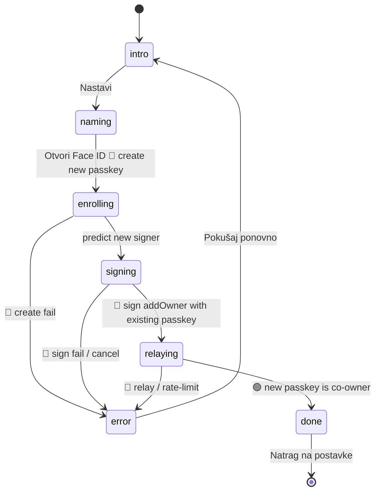

> ⚠️ `createPasskey(chosenName)` here is called with **no** `excludeCredentials` —
> see §8 hardening item 4.

### 7b. WalletSwitcher — "Novi račun" / switch / archive

A pure-local derivation: a new 1-of-2 `[signer, recoveryOwner]` Safe at the next
saltNonce under the SAME passkey. No Face ID, no tx, no gas until first send.

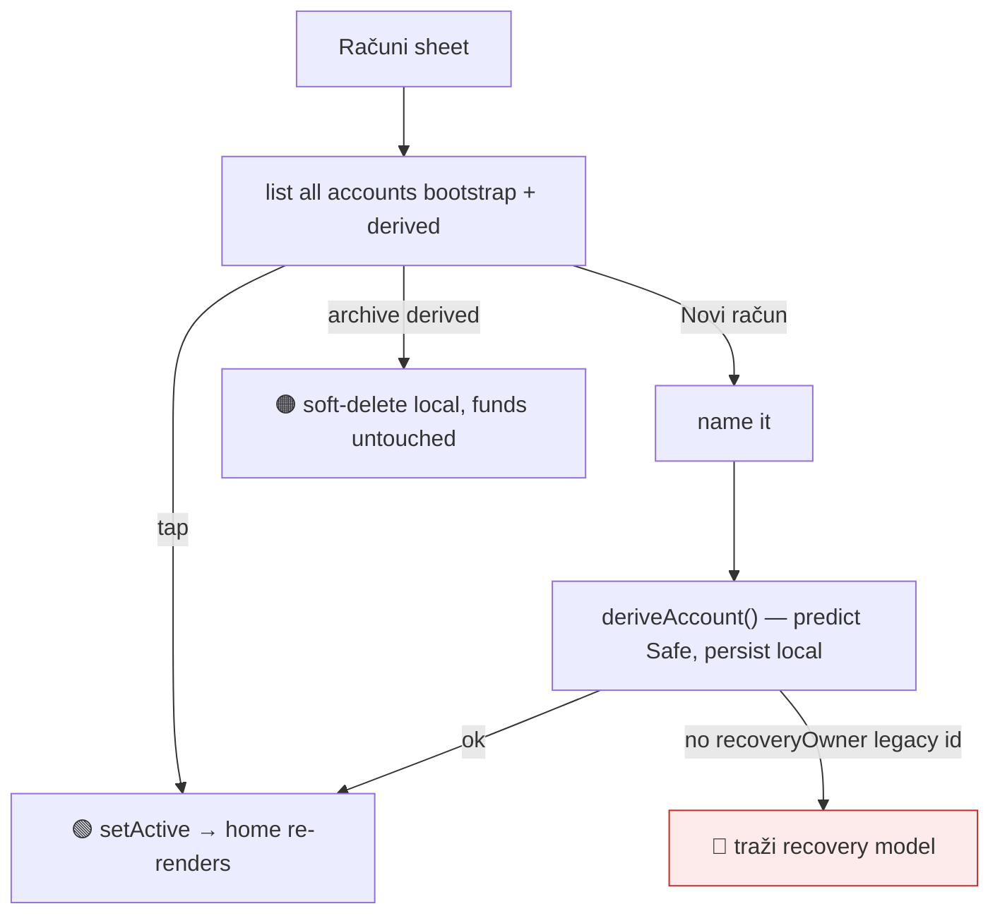

### 7c. BindPhone (`/settings/phone`) — OTP via otp.domovina.ai

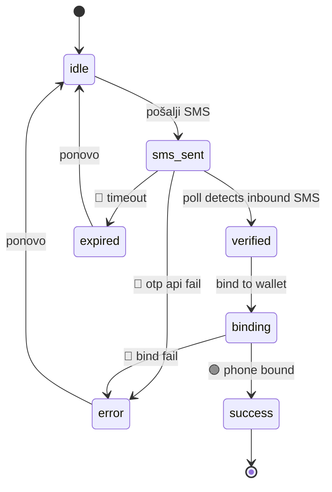

---

## 8. The duplicate-passkey bug — root cause & fix plan

> Observed: **two `domovina-wallet-v1` entries in Apple Passwords**. This section
> explains exactly how, and the plan to stop it.

### 8.1 Mechanism

Apple Passwords / iCloud Keychain (and Google PM) key a stored passkey by
**`(rpId, user.id)`**, *not* by `user.name`. `createPasskey()` sets:

- `user.name = 'domovina-wallet-v1'` — **fixed** (the version-pinned identity slug);
- `user.id = crypto.getRandomValues(16)` — **fresh random every call** (deliberate:
  a stable `user.id` would make `create()` **overwrite** the existing passkey →
  different keypair → **orphaned funded Safe**, strictly worse than a duplicate).

So two `create()` calls produce two different `user.id`s → two distinct passkeys
that **share the display name** `domovina-wallet-v1`. The only thing that *prevents*
a second create is `excludeCredentials` — but it is sourced **only from
`listKnownPasskeys()` (localStorage)**, and `create()` goes straight in with **no
get-first existence probe** (the probe was removed because a `get()` picker shows
"Use a saved passkey" with no create affordance, which trapped first-time users).

Therefore a duplicate is minted, silently, whenever `create()` runs while the
device's existing DOMOVINA passkey is **not** in `excludeCredentials`:

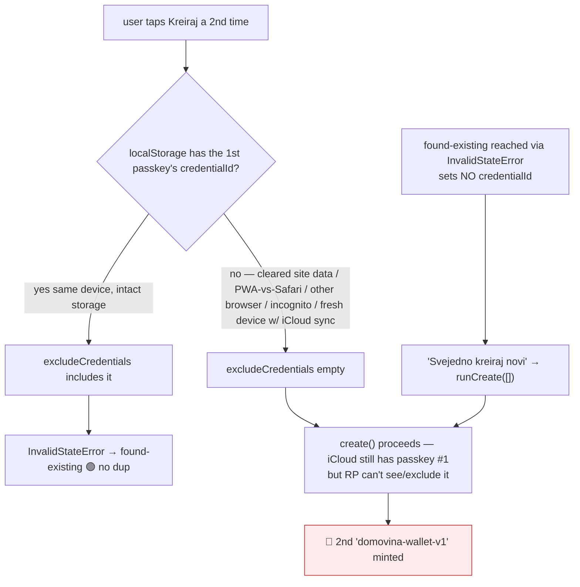

**Reproduction paths** (any one suffices):
1. Create wallet → clear site data (or open the installed PWA vs Safari tab — they
   have separate `localStorage`) → tap Kreiraj again → silent duplicate.
2. Same iCloud on a second device (localStorage empty there) → Kreiraj → duplicate.
3. `found-existing` (from a same-device InvalidStateError) carries **no**
   `credentialId`, so its **"Svejedno kreiraj novi"** calls `runCreate([])` → no
   excludes → duplicate.

Why it matters beyond clutter: each duplicate is a **separate identity → separate
Safe → separate recovery seed**. Funds can land in the wrong one; the first Safe's
one-time seed may already be gone (cf. Postmortem 0001).

### 8.2 Fix plan (phased, ranked)

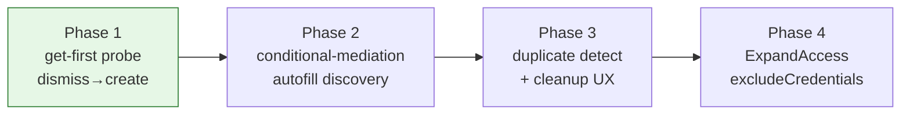

**Phase 1 — reinstate a get-first probe with graceful fallthrough (high value, low risk).**
Before `create()`, run `navigator.credentials.get({ rpId, mediation:'optional' })`
across `[RP_ID, LEGACY_RP_ID]`. This surfaces passkeys from iCloud/Google
**regardless of localStorage**.
- returns a credential → route to `found-existing(credentialId)` → **open it** (no dup);
- user dismisses / none exist (`NotAllowedError`/null) → **proceed to `create()`**.
The historical trap was treating dismiss as a dead-end; here dismiss → create, so a
true first-timer just dismisses one picker. This closes reproduction paths 1 & 2 and
gives path 3 a real `credentialId` to exclude.

**Phase 2 — conditional-mediation (autofill) discovery on the welcome screen (removes Phase-1 friction).**
Gate on `PublicKeyCredential.isConditionalMediationAvailable()`. Render a hidden
`autocomplete="webauthn"` field and start a conditional `get()`; returning users see
their synced passkey passively (no modal) while "Kreiraj" stays instant for
first-timers. Falls back to Phase 1 where conditional UI is unsupported (older iOS).

**Phase 3 — duplicate detection + remediation UX.**
When `welcome-known` (or Settings → Računi) holds ≥2 identities — especially ones
sharing `keychainName === 'domovina-wallet-v1'` — surface a banner with each
wallet's EURe balance and a "je li ovo greška?" cleanup affordance: archive the
empty/stale one locally **and** instruct the user to delete it in Apple Passwords
(the RP cannot delete an OS-stored passkey). Prevents a funded-but-forgotten Safe.

**Phase 4 — harden the other create site.**
`ExpandAccess.runExpand()` calls `createPasskey(chosenName)` with **no**
`excludeCredentials`. Pass `listKnownPasskeys()` IDs so it can't re-mint the same
authenticator as a "new" co-owner on the same device.

### 8.3 Irreducible limits (set expectations)

- A user can always choose **"Svejedno kreiraj novi"** — intentional duplicates stay
  possible (by design; sometimes wanted).
- The RP **cannot enumerate or delete** passkeys held by a third-party provider
  (1Password/LastPass) or in another OS account — cross-provider dups can't be fully
  prevented, only detected after the fact.
- Stable `user.id` is **not** an option — it trades a duplicate for an overwrite that
  orphans a funded Safe.

The plan eliminates **accidental/silent** duplicates (the reported case) without
reintroducing the create-trap or the overwrite footgun.

---

## 9. Coverage matrix (every route × terminal)

| Route | Happy terminal(s) | Dead-end / sad terminal(s) | Face ID |
|---|---|---|---|
| Landing | enter wallet · created · SDK redirect-back | error · unusable-passkey · found-existing(→dup risk §8) | create / open |
| `/` Wallet | balance + activity render | none (balance "—" if undeployed) | — |
| `/send` | Poslano ✓ | invalid input · rate-limit(429) · turnstile(403) · revert/500 · cancel | sign |
| `/receive` | address/QR · IBAN+ref | SEPA intent api error | — |
| `/recover` | deployed + withdrawn | wrong passkey · empty Safe · relay fail | identify + withdraw |
| `/embed` | { txHash } | origin mismatch · not-connected · wallet-mismatch · cancel · relay fail | confirm sign |
| `/settings/expand-access` | co-owner added | create/sign/relay/rate-limit fail | create + sign |
| `/settings/phone` | phone bound | expired · otp/bind fail | — |
| WalletSwitcher | switch / new account | legacy-no-recoveryOwner | — |
| `/settings` | theme/info · sign-out | — | — |

Every `stage`/`phase` enum value across the codebase appears in a diagram above; the
matrix is the checklist when adding a new route or terminal state.
